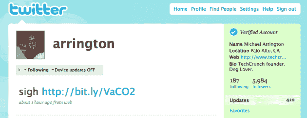

# Twitter 开始验证帐户，但没有真正验证它们 

> 原文：<https://web.archive.org/web/http://techcrunch.com/2009/06/11/twitter-starts-verifying-accounts-without-verifying-them/>

# Twitter 开始验证帐户，但并没有真正验证它们

看起来 Twitter 刚刚推出了它的验证账户。正如你在[迈克尔的个人账户](https://web.archive.org/web/20230209190322/http://twitter.com/arrington)上看到的，在他名字的正上方有一个“已验证账户”的标志。Twitter】之前已经宣布会这么做，但是今晚没有任何警告就这么做了。

奇怪的是，迈克尔从未在 Twitter 上向任何人核实过他的账户。当然，很明显这是他的真实账户，但还是有点奇怪，他们没有核实就核实了。预计在接下来的几天里会有更多的客户看到这种情况。

还有一点奇怪的是——好吧，以一种自私的方式奇怪——一个比迈克尔(你真正的粉丝)有更多粉丝的人没有经过验证的账户，而他的老板却有。叹气。就连拥有超过 70 万粉丝的 [TechCrunch 的常规账户](https://web.archive.org/web/20230209190322/http://twitter.com/techcrunch)也没有得到证实。我猜只有那些精选的“名人”或高知名度的人得到验证，遵循脸书的虚荣心网址模型。

**更新**:以下是 Twitter 对现在谁获得了验证账户的[解释](https://web.archive.org/web/20230209190322/http://twitter.com/help/verified):

> 我们从有假冒或身份混淆问题的知名账户开始。(比如知名艺人、运动员、演员、公职人员、公共机构)。我们可能会在未来验证更多的帐户，但由于所需的成本和时间，我们目前只在一小部分人身上测试该功能。随着测试的进行，我们可能会在接下来的几个月里将测试扩展到更多的账户。