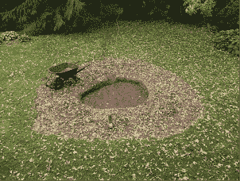

# 嘿，Twitter 初创公司:是时候停止填补漏洞，开始构建黑仔应用了 

> 原文：<https://web.archive.org/web/https://techcrunch.com/2010/04/07/twitter-startups-stop-filling-holes/>

# 嘿，Twitter 初创公司:是时候停止填补漏洞，开始构建黑仔应用了

Twitter 上有成千上万的应用程序，但它们中有哪一个是真正的杀手级应用程序，可以催生一个全新的子行业吗？风险投资家、Twitter 投资者弗雷德·威尔逊不这么认为。虽然 Twitter 桌面客户端、移动应用程序、照片上传服务和网址缩短器都成就了 Twitter 的今天，但他[指出](https://web.archive.org/web/20230126184510/http://www.avc.com/a_vc/2010/04/the-twitter-platform.html):

> Twitter 平台的大部分早期工作都是在填补 Twitter 产品的漏洞。

威尔逊仍在等待桌面出版初创公司的出现，它定义了早期的 Mac 电脑或个人电脑的 Lotus Notes。他表示，填补漏洞的时代已经结束了。Twitter 现在已经大到足以让一些杀手级应用出现，并创造全新的业务。

威尔逊列举了一些显而易见的(对他来说)机会，围绕社交游戏、金融和电影等垂直领域、企业应用、信息发现和分析创建新的 Twitter 创业公司。当然，许多初创公司已经在解决其中的一些领域，这就是为什么威尔逊认为真正的杀手级应用在它们击中我们之前不会那么明显。

那些杀手级应用会是什么？