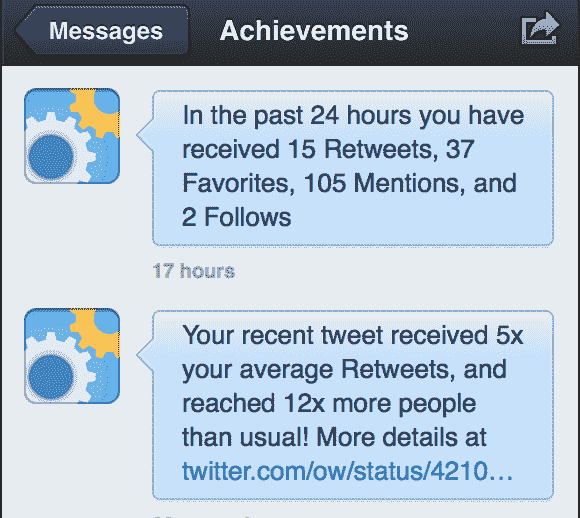
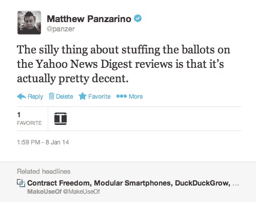
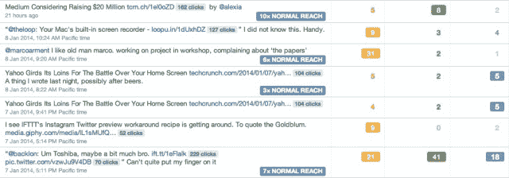

# Twitter 玩具通过“@成就鸟”实验增加参与度

> 原文：<https://web.archive.org/web/https://techcrunch.com/2014/01/09/twitter-toys-with-ways-to-boost-engagement-with-achievementbird-experiment/>

Twitter 已经开始试验一个名为 [@AchievementBird](https://web.archive.org/web/20230326081205/https://twitter.com/achievementbird) 的账户，这个账户会将你通过推文获得的“成就”信息直接发送给你。该帐户受到保护，但在过去几天内已授予以下权限。

一旦你上了名单，这个账户会时不时地给你发消息，告诉你某条推文的表现如何。Xero 工程师欧文·威廉姆斯[在推特上记下了账号](https://web.archive.org/web/20230326081205/https://twitter.com/ow/status/421035242963890176)，以及他目前收到的几条信息:

我的一条推文被“用在了一篇文章中”,成就鸟通知了我这个事实。当我点击链接时，相对较新的“相关标题”功能向我显示了这条推文被使用的确切位置。

另一个名为[@ magichaedlines](https://web.archive.org/web/20230326081205/https://twitter.com/MagicHeadlines)的 Twitter 实验账户可能与这一努力有关，因为它声称可以让你“看到网络上嵌入的推文”——尽管它可能有一些更广泛的应用，作为有新闻价值的推文的摘要。**更新**:这个账户似乎是 Twitter 黑客周项目的一部分，因为现在已经更新了个人资料以反映这一点。所以可能不是 Twitter 的主要“实验”管道的一部分，而是团队成员作为一个附带项目在做的一些事情。

当被问及对成就鸟账户的评论时，Twitter 向我们推荐了关于其持续实验努力的博文。

似乎 AchievementBird 正在利用 Twitter 的分析包来显示用户推文的结果。虽然它首先向商业用户和验证用户推出分析，但现在任何人都可以使用他们的“广告”仪表板访问页面。

看起来是这样的:

如果你是一个经常发微博的人，你会有一些关于即时战略、收藏夹、关注者等等的统计数据。我之前谈过 Twitter 如何试验一个名为@magicstats 的账户，这个账户似乎通过速度来衡量推文的受欢迎程度。在那篇文章中，我提到第三方 Twitter 参与度追踪器 Favstar 是我每天必去的网站之一。

[Favstar](https://web.archive.org/web/20230326081205/http://favstar.fm/) 提供的一个功能是当你的推文超过“50”或“100”这样的 fav 里程碑时，账户会点击你。它还提供了一个“每日推文”奖，你可以授予朋友或你认为发了好推文的粉丝。

谁知道 Twitter 最终会对 AchievementBird 账户做什么，但看到它像对 MagicRecs 账户所做的那样将其融入主产品，我一点也不会感到惊讶。完全访问 Twitter 的数据集意味着 Twitter 可以提供 Favstar 无法提供的功能，因为它必须轮询 API。

我仍然更喜欢 Favstar 的演示，以及它与第三方应用程序的集成，但它还处于实现阶段，Bird 和 Twitter 总是可以修改其分析，使其更加友好。无论哪种方式，这似乎是沿着集成的轨道滚动，作为推送通知，而不是登录页面。

向用户发送提醒，通知他们人们实际上正在阅读甚至在文章中使用他们的推文，这似乎是鼓励这些用户更多使用推文的好方法。将用户从潜伏者转化为活跃的推特用户对保持和增长非常重要。

*图片来源:[杰琳莱](https://web.archive.org/web/20230326081205/http://www.flickr.com/photos/80315254@N00/2244173658/in/photolist-4qiYDh-4BPHjq-4JVxNN-4LxmYw-4Lxn3h-4RoM5T-4XXx6F-4YdLc2-4YzNTp-4YzNTX-4YzNUt-4ZcVo7-52xhT3-59AWHB-5d4AR8-5demcn-5miq1e-5qsaag-5rR5cD-5tpdjK-5ttBLY-5tRe6h-5xYkqc-5y3KzE-5yjE15-5zArPm-5APt1a-5Bz3C1-5DyorA-5ET4v4-5Gu6Gh-5J29V6-5KpMPg-5MHkgV-65MYms-6d8Uv2-6d9ZPn-6jNvgu-6kWB9S-6sUnvC-6x75k2-6y1a2X-6GvbPd-6LpGtS-6MnAFF-6NKDJo-6QutxV-6TLqYP-79Banx-7bAtMn-7kW6HV)*