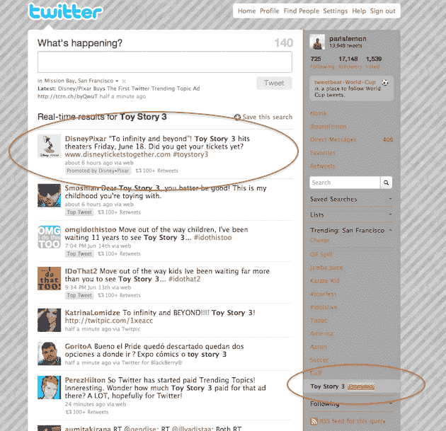

# 迪士尼/皮克斯收购首个 Twitter 热门话题广告 TechCrunch

> 原文：<https://web.archive.org/web/https://techcrunch.com/2010/06/16/twitter-trending-topics-ad/>

# 迪士尼/皮克斯购买了第一个 Twitter 热门话题广告

自 4 月份以来，Twitter 用户已经习惯了 Twitter 的第一个广告收入游戏:[推广推文](https://web.archive.org/web/20230204211641/https://techcrunch.com/2010/04/12/full-details-on-twitters-long-awaited-ad-platform/)。如今，这一策略的第二阶段开始受到考验:推广趋势话题。第一个这样的题目？迪士尼/皮克斯推广的《玩具总动员 3》。

正如你在 Twitter.com 的右边工具栏看到的，在趋势话题区的底部，现在有第 11 个话题，“玩具总动员 3”旁边是一个黄色的大框，让你知道这是一个推广的趋势话题。就像推广的推文一样，这些推广的趋势主题的功能与常规的趋势主题相同——点击它会将你带到搜索结果页面，以查看人们对《玩具总动员 3》的评论。

"*正如我们一直所说的，我们计划在用户和品牌价值货币化工作的早期阶段测试不同的广告和促销模式。作为这项工作的一部分，我们正在测试明确标记为“促进”的趋势，时间不确定*，”一位 Twitter 代表告诉我们。

Twitter 证实，除了购买热门话题，迪士尼/皮克斯还会在信息流顶部获得一条推广推文。Twitter 还表示，就像推广的推文一样，推广的趋势话题“必须引起共鸣”，否则就会消失。

这里还有两件事需要注意。首先，有趣的是，Twitter 将这些放在了热门话题的底部，而不是顶部。尽管如此，黄色徽章自然会吸引你的注意力。其次，无论您将趋势主题设置为哪个城市或国家，推广的趋势主题都会出现。在未来，你可以想象这些推广的护理主题甚至会更有针对性地针对某些地区/城市。

