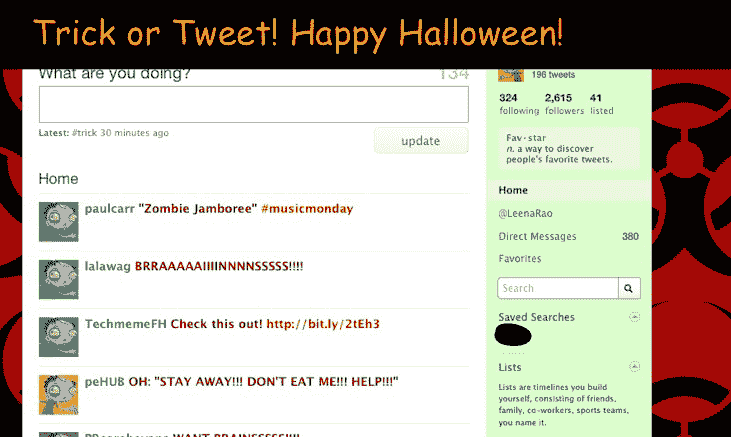
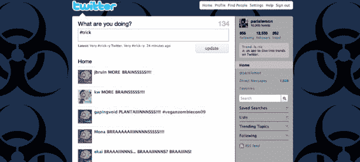

# 万圣节的 Twitter 技巧和款待 TechCrunch

> 原文：<https://web.archive.org/web/https://techcrunch.com/2009/10/30/twitter-tricks-and-treats-for-halloween/>

# 万圣节的推特技巧和款待

Twitter [发推文](https://web.archive.org/web/20221002131653/http://twitter.com/twitter/status/5295784041)今天发布了一条关于万圣节特别功能的消息，如果你发推文“#trick”或“#treat”一开始很难弄清楚，但是如果你从你的 Twitter 主页上发推文(这是关键，当你在客户端上时，你不能启用该功能)，你的主页背景将变得“残忍”，你页面上推文的头像将变成僵尸和食尸鬼。

触发它的方法是在推特上只发“#trick”或“#treat”而不发其他信息。 [#Treat](https://web.archive.org/web/20221002131653/http://twitter.com/#search?q=%23treat) 是推特上最热门的话题，所以看起来大众还没搞清楚。如果你只发布了#trick or #treat，它实际上并没有发布出去(如果你是从 Twitter 的网站上发布的)。万圣节快乐！

Twitter 在这个魔术中展示了一些不同的背景。这是我们找到的。

感谢 [@orli！](https://web.archive.org/web/20221002131653/http://twitter.com/Orli/status/5296400951)