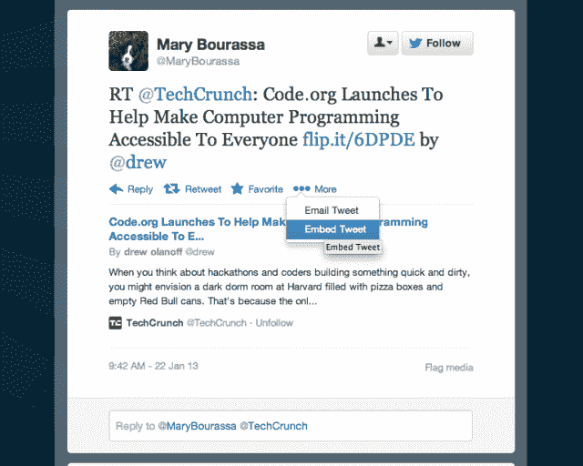
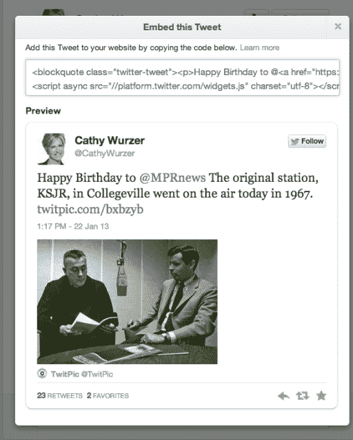

# Twitter 更新嵌入式推文，以包含更多内容、上下文、速度和易用性 

> 原文：<https://web.archive.org/web/https://techcrunch.com/2013/01/22/twitter-updates-embedded-tweets-to-include-more-content-context-speed-and-ease-of-use/>

# Twitter 更新嵌入式推文，以包含更多内容、上下文、速度和易用性

Twitter [昨天](https://web.archive.org/web/20221210020648/https://beta.techcrunch.com/2013/01/21/twitters-having-connectivity-issues-but-the-fail-whale-is-nowhere-to-be-found/)过得不是最好的一天。事实上，就保持其服务正常运行而言，这一周并不顺利。今天的公告可能会解释为什么该网站行为怪异，因为每当 Twitter 推出新代码或新功能时，它都会事先影响该网站。

公司[今天](https://web.archive.org/web/20221210020648/http://blog.twitter.com/2013/01/an-update-to-embedded-tweets.html)宣布，它已经调整了其嵌入式 tweets 产品，以包含更多内容。你为什么要嵌入推文？嗯，该公司不赞成截图，尤其是当你在一篇帖子中包含一条推文时。

除了可嵌入的 tweets，Twitter 还提供流媒体工具，这是他们[去年九月](https://web.archive.org/web/20221210020648/https://beta.techcrunch.com/2012/09/05/twitter-embeddable-timelines/)推出的。

这里有一个嵌入推文的例子:

[推特 https://twitter.com/CathyWurzer/status/293709035562233856]

> 今天，我们将推出几项增强功能，让嵌入式推文更吸引人、更有用、更快捷:
> 
> 更多的内容和语境。嵌入式推文显示推文中分享的照片、视频、文章摘要和其他内容，就像你在 twitter.com 上看到的一样。您还可以查看转发和收藏数量，以更好地了解参与度，我们对设计进行了一些调整，以便嵌入的推文更容易阅读。
> 
> 更快的装载。你会看到嵌入的推文在你访问的网站上显示得更快。
> 
> 轻松嵌入。现在，在自己的网站上嵌入推文甚至更容易了。只需点击 twitter.com 上任何推文中的“更多”按钮，然后选择“嵌入此推文”来丰富您的博客帖子或页面。你可以在 TweetDeck 上做同样的事情。

要嵌入一条推文，你所要做的就是当你在推文的登录页面上点击“更多”时，抓取 Twitter 提供给你的代码，并将其放入你的页面或博客帖子中。

很难在其他人的网站上提供内容，因为你不知道他们的网络服务器的状况和页面速度。这肯定与 Twitter 过去几个月的缓慢有关。例如，如果世界上最大的网站要嵌入任何一条推文，这就是 Twitter 正在提供的负载。

这绝对不是小事。通过保留推文的原始内容、链接和来源，媒体可以更好地从 Twitter 获取新闻故事。我在过去见过被篡改的截图，它们被当作原始推文。没有推文本身的链接，读者只能决定它是否可信。对于嵌入式 tweets，这不是问题，因为你可以简单地点击查看 Twitter 网站上的原始内容。

通过提供更多的“内容和背景”，你可以决定是否点击一条推文中的链接，就像你在 Twitter 的网站上一样。没有什么比点击了某样东西却没有获得巨大的时间回报更糟糕的了。这个功能是 Instagram 取消对 Twitter 卡片的支持的原因之一，希望人们链接到最初的 Instagram 网页，而不是“免费”看到照片。

[图片来源: [Flickr](https://web.archive.org/web/20221210020648/http://www.flickr.com/photos/stevegarfield/3616155715/)