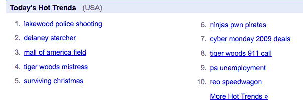

# Twitter 不追踪时代精神。只有 2%的推文与搜索趋势重叠。

> 原文：<https://web.archive.org/web/https://techcrunch.com/2009/11/29/twitter-zeitgeist-2-percent-overlap/>

# Twitter 不追踪时代精神。只有 2%的推文与搜索趋势重叠。

每当你想阅读当前的[时代精神](https://web.archive.org/web/20221209084911/http://www.beta.techcrunch.com/2008/12/10/to-really-understand-the-google-zeitgeist-you-need-to-dive-into-the-details/)时，流行的搜索词可以告诉你很多关于人们在想什么。例如，现在，谷歌趋势上最热门的搜索词包括“莱克伍德警察枪击案”、“老虎伍兹情妇”、“幸存的圣诞节”和“2009 年网络星期一交易”然而，如果你在 Twitter 上查看热门话题，你会看到“#isitme”、“Google Wave”和“灵魂列车奖”我怀疑只有最后一个可能成为热门搜索词。

热门搜索词和推特之间的重叠非常低(即使推特本身是一个[热门搜索词](https://web.archive.org/web/20221209084911/http://www.beta.techcrunch.com/2009/11/29/bings-2009-top-search-term-michael-jackson-beats-our-twitter/))。几周前，我在主持一个实时搜索小组时，Vik Singh(Yahoo Boss 背后的工程师，即将成为 Sutter Hill Ventures 的 [EIR)宣称，只有 2%的推文匹配热门搜索词。](https://web.archive.org/web/20221209084911/http://www.beta.techcrunch.com/2009/11/25/yahoo-boss-loses-vik-singh/)

他的数据来自对去年夏天他抓取的 1000 万条推文的分析。他查看了所有的推文，而不仅仅是热门话题。当他剔除不必要的词时，他发现平均每条推文包含 6.28 个词，相当于一个真正好的搜索查询。但是人们在推特上谈论的内容和普通大众搜索的内容之间并没有太多的重叠。也许这是因为人们倾向于搜索他们不知道的东西，而他们在推特上谈论他们知道或认为他们知道的东西。也可能只是因为推特上的人不正常。

辛格发现了其他一些数据:

*   带有网址的推文比例:约 18%
*   (唯一网址的百分比:~65%)
*   邮件@回复或其他@x 术语的百分比:~37%
*   带有#标签的邮件百分比:~7%
*   被转发的邮件百分比:~1%

同样，这些数据是基于 1000 万条推文的抓取，但这些推文是在 7 月底，也就是 Twitter 将转发作为该服务的官方功能之前。所以如果转发率还这么低，我会很惊讶。现在推特上的人也多了很多，所以也许人们推特的主题现在与搜索趋势的重叠超过了辛格发现的 2%。如果今天有人进行同样的分析，将会很有启发性。直到推特成为网络上每个人(不仅仅是技术专家和其他早期用户)的日常习惯，推特将不会反映普遍的时代精神。

但它确实反映了你所关心和追随的人的时代精神。也许最终这才是最重要的。