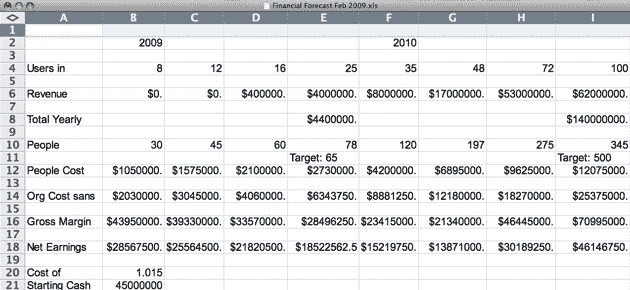

# Twitter 的财务预测显示第三季度首次实现收入，2013 年用户将达到 10 亿 

> 原文：<https://web.archive.org/web/https://techcrunch.com/2009/07/15/twitters-financial-forecast-shows-first-revenue-in-q3-1-billion-users-in-2013/>

# Twitter 的财务预测显示，2013 年第三季度首次实现收入，用户将达到 10 亿

我们与 Twitter(或者更确切地说是 Twitter 的律师)就我们打算[向](https://web.archive.org/web/20230213030240/https://techcrunch.com/2009/07/14/in-our-inbox-hundreds-of-confidential-twitter-documents/)发布 310 份被黑客窃取的机密文件的一小部分的谈判仍在继续。今天早上早些时候，我们发布了第一份文件，一个名为“最终推特”的电视真人秀节目的[推介](https://web.archive.org/web/20230213030240/https://techcrunch.com/2009/07/15/final-tweet-the-twitter-reality-tv-show-pitch/)。

然而，更有趣的是 2009 年 2 月的 Twitter 内部财务预测。Twitter 告诉我们，这从来就不是一份官方文件，当然也不再准确。尽管如此，它还是让人对该公司的财务目标有了有趣的一瞥。这些预测一直持续到 2013 年。

最有趣的数据点——截至 2 月，Twitter 预计他们的第一笔收入将在 2009 年第三季度(现在)实现。第四季度的预期收入为 40 万美元，其次是 400 万美元。该文件还显示了 Twitter 的预计用户增长(到 2009 年底达到 2500 万)，这绝对是已经突破的。到 2010 年底，Twitter 预计营收将达到 1.4 亿美元。

截至 2 月，该公司在银行有 4500 万美元存款(当时他们已经筹集了 5500 万美元)。他们预计每个 Twitter 用户给公司带来的成本将超过 1 美元/年。

我们只包括到 2010 年的预测，接下来三年的数据太不可靠，没有用。但这是他们 2013 年底的目标数字:10 亿用户，15.4 亿美元的收入，5200 名员工和 11 亿美元的净收入。

那么，他们认为本季度将带来 40 万美元收入的产品是什么呢？这是我们将在下一篇文章中讨论的内容。

