# Twitter 的内部战略暴露无遗:成为“地球的脉搏”

> 原文：<https://web.archive.org/web/https://techcrunch.com/2009/07/16/twitters-internal-strategy-laid-bare-to-be-the-pulse-of-the-planet-2/>

周二晚上，超过 300 份推特机密文件和截图进入了我们的收件箱。我们说过我们将只发布一小部分，在过去的 36 个小时里，我们花了很多时间直接在 Twitter 上谈论如何正确地去做这件事。几天后，我们将对这一过程有更多的了解。

这些文件包括雇佣协议、创始人的日历、新员工面试时间表、电话记录和账单、闹钟设置、一份[财务预测](https://web.archive.org/web/20230403225931/https://techcrunch.com/2009/07/15/twitters-financial-forecast-shows-first-revenue-in-q3-1-billion-users-in-2013/)、一份 [Twitter 电视节目](https://web.archive.org/web/20230403225931/https://techcrunch.com/2009/07/15/final-tweet-the-twitter-reality-tv-show-pitch/)的推介、与 AOL、戴尔、爱立信和诺基亚等公司的保密协议、一份员工饮食限制清单、信用卡号码、Paypal 和 Gmail 截屏等等。

这是我们要分享的最后两份文件:2009 年 2 月 12 日至 6 月 9 日期间召开的一系列高管会议的详细记录的子集。这些笔记中的许多信息要么是个人性质的(新员工等)。)或者过于敏感不愿分享。其余有趣的是，我们在这里张贴我们的评论。这些笔记包括 Twitter 与谷歌、微软和其他公司之间从未披露过的讨论，以及产品规划、公司目标、员工保留和新提议的服务条款和 API 的细节。甚至像 CoTweet 和 Twitpic 这样的收购目标也被讨论过(有时被驳回)。值得注意的是，Twitter 为我们发布这些信息开了绿灯——他们对此并不高兴，但他们能够忍受，他们说(在我们稍后的帖子中会详细介绍他们为什么这样做)。

另一个警告——正如我们之前说过的，这些文件是粗略的会议记录，不是为广泛消费而精心制作的文件。有很多错别字和过时的信息。但从积极的一面来看，它的不成熟显示了这个团队的奉献精神和对将 Twitter 打造成世界级公司的深切承诺。

最后，有一些关于合作伙伴讨论的细节，特别是围绕谷歌和微软的，我们只是不打算公布。几个月来，Twitter 一直在与两家公司就一系列交易进行谈判。但我们不会详细讨论具体讨论了什么，或者 Twitter 对这些谈判的策略。因此，虽然下面的讨论看起来有很多细节，但最敏感的内容已经被删除了。

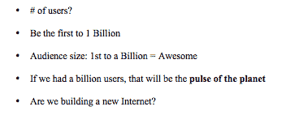

让我们从 2009 年 2 月 25 日的一次重要战略会议说起。战略会议记录中列出的大胆目标之一是让 Twitter 成为第一个拥有 10 亿用户的网络服务。笔记以要点形式排列，每一条读起来都像一条推文:“如果我们有 10 亿用户，那将是地球的脉搏。”在会议上，斯通试图通过称其为“神经系统”而不是警报系统来说明 Twitter 是什么。

自二月以来发生了很多事情。Twitter 的网站已经从美国 T2 的大约 400 万访客增加到 T4 的 2000 万访客，而全球的访客几乎是这个数字的两倍。然而，这些注释提供了一个难得的视角，让人们得以了解该公司在进入当前高速增长阶段之前的战略思维。

[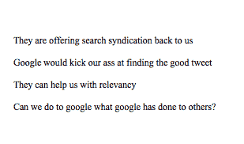 ](https://web.archive.org/web/20230403225931/https://techcrunch.com/wp-content/uploads/2009/07/13.png) **应对谷歌**:在过去的六个月里，Twitter 会议上的大部分讨论都围绕着应对谷歌和脸书。例如，在 2009 年 3 月 13 日的一次管理会议上，在讨论与谷歌的搜索交易时，有人表示担心“谷歌会在寻找好的推文方面踢我们的屁股。”但是紧接着，有人问，“我们能像谷歌对其他人做的那样对谷歌做吗？”

在 5 月 7 日的管理层会议上，讨论了 Twitter 与谷歌的搜索联合战略，以及“每个科技公司”获得“Hosebird”的愿望，Twitter 正在开发一个 API，向搜索合作伙伴和其他人提供完整的推文流。对谷歌的态度是谨慎的:“在这里玩火，我们知道谷歌正在打造有竞争力的产品。”

[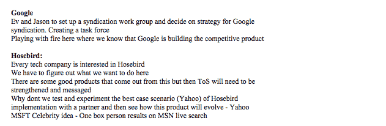](https://web.archive.org/web/20230403225931/https://techcrunch.com/wp-content/uploads/2009/07/7.png) 但是到了 6 月 9 日，谷歌的事情似乎有了进展。在与谷歌高管进行了两个小时的会谈后，Twitter 领导层决定“在一段时间内达成协议是有意义的——根据我们的参数。”但与此同时，他们决心让 Twitter 自己的“搜索结果页面变得更好——比谷歌的登陆页面更好。” [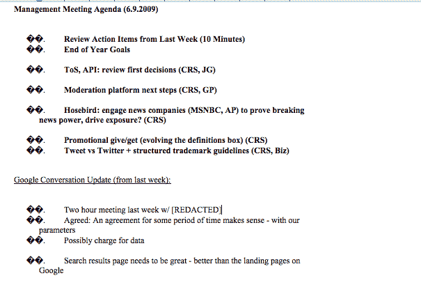](https://web.archive.org/web/20230403225931/https://techcrunch.com/wp-content/uploads/2009/07/9.png) **公司目标和新的 TOS/API**:在 6 月 9 日的同一次会议上，Twitter 高管谈到了他们的年终目标，包括“下一代搜索结果页面”和(急需的)声誉系统，内部称之为“Tweet rank”该公司还在努力定义一个新的服务协议条款，它将与新的 API 一起发布。这些将决定 Twitter 将有权通过广告赚钱的商业信息类型。Twitter 希望“获得内容的广泛许可，但有两个例外(认可、内容盈利)，并且不能选择退出。”Twitter 还谈到让其 API 许可“比 ToS 更受限制”

[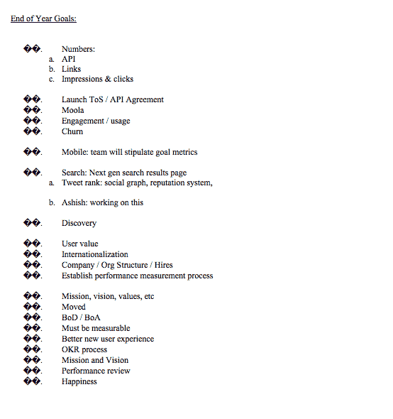 ](https://web.archive.org/web/20230403225931/https://techcrunch.com/wp-content/uploads/2009/07/91.png) [ 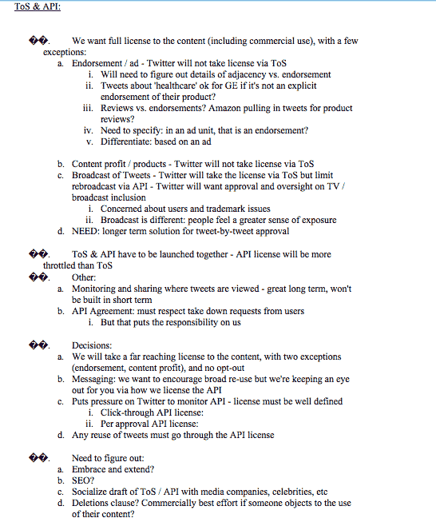](https://web.archive.org/web/20230403225931/https://techcrunch.com/wp-content/uploads/2009/07/92.png)

Diddy、Marissa 和微软:笔记中的另一件事是每个人都有多喜欢 Twitter。2009 年 4 月 16 日 Twitter 管理层会议的议程主题读起来就像好莱坞和硅谷的名人录:迪迪、奥普拉、玛丽莎·梅耶尔、微软、4Chan。他们讨论给艺人 Diddy“顾问股份”，Diddy 是一个大的高音歌手，但也认为他是一个分散注意力的人。“迪迪比我们更重视他的贡献，”会议记录上写道。在 4 月 2 日的早些时候的一次会议上，讨论的其他潜在顾问包括沙克和戈尔(推测两人也将获得顾问股份)。

如果 Diddy 是一个干扰，谷歌产品总监 Marissa Mayer 是一个“巨大的干扰”，他一直要求 Twitter 的增长统计数据。Twitter 管理层决定给她“一个受约束的增长版本”。最后，微软想谈一笔深度的基础设施交易(“我们现在不想谈这个”)和一个“x-box 的秘密项目”。

[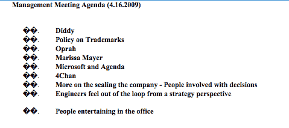 ](https://web.archive.org/web/20230403225931/https://techcrunch.com/wp-content/uploads/2009/07/16-diddy-oprah.png) [ 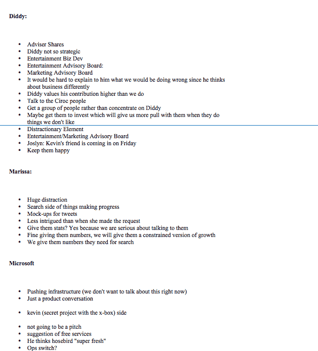](https://web.archive.org/web/20230403225931/https://techcrunch.com/wp-content/uploads/2009/07/16.png)

尽管有兴趣和关注，但 Twitter 管理层真正想要的似乎是不被打扰，甚至是被自己的董事会成员打扰。在 5 月 7 日的一次会议上，他们讨论了如何以一种不错的方式推迟信息会议:“我们如何与董事会(和投资者)沟通，让他们放弃。”

[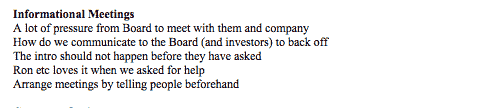](https://web.archive.org/web/20230403225931/https://techcrunch.com/wp-content/uploads/2009/07/71.png)

**与投资银行家交换人情:**5 月 26 日，Twitter 管理团队讨论了选择投资银行家的问题，他们的想法是让投资银行家参与“一年半的时间——交换人情，然后利用他们进行交易”尚不清楚“交易”是什么，但它只能是 IPO 或收购。

管理信息:5 月 26 日的会议记录也揭示了 Twitter 如何管理媒体。有消息称一部 [Twitter 电视节目](https://web.archive.org/web/20230403225931/https://techcrunch.com/2009/05/25/twitter-heads-to-hollywood-plans-to-develop-tv-show)正在筹备中，Twitter 决定需要“消除 Twitter 将推出一部电视节目的报道”。信息:有许多推特用户——没有一个得到官方的祝福。
[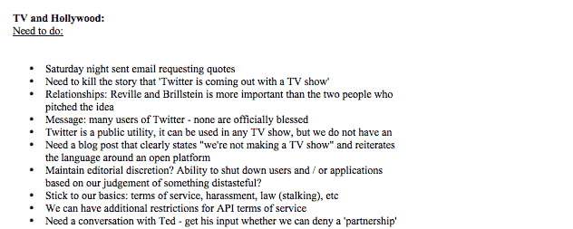](https://web.archive.org/web/20230403225931/https://techcrunch.com/wp-content/uploads/2009/07/261.png)

**身份危机**:让我们回到 2 月 25 日的那个关键战略会议上来(从现在开始我会试着按时间顺序进行)。从笔记中可以明显看出，该公司仍在努力定义自己:一些定义公司使命的内容包括“Twitter 是为了发现和分享当前正在发生的事情”，以及“Twitter 让你更聪明、更快、更高效、更强大。”以下是从整个文档中摘录的内容。

[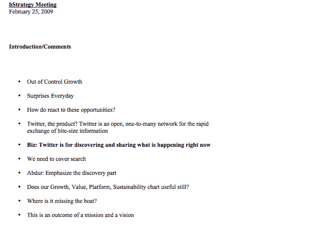](https://web.archive.org/web/20230403225931/https://techcrunch.com/wp-content/uploads/2009/07/tw-strat-intro.png)

**收购焦虑:**这次会面发生在去年秋天与脸书的收购[谈判破裂](https://web.archive.org/web/20230403225931/https://techcrunch.com/2008/11/24/acquisition-dance-between-facebook-and-twitter-over-for-now/)之后，在此之前，今年春天与谷歌的类似谈判也[无果而终](https://web.archive.org/web/20230403225931/https://techcrunch.com/2009/04/03/twitter-wouldnt-sell-for-1-billion-says-source/)。会议的大部分时间都在讨论 Twitter 的收购焦虑，并试图决定“我们长大后想做什么？”该公司有“IPO 偏好”，但意识到它将“永远不得不开放退出。”“我们唯一感兴趣的收购类型是我们继续掌控的那种。”也许这就是扼杀脸书协议的原因。Twitter 管理层认为“出售脸书似乎总是错的”，这是“Twitter 的错误命运”

[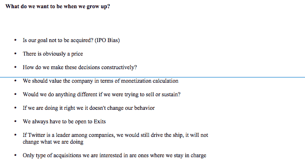](https://web.archive.org/web/20230403225931/https://techcrunch.com/wp-content/uploads/2009/07/tw-strat-acquisition-angst.png)

[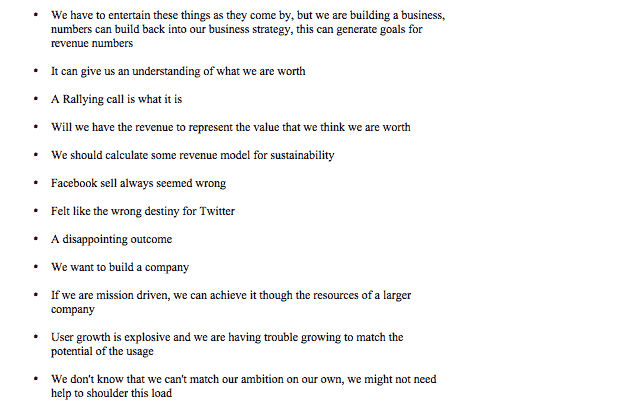](https://web.archive.org/web/20230403225931/https://techcrunch.com/wp-content/uploads/2009/07/tw-strat-acquisition-angst-2.png)

脸书威胁:脸书威胁不断出现。在会议的一部分专门讨论“脸书怎么能杀死我们？”他们列举了一些威胁，比如脸书采用[实时搜索](https://web.archive.org/web/20230403225931/https://techcrunch.com/2009/06/16/facebook-fixes-search-but-only-in-beta/)，改变选择加入选项以公开[状态信息](https://web.archive.org/web/20230403225931/https://techcrunch.com/2009/06/24/facebook-brings-privacy-controls-to-publisher/)，强调其[短信功能](https://web.archive.org/web/20230403225931/https://techcrunch.com/2009/05/04/showing-its-twitter-envy-facebook-gets-serious-about-sms/)，以及普遍抄袭 Twitter 的功能和用户界面[(所有这些都已经开始发生)。](https://web.archive.org/web/20230403225931/https://techcrunch.com/2009/03/04/facebooks-response-to-twitter/)

[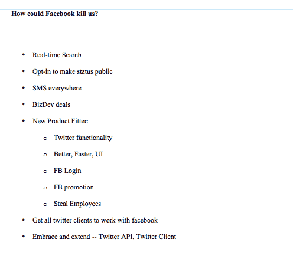](https://web.archive.org/web/20230403225931/https://techcrunch.com/wp-content/uploads/2009/07/tw-strat-fb-kill-us-2.png)

防御策略:公司也考虑如何最好地防御脸书。“确保人们开心”排在第一位，接下来是“邪教”和“获得更多更好的开发者。”做得更好，让“推特无处不在”似乎是它最好的防御。

[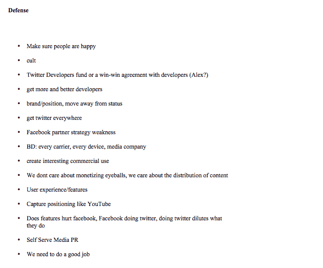](https://web.archive.org/web/20230403225931/https://techcrunch.com/wp-content/uploads/2009/07/tw-strat-defense-against-facebook.png)

[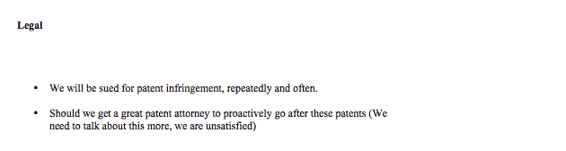](https://web.archive.org/web/20230403225931/https://techcrunch.com/wp-content/uploads/2009/08/twitter-legal-threats-patents.png)

实时搜索:Twitter 显然很关心如何让自己与两个主要竞争对手和潜在收购者竞争。与在 Twitter 上发现“现在正在发生什么”相反，“谷歌是旧闻。”然而，在会议期间，该公司显然全神贯注于搜索:“twitter 产品是 Twitter 搜索的工具；“人们不使用 twitter 进行搜索；“Twitter 应该告诉我一些事情，而不需要我去搜索。"

【T2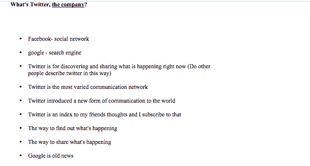

[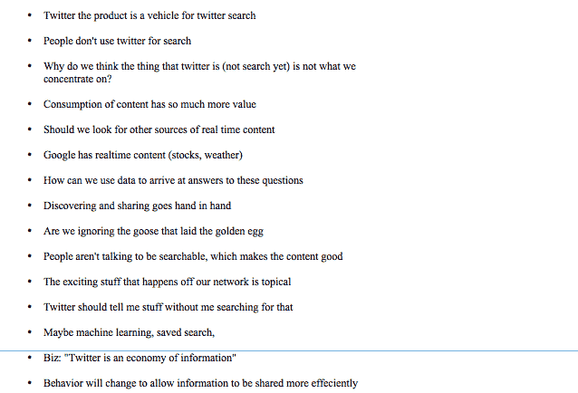](https://web.archive.org/web/20230403225931/https://techcrunch.com/wp-content/uploads/2009/07/tw-strat-what-is-twitter-2.png)

**财务**:该公司谈论其财务模式，该模式归结为“每个用户每年产生 1 美元”，从 2009 年底的 2500 万用户增加到 2013 年的 10 亿用户，用户被定义为“在给定的一周内有意识地使用 twitter 的独特个人”

[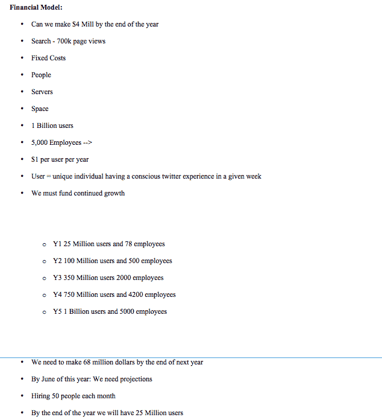](https://web.archive.org/web/20230403225931/https://techcrunch.com/wp-content/uploads/2009/07/tw-strat-financial-model.png)

**收入模式**:战略会议还涵盖了未来的收入模式，从[经过验证的商业账户](https://web.archive.org/web/20230403225931/https://techcrunch.com/2009/06/06/facing-lawsuits-and-complaints-from-celebs-twitter-launches-verified-accounts/)开始，这被描述为“最快的赚钱方式，无需整个组织的支持。”瞄准企业和名人用户的另一个好处是:“向更少的用户收取更多的费用是一个好模式。”

但接下来的商业模式才开始变得有趣。这些包括搜索/内容广告(搜索 API 的大量用户需要运行广告)、赞助推文、“Adsense Widgets”(可能是可以在谷歌的 Adsense 等其他网站和其他应用程序中运行的 Twitter 广告)和支付。

[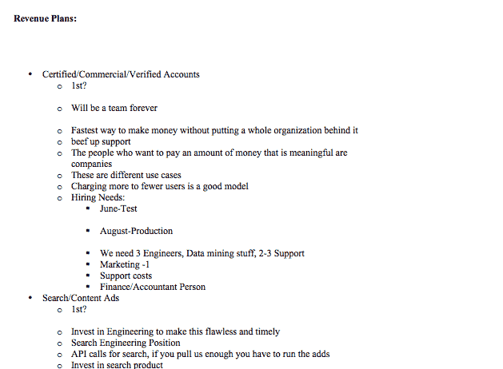](https://web.archive.org/web/20230403225931/https://techcrunch.com/wp-content/uploads/2009/07/tw-strat-revenue-plans.png)

[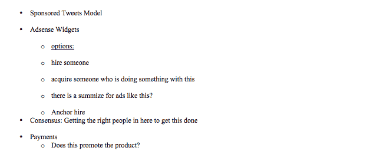](https://web.archive.org/web/20230403225931/https://techcrunch.com/wp-content/uploads/2009/07/tw-strat-revenue-plans-2.png)

达到 10 亿用户:大多数商业模式的关键是不断吸引更多用户，公司在如何获得用户方面有一些创造性的想法。其中包括:“预装 twitter 的免费手机”、“电视 twitter”、“Kindle”、“收音机”、“戴尔、内置于”、“视频游戏控制台、网站插件、即时通讯网络和个人电脑”。他们也意识到“如果我们明天有十亿用户，成本会杀了我们。”

[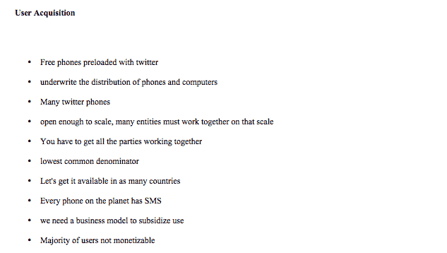](https://web.archive.org/web/20230403225931/https://techcrunch.com/wp-content/uploads/2009/07/tw-strat-user-acquisition1.png)

[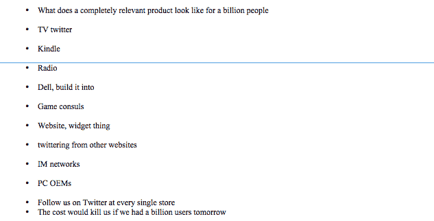](https://web.archive.org/web/20230403225931/https://techcrunch.com/wp-content/uploads/2009/07/tw-strat-user-acquisition-2.png)

RSS 是我们的敌人:他们担心的另一项开支是支持所有迁移到 Twitter 的 RSS 提要。运行 Twitter 的人肯定不喜欢 RSS，而[谁能责怪他们呢？](https://web.archive.org/web/20230403225931/http://www.techcrunchit.com/2009/05/05/rest-in-peace-rss/)会上表达的最大担忧是，“如果所有的订阅源都通过 twitter:会很贵吗？”以及“订阅源不是唯一的内容。”(他们也是[太慢](https://web.archive.org/web/20230403225931/https://techcrunch.com/2009/07/09/speeding-up-rss/)，但那是另一个问题)。
[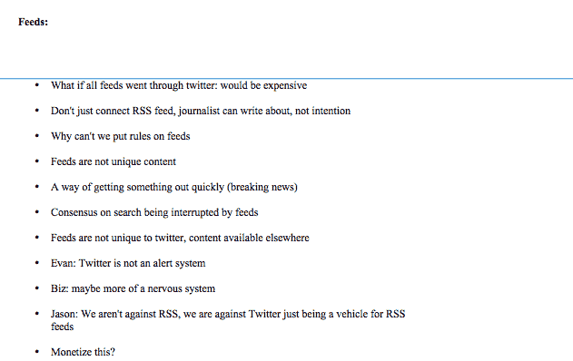](https://web.archive.org/web/20230403225931/https://techcrunch.com/wp-content/uploads/2009/07/tw-strat-feeds.png)

**2009 年 3 月 12 日会议(回到谷歌):**在 3 月 12 日的一次管理层例会上，谷歌的话题再次出现。谷歌的博客搜索团队搜索了 Twitter 的网站，只得到“60-70%的更新”他们希望 Twitter 加快其 Hosebird API，这样他们就可以开始索引每一条推文。计划是“包括 blogsearch.google.com 的微博内容(比推特搜索得到的少)。”Twitter 已经占据了谷歌博客搜索“90%的内容”。正如会议记录所说:“我们就是这个产品。”还有人说，将微博结果放在主搜索页面上，这将是“谷歌搜索多年来最大的变化”

【T12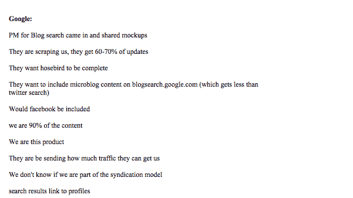[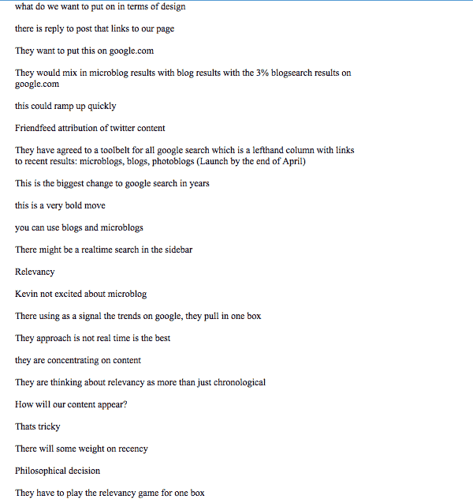](https://web.archive.org/web/20230403225931/https://techcrunch.com/wp-content/uploads/2009/07/121.png)[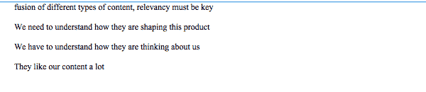](https://web.archive.org/web/20230403225931/https://techcrunch.com/wp-content/uploads/2009/07/122.png)

在 3 月 12 日的同一次会议上，Twitter 还与微软就拟议中的搜索广告合作进行了激烈的争论。团队“还没有准备好”，认为这又是一次“分心”有人担心这会使 Twitter 的工程资源紧张，与微软的任何合作都会引发品牌问题:“这会让人觉得我们在约会。”董事会还担心 Twitter“与微软同流合污”。在讨论结束时，有人会问，“为什么我们一开始就开始与微软对话”？

[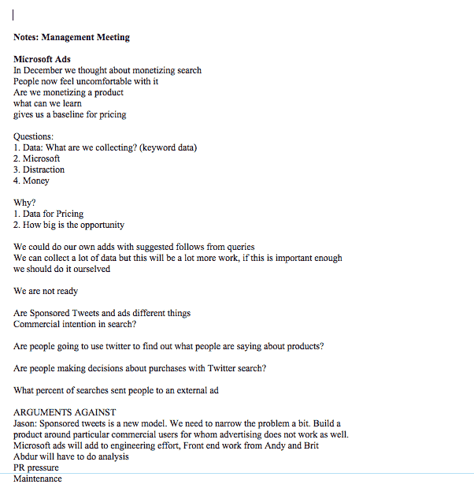](https://web.archive.org/web/20230403225931/https://techcrunch.com/wp-content/uploads/2009/07/123.png)[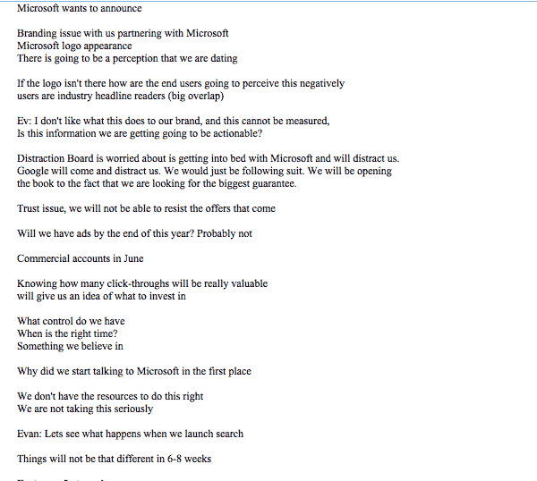](https://web.archive.org/web/20230403225931/https://techcrunch.com/wp-content/uploads/2009/07/124.png)**Twitpic，Photobucket，Tweetie:**Twitter 在赶走微软和谷歌的同时，也在培养规模较小的创业公司。在同一个 3 月 12 日的会议上，一个议程项目是“Twitpic-买还是不买(1)”他们决定不这么做，第二周在 3 月 19 日的一次会议上，他们决定“祝福”一款名为 [Twitgoo](https://web.archive.org/web/20230403225931/http://twitgoo.com/) 的竞争 Photobucket 应用。Twitter 还在 3 月 26 日的一次会议上决定“我们喜欢 Tweetie”，这是一款流行的移动 Twitter 客户端。【T10[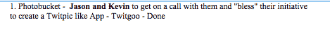](https://web.archive.org/web/20230403225931/https://techcrunch.com/wp-content/uploads/2009/07/19.png)
[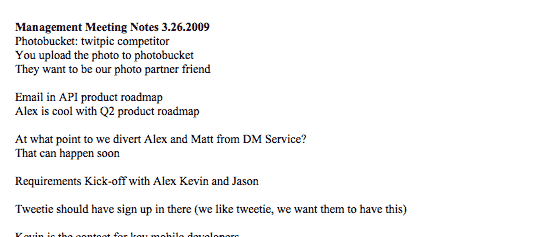](https://web.archive.org/web/20230403225931/https://techcrunch.com/wp-content/uploads/2009/07/26-photobucket-tweetie.png)

**另一个收购对象:CoTweet** 。最近，在 6 月 2 日的一次会议上，CoTweet 和支持商业账户的需求出现了，合作、购买或雇佣的需求也出现了，就像过去一样。而 CoTweet 似乎被确定为“另一个收购目标”。

【T2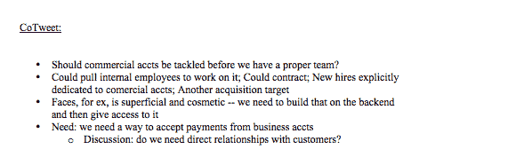

你也可以看到没有得到 Twitter 支持的初创公司会发生什么。在 5 月 7 日的一次会议上，Twitter 首席执行官伊万·威廉姆斯“没有被小额支付初创公司 [Mogees](https://web.archive.org/web/20230403225931/http://www.crunchbase.com/company/mogees) 吹走”，因为“Paypal 和亚马逊可以做到这一点”Mogees 似乎不再服役了。
[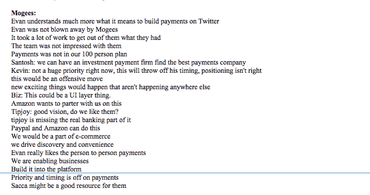](https://web.archive.org/web/20230403225931/https://techcrunch.com/wp-content/uploads/2009/07/73.png)

**2009 年 4 月 30 日，留住员工(“快乐委员会”)** : Twitter 的管理层会议也讨论了很多如何留住员工的问题。4 月 30 日的管理会议记录谈到了从脸书招聘，并指出:“人们不是离开工作，而是离开经理，”他们“离开让他们难过的情况。”为了防止这种情况在 Twitter 上发生，有人提议成立一个“幸福委员会”。那应该有用。
[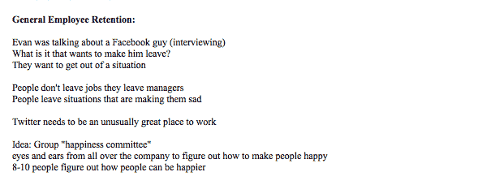](https://web.archive.org/web/20230403225931/https://techcrunch.com/wp-content/uploads/2009/07/30.png)

**没有什么是永远免费的** : 在 4 月 30 日的同一次会议上，该团队谈到了向合作伙伴许可推特:“我们可以免费给人们东西，但不是永远。”还有一场关于用户应该如何选择不通过电视节目等其他媒体联合发布推文的有趣讨论。提出的一个想法是，您的推特只能由与您已经有关系的其他人或实体联合发布。
[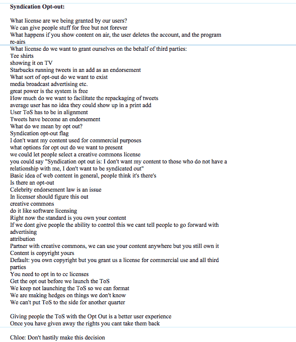](https://web.archive.org/web/20230403225931/https://techcrunch.com/wp-content/uploads/2009/07/301.png)

**搜索即发现**:4 月 30 日的另一个有趣的讨论与搜索即发现和一位斯坦福客座教授的工作有关。考虑了每个跟随者收费的概念。
[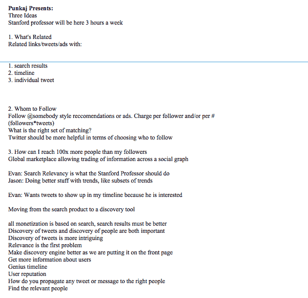](https://web.archive.org/web/20230403225931/https://techcrunch.com/wp-content/uploads/2009/07/72.png)

**转发(一场“原力骚动”)**:最后，大家最喜欢的话题，转发，在 6 月 2 日的会议上被提了出来。看起来推特将把它作为一个正式的功能，但是伊万·威廉姆斯担心转发会被“打断”，因为它变得“很难阅读谁写了，人们编辑了实际上说了什么”。“嗯，是啊。只有 140 个字符。

[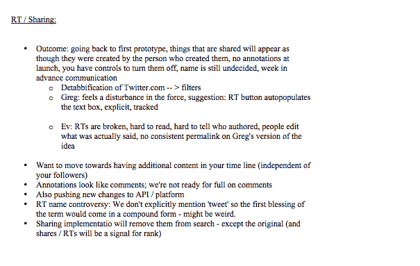](https://web.archive.org/web/20230403225931/https://techcrunch.com/wp-content/uploads/2009/07/22.png)