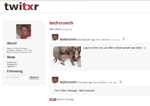

# Twitxr -类似 Twitter，有图片。是的，这是摄影博客。TechCrunch

> 原文：<https://web.archive.org/web/https://techcrunch.com/2008/02/17/twitxr-like-twitter-with-pictures-yeah-its-photoblogging/>

# twitxr——像 Twitter 一样，有图片。是的，这是摄影博客。

 FON(更出名的是建立了一个 [WiFi 社区](https://web.archive.org/web/20221126130309/http://www.crunchbase.com/company/fon))今天通过他们的 [FON Labs](https://web.archive.org/web/20221126130309/http://labs.fon.com/) 组推出了 [Twitxr](https://web.archive.org/web/20221126130309/http://www.twitxr.com/) 。基本上，它是 Twitter，但允许在发送消息时上传图片(这使得它对拍照手机特别有用)。FON 创始人[马丁·瓦萨夫斯基](https://web.archive.org/web/20221126130309/http://www.crunchbase.com/person/martin-varsavsky)在其博客上公布了产品[。](https://web.archive.org/web/20221126130309/http://english.martinvarsavsky.net/general/fon-labs-launches-twitxr-for-the-iphone-and-all-computers.html)

所以，是的，基本上它是一个摄影博客。不过，你可以很容易地设置它，让它自动将你的信息发送到 Twitter 和脸书，这很有用。我的 Twitxr 账号是[这里](https://web.archive.org/web/20221126130309/http://www.twitxr.com/techcrunch/)。这里有一个[消息被复制到 Twitter 的例子](https://web.archive.org/web/20221126130309/http://twitter.com/TechCrunch/statuses/723635412)。我喜欢的另一个特点是，你告诉它你在哪里，所以位置信息包括在内。

瓦萨夫斯基说这是专门为 iPhone 设计的，他们已经开发了[软件](https://web.archive.org/web/20221126130309/http://www.twitxr.com/iphoneclient/)，使得从 iPhone 上传文本和照片变得非常容易。不过，作为第三方应用，它还不能在 iPhone 上正式使用。你必须“越狱”手机，然后才能安装他们的应用程序。看起来你也不能简单地从 iPhone 上抓取一张平常拍摄的照片。你必须通过 Twitxr 应用程序启动照片。该应用程序自动将位置信息添加到您的照片和更新中。

Twitxr 是 Twitter 出现的第十个变种(见 [Jaiku](https://web.archive.org/web/20221126130309/http://www.crunchbase.com/company/jaiku) ( [被 Google](https://web.archive.org/web/20221126130309/http://www.beta.techcrunch.com/2007/10/09/google-buys-social-mobile-startup-jaiku/) 收购) [Pownce](https://web.archive.org/web/20221126130309/http://www.crunchbase.com/company/pownce) 等)。一个克隆人甚至[去了死池](https://web.archive.org/web/20221126130309/http://www.beta.techcrunch.com/2007/06/21/german-twitter-clone-dukudu-for-sale-on-ebay/)。这甚至不是第一个包含照片的 Twitter 变体——见 [Zannel](https://web.archive.org/web/20221126130309/http://www.beta.techcrunch.com/2007/10/01/zannel-twitter-with-pictures-and-video/) 。这也是 Dave Winer 在他的[Flickr Twitter](https://web.archive.org/web/20221126130309/http://www.twittergram.com/flickrtotwitter/)项目中一直在做的事情——将你的新 Flickr 照片链接发送到你的 Twitter 账户。照片博客并不是什么新鲜事。因此，尽管 Twitxr 很漂亮，但 FON 应该坚持使用 wifi。

**更新:**我实际上打算重新越狱我的 iphone 来测试这个软件——上传是如此容易，而且它添加了位置信息，这一点值得注意。如果效果真的很好，这实际上可能是我停止直接在 Twitter 上发帖的原因。