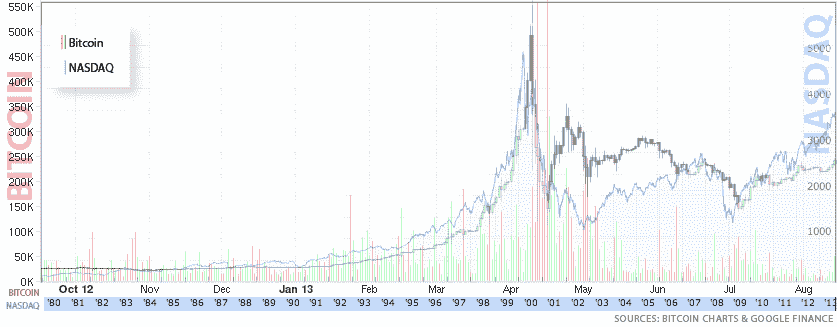

# 两次繁荣，两次萧条:比特币如何步纳斯达克的后尘 

> 原文：<https://web.archive.org/web/https://techcrunch.com/2013/09/11/two-booms-two-busts-how-bitcoin-is-following-in-the-nasdaqs-footsteps/>

# 两次繁荣，两次萧条:比特币如何步纳斯达克的后尘

昨天在 TechCrunch Disrupt 上，我们主持了一个讨论比特币的小组(点击这里可以找到一个[摘要](https://web.archive.org/web/20221003204429/https://beta.techcrunch.com/2013/09/10/disrupt-sf-13-bitcoin-panel/))。在讨论过程中，我注意到一些有趣的事情:比特币价格的前一次繁荣，以及随后的不应期，与纳斯达克在 90 年代末臭名昭著的繁荣非常相似。

出于好玩，我们为每一个都做了一个图表，并将它们堆叠在一起，如下图所示:

【T2

*(显然，我们制作这张图表是为了表明一个观点:抱怨我们如何调整它的评论将被忽略。)*

从这能得到什么？至少在某些情况下，繁荣是非常相似的。这里的安全性并不重要，在这种情况下，公众股票与数字加密货币相对抗。有趣的是，交易的内容没有围绕它的市场情绪重要。

有一个漫长、缓慢、有分寸的低 VIX 期(波动性有限的时期)，随后是疯狂飙升。接下来是剧烈的调整，市场测试新的支撑位，然后是缓慢的倾斜。

或者，换句话说，比特币的表现极其正常——尽管它是一种全新的金融工具。为了好玩，在心理上比较一下当比特币突破 200 美元大关时围绕着它的几乎令人捧腹的炒作，以及允许纳斯达克达到其峰值价格的愚蠢的市场状况。本质上是一样的:缺乏远见加上害怕错过。

无论如何，比特币的历史并不太混乱。事实上，这绝不是:这是我们应该预料到的。现在，[下一个](https://web.archive.org/web/20221003204429/https://beta.techcrunch.com/2013/09/10/disrupt-sf-13-bitcoin-panel/)是什么？

*顶级形象功劳:[乔·杰克曼](https://web.archive.org/web/20221003204429/http://www.flickr.com/photos/jojakeman/)*