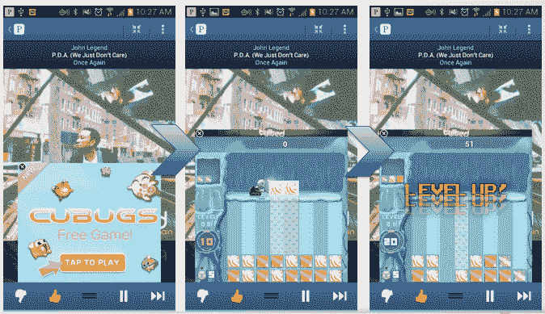

# Tylted 推出 GameDrop，这是一种新的基于广告的手机游戏应用程序网络 TechCrunch

> 原文：<https://web.archive.org/web/https://techcrunch.com/2012/11/16/tylted-launches-gamedrop-a-new-kind-of-in-app-ad-based-network-for-mobile-games/>

当谈到最卖座的应用程序时，手机游戏占据了排行榜的主导地位，但这种受欢迎程度也滋生了许多竞争。[最近从 Cellufun](https://web.archive.org/web/20221207045549/http://www.tylted.com/) 更名为[的游戏发行商 Tylted](https://web.archive.org/web/20221207045549/https://beta.techcrunch.com/2012/04/10/hmtl5-mobile-gaming-site-cellufun-is-now-tylted-eyes-up-substantial-facebook-play-virtual-goods-ads/) 希望通过 GameDrop 利用这一机会，game drop 是一种新的发行网络，利用现有的广告平台提供应用内游戏覆盖，Pandora 是首批签约与之合作的应用发行商之一。

GameDrop 的工作方式是这样的:Tylted 将其基于 HTML5 的广告服务器与一家应用发行商现有的广告服务器集成在一起。在有闲置库存的地方，Tylted 会从 GameDrop 的网络中插入游戏促销信息。Tylted 表示，这些广告反过来又是有效嵌入到其他应用中的游戏。要播放它们，用户不需要离开现有的应用程序或下载任何东西:他们点击它们，在该应用程序的“顶部”展开一个覆盖图。看起来是这样的:

Tylted 也在测试其他内容的格式:它还与 Beintoo 一起在 Pandora 的应用程序中进行了一次较小的试验，bein too 是一个奖励/忠诚度平台，当游戏玩家通过 GameDrop 玩游戏达到里程碑时，会向他们提供交易。这些产品的转化率为 4%。

Tylted 发布社交游戏、数字棋盘游戏、智力游戏和赌场主题游戏，每月有 1000 万独立访客。tyl ted 表示，它已经申请了这项技术的专利，并表示这项技术可以在任何平台和任何设备上运行。但目前，GameDrop 只能在本地应用上运行，不能在网络应用上运行。

为了在向其他游戏发行商发布之前看看这是否可行以及如何运作，Tylted 在 10 月份对其自己的内容进行了测试:它在 Pandora 的 iOS 和 Android 应用程序上为其 Cubugs 游戏开展了一场活动。

在 4500 万次展示中，Cubugs 获得了额外的 80 万次注册和 1000 万分钟的播放时间。Tylted 的首席执行官 Lon Otremba 表示，这次试验非常成功，足以让 Pandora 成为 GameDrop 商业发布的合作伙伴。他说，其他几家大型出版商也已经签约，尽管他们的名字还没有公开。至于游戏开发者，除了 Tylted 自己发布的游戏之外，他们中的 8 个也将推出游戏 Drop。奥特伦巴说，到今年年底，这个数字可能会达到 20。

奥特伦巴认为，GameDrop 不仅给了游戏公司一种更直接的向用户交付游戏的方式，还给了应用发行商一种销售更多广告空间的方式。“看到所有的广告库存都浪费在手机上是很痛苦的，”他说。"泰勒德的 GameDrop 让这些未使用的库存发挥了作用."

Tylted 现在正在“积极地”扩大 GameDrop，不仅与出版商和游戏开发商建立更多的合作伙伴关系，还与广告商建立合作伙伴关系。事实上，后一类可能会成为最有利可图的类别之一，因为品牌已经在手机游戏上进行投资，以提高其产品的知名度(可口可乐只是其中之一)。

然而，考虑到用户经常不小心点击移动广告——屏幕很小，我们的手指很大——一个扩展的游戏对一些人来说可能有点太具侵略性了。奥特伦巴补充说，这很容易避免，要么尽量不点击广告，在这种情况下，它仍然是一个小横幅，要么如果你不小心打开它，就关闭它。