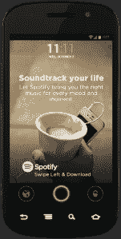

# 提拉·班克斯投资了 Locket，这款应用将广告和其他内容引入安卓锁屏 TechCrunch

> 原文：<https://web.archive.org/web/https://techcrunch.com/2013/11/19/tyra-banks-invests-in-locket-the-app-that-brings-ads-and-other-content-to-android-lockscreens/>

Android 应用 Locket 将广告和其他内容放在你的锁屏上，让用户每次解锁智能手机时都能赚到少量的钱，该应用获得了提拉·班克斯公司投资部门凶猛资本有限责任公司的额外投资。 *Smize* ，伙计们，Tyra 现在迷上广告技术了！

投资规模尚未披露，但该公司正在筹集一轮数百万美元的资金，预计将于明年完成。当这种情况发生时，银行将不会在即将到来的一轮中领先，不管它值不值得。

对于那些不熟悉的人来说， [Locket](https://web.archive.org/web/20221206222353/http://www.getlocket.com/) 是今年夏天推出的 Android 智能手机的移动应用程序，可以在锁屏上放置广告，用户可以通过滑动来选择参与。如果你向一个方向滑动，你就可以与广告互动——例如，访问网站、脸书页面、获得优惠券、观看电影预告片等等——无论广告商想做什么。如果你不感兴趣，就像往常一样刷另一边解锁手机。

该公司已经与数十个知名品牌合作，包括好时、HotelTonight、Sunny D、西尔斯、ZipCar、易贝、Spotify 等，广告商报告其广告活动的点击率为 3%至 5%。

 用户刷卡每小时只赚几分钱，所以不要指望在这里赚大钱。然而，为了鼓励更多的用户采用，该公司最近也在 Locket 体验中添加了其他内容，包括天气、报价、新闻、500px 的照片等等。他们还刚刚与另一家顶级应用程序制造商达成了一项内容协议，目前也没有披露。

据 Locket 的联合创始人兼首席执行官云海·金(Yunha Kim)说，她是在 StartupAgency 的联合创始人[凯文·古尔德](https://web.archive.org/web/20221206222353/http://www.linkedin.com/pub/k-r-gould/34/202/b88)发现金拿着一台前面有 Locket 贴纸的笔记本电脑跑过时代广场后被介绍给泰拉的，凯文·古尔德的公司帮助初创公司进行战略投资。他做了自我介绍，说他对 Locket 感兴趣，很快就发现金直接向班克斯推销自己。

金说:“(班克斯)喜欢关于我们是一家拉面创业公司，以及我是团队中唯一的女性的故事。”。"她很高兴自己能够支持一位女企业家。"她补充说，班克斯为这次会议做了充分的准备，有几页纸的问题与其他投资者问她的问题是一致的。(哦，在投资之后，班克斯给金寄了一件 t 恤，上面写着“*我是一个企业家，b*tch”，*见右图*。)*

当然，这并不是班克斯的第一笔创业投资——她还投资了其他公司，如[购物网站](https://web.archive.org/web/20221206222353/https://beta.techcrunch.com/2013/04/16/crowdsourced-shopping-site-the-hunt-raises-additional-700k-from-ashton-kutcher-other-high-profile-investors/)狩猎和[摄影应用 Flixel](https://web.archive.org/web/20221206222353/http://www.businesswire.com/news/home/20130808006246/en/Tyra-Banks-Invests-%E2%80%98The-Future-Photography%E2%80%99-Flixel) ,班克斯在她的“顶级模特”电视节目中大力推广了这些应用。

金说，有了小金盒，可能还有更多交叉促销的空间——班克斯有一个化妆品系列，将来可能成为小金盒的广告客户。

更新，美国东部时间晚上 9:30:文章发表后，银行的发言人出面澄清，目前还没有确定的化妆品系列或与吊坠盒的交易。然而，他们说，银行有几个即将到来的商业风险，可能成为未来的 Locket 广告客户。