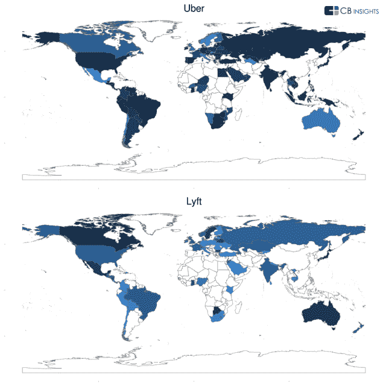
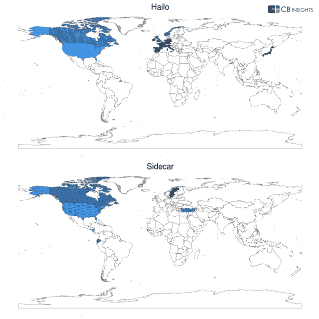
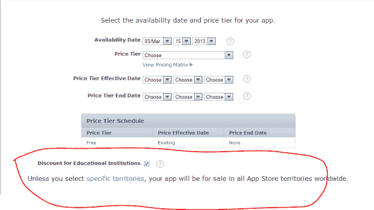

# 优步在尼日利亚很受欢迎？为什么今天的移动应用在它们不服务的市场中排名很高 

> 原文：<https://web.archive.org/web/https://techcrunch.com/2014/01/09/uber-is-popular-in-nigeria-why-todays-mobile-apps-are-ranking-highly-in-markets-they-dont-serve/>

Lyft 和优步等公司的按需拼车、出租车和黑车服务在全球新的[城市](https://web.archive.org/web/20221209073509/http://www.lyft.me/cities)和[国家](https://web.archive.org/web/20221209073509/https://www.uber.com/cities)迅速发展，但尚未在全球范围内提供。这就是为什么看到他们的移动应用在尼日利亚、哈萨克斯坦、爱沙尼亚和蒙古等国家排名很高看起来很奇怪。这是增长黑客的另一个例子，还是一个 bug，或者完全是别的什么？

这个问题是昨天由私人公司 M&A 数据库 CB Insights [在其博客](https://web.archive.org/web/20221209073509/http://www.cbinsights.com/blog/trends/uber-app-store-rankings)上提出的。在分析各种运输服务的数据时，该公司发现了这个奇怪的发现。博文中写道，“市场上许多最大的玩家甚至在他们没有业务的国家也有排名(有时排名很高)。例如，优步在尼日利亚的旅游类别中排名第 9……同样，Lyft 在巴巴多斯排名第 94，而它的网站似乎表明，他们是一家只在美国经营的企业。”

该公司还调查了优步较小的竞争对手，如 SideCar 和 Hailo，它们也显示出类似的趋势。

CB Insights 提出的问题[仍然没有答案——只是暗示这些公司可能试图以某种方式操纵排名，可能是通过不太光明正大的手段。或者，在几个意想不到的地方，对优步等人有一些被压抑的需求。](https://web.archive.org/web/20221209073509/http://www.cbinsights.com/blog/trends/uber-app-store-rankings)

事实是，这种事情在今天的应用商店开发者中很常见。像优步和 Lyft 这样的服务更容易追踪，因为它们有非常具体的市场。但是，你可能仍然想知道为什么优步的应用程序会出现在尼日利亚的应用程序商店里，因为它根本就不在尼日利亚做生意。

这部分很好回答。在 iTunes 开发者门户中，公司最初向苹果商店提交应用程序，默认情况下，在所有支持的国家/地区提供应用程序的选项是打开的。正如苹果解释的那样，“除非你选择特定的区域，否则你的应用程序将在全球所有的应用商店区域出售。”大多数开发人员只是让这个选项保持原样，因为这样做没有什么坏处。

但是，为什么一个应用在一个公司不运营的国家排名很好，有时甚至*非常*高？CB Insights 的博客文章提出，这可能是一个错误，是特定市场潜在需求的某种证据，或者是应用商店优化(ASO)的尝试。一种理论在我的脑海中浮现，一位用户在黑客新闻上也提到了这种理论，即这些较小的发展中国家的富裕 iOS 用户可以帮助应用程序在这些竞争不那么激烈的地区迅速上升。

正如 ASO 服务公司[SearchMan.com](https://web.archive.org/web/20221209073509/http://www.searchman.com/)的联合创始人柴田直树(Naoki Shibata)解释的那样，优步在像日本这样的大市场很难登上排行榜，但在 iPhone 用户不多的国家排名靠前相对容易。因此，举例来说，如果一个用户在尼日利亚应用商店有一个 iTunes 账户，并且计划去优步*工作的城市旅行，他们可能会提前从他们的商店下载应用。这将计入他们本地应用商店的下载量。由于缺乏竞争，优步可能很快就会在应用商店排行榜上名列前茅。*

当然，这可以解释一些排名，但当应用程序在这些商店的排行榜上出现大幅飙升时，可能还有另一个原因。

另一家专注于 ASO 的公司[Straply.com 的创始人乔治·劳伦斯(George Lawrence)认为，这些飙升有很多可能性，比如旅游业、黑帽 ASO 骗局，或者苹果排名算法的改变。他说，真正的原因是什么？付费安装。](https://web.archive.org/web/20221209073509/http://www.straply.com/)

“脸书和其他人一直在移动营销人员面前炫耀终极快克可卡因的诱惑，”Lawrence colorfully 解释道，他指的是流行且成功的移动应用安装广告。这些广告让应用营销人员瞄准特定国家的用户，促使他们安装自己的应用。“只要有足够的钱烧钱——优步最近筹集的 2.58 亿美元就符合条件——那么我就可以继续在世界上任何我想去的地方支付应用安装费用，”他说。"通过这样做，在那个国家的商店里攀升图表."

那么问题就变成了，为什么要烦恼呢？虽然没有人知道 App Store 算法的细节，但人们普遍认为，评论量、平均评分和下载量等因素都在应用排名中发挥着作用， [Appnique](https://web.archive.org/web/20221209073509/https://appnique.com/) 首席执行官 Jai Jaisimha 解释道。

这意味着，假设苹果将全球所有(总)下载速度作为其排名指标的一部分，在其他国家获得下载——包括优步或 Lyft 等服务实际运行地区以外的国家——可以提高应用在他们*关注的国家的排名。但这似乎只是一种理论。有人说是这样，有人说不是。*

然而， [MobileDevHQ](https://web.archive.org/web/20221209073509/http://www.mobiledevhq.com/) 的首席执行官伊恩·塞弗曼做了一些研究，并声称“几乎可以肯定的是，苹果将全球下载量和下载速度作为其跨地区本地排名的一部分。”然而，就优步而言，他并不认为这真的是一次增长黑客攻击，这更像是一次偶然事件。

换句话说，没有充分的理由将一个应用程序从其他应用程序商店中排除，而且，如果有资金用于提高应用程序商店的排名，将其中的一小部分用于针对全球用户的应用程序安装广告也不会有什么损失。

*(图片鸣谢: [CB Insights](https://web.archive.org/web/20221209073509/http://www.cbinsights.com/blog/trends/uber-app-store-rankings) )*