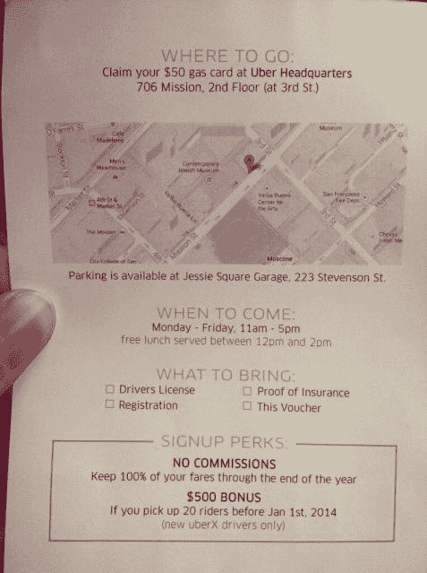

# 优步向 Lyft 司机免费提供 50 美元汽油，签署津贴以转换车队 

> 原文：<https://web.archive.org/web/http://techcrunch.com/2013/12/11/uber-offering-lyft-drivers-free-50-in-gas-signing-perks-to-switch-teams/>

# 优步向 Lyft 司机免费提供 50 美元的汽油，签署津贴以更换车队

优步正在向 Lyft 司机提供几项补贴，以吸引他们放弃拼车服务。额外待遇包括一张 50 美元的加油卡，只需在三藩市的优步总部停留一下，如果他们选择接受这个提议，还可以获得签名奖金。

我们听到签约奖金的报道已经有一段时间了，但是 Tradecraft 创始人 Misha Chellam 在 Lyft 上发现的一份传单详细描述了优步为转换 Lyft 用户提供的优惠。Chellam 说，有人从优步跳上司机的车，开了 3 个街区，然后把单子递给他们。

一边是一张 50 美元汽油代金券的大幅通知，这让 Lyft 司机们有了机会。另一方面是该计划的细节，该计划为新注册用户提供 100%的票价，直到 2013 年底，没有优步佣金。如果司机在 2014 年 1 月 1 日之前搭载 20 名乘客，还将获得 500 美元的奖励:

我们自己的 Josh Constine 也在几天前从 Lyft 的一名司机那里听说，优步为新司机提供 500 美元的奖金，用于完成一定数量的乘坐。

Lyft 增长总监亚当·菲什曼[对切拉姆的推文](https://web.archive.org/web/20230128094950/https://twitter.com/fishmanaf/status/410905584817274880)发表了评论，指出公司已经知道了这次促销活动。“我们意识到并受宠若惊的兴趣，我们真棒社区的司机，”读 Fishman 的回复。

如果这一策略是有效的，它可能会在几个层面上影响 Lyft，因为它减少了他们的司机供应，同时增加了优步客户的可用司机库。进入假日季节，人们在旧金山找不到 Lyft 的可能性增加了——转向优步会发现更容易找到一辆车。优步正在寻找更多的司机，最近[宣布与金融家和汽车制造商](https://web.archive.org/web/20230128094950/https://techcrunch.com/2013/11/24/uber-driver-car-financing/)合作，允许在其平台上获得批准的司机购买负担得起的汽车。创始人特拉维斯·卡兰尼克告诉 TechCrunch，他们希望让“数十万辆”汽车上路。

我们联系了菲什曼，了解 Lyft 如何处理这一战略的更多信息。我们也联系了优步来确认这次活动。

*Josh Constine 补充报道，文章更新反映优步不雇佣司机。*