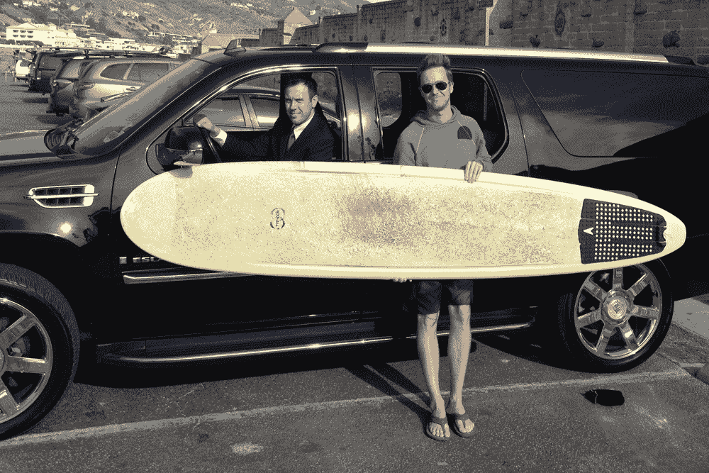

# 优步测试在洛杉矶和多伦多开始；爱德华·诺顿在洛杉矶的“骑手 0”称号中落败 

> 原文：<https://web.archive.org/web/https://techcrunch.com/2012/02/12/uber-testing-begins-in-la-toronto-edward-norton-gets-beaten-out-for-las-rider-0-title/>

# 优步测试在洛杉矶和多伦多开始；爱德华·诺顿击败了洛杉矶的“骑士 0”称号

快速增长的按需叫车服务优步(T1)，让你可以使用短信或该公司的 iPhone 和 Android 应用程序随时请求搭车，在提供出租车服务的颠覆性替代服务方面，它经历了相当大的努力。尽管如此，优步仍在继续前进，[在 12 月从门罗风险投资、杰夫·贝索斯和高盛等公司筹集了 3200 万美元。这家初创公司还继续推进其国内(和国际)服务，最近在芝加哥](https://web.archive.org/web/20221205134914/https://beta.techcrunch.com/2011/12/07/uber-announces-32-million-in-funding/)、[华盛顿](https://web.archive.org/web/20221205134914/https://beta.techcrunch.com/2011/12/15/uberdc/)和[巴黎](https://web.archive.org/web/20221205134914/https://beta.techcrunch.com/2011/12/05/uber-launches-its-first-international-efforts-in-paris/)推出或试运行了[。](https://web.archive.org/web/20221205134914/https://beta.techcrunch.com/2011/08/25/spotted-uber-testing-its-disruptive-car-service-in-chicago/)

现在，优步似乎准备开始在波士顿、纽约、巴黎、旧金山和西雅图的现有服务基础上增加更多的城市，在格莱美奖之前在天使之城试运行(或进入超级秘密的“测试阶段”)。是的，[根据优步的博客](https://web.archive.org/web/20221205134914/http://blog.uber.com/2012/02/12/uber-fight-club-ed-norton-gets-beat-in-race-for-la-rider-zero/)，是时候开始在洛杉矶水域测试其汽车服务了。哦，以防你错过，[优步本周也开始了它在加拿大第一个城市多伦多的测试/研究阶段](https://web.archive.org/web/20221205134914/http://www.stumbleupon.com/su/54q6G2/blog.uber.com/2012/02/04/uber-sighting-in-toronto/)。

至于其在洛杉矶的软启动，优步说，它的第一批骑手是“爸爸唐和妈妈邦妮卡兰尼克”，优步首席执行官特拉维斯·卡兰尼克的母亲和父亲，他击败了著名的舞台和屏幕演员(显然是狂热的冲浪运动员)爱德华·诺顿。诺顿不得不满足于洛杉矶的“骑手 1”称号。当然，优步的试运行经常伴随着“名人”或知名人士，如本·马尔罗尼是加拿大的“零骑士”可以肯定的是，聪明的营销。

该公司还补充说，用户现在可以在洛杉矶申请汽车(它已经正式“在地面上”)，但在该服务即将正式推出之前，该服务仍将处于“秘密阶段”(抱歉，伙计们)，可用性有限。

当谈到洛杉矶这样规模的城市时，多样性和必然会有障碍，所以优步正在“分析我们的发现并做出调整，直到我们正确对待洛杉矶，”根据其博客[。这也给洛杉矶的早期采用者带来了一个警告:“仅限冒险车手”。](https://web.archive.org/web/20221205134914/http://blog.uber.com/2012/02/12/uber-fight-club-ed-norton-gets-beat-in-race-for-la-rider-zero/)

当我们了解更多的时候，我们将会更新。下面是优步的“骑手 1”的照片:

【T2