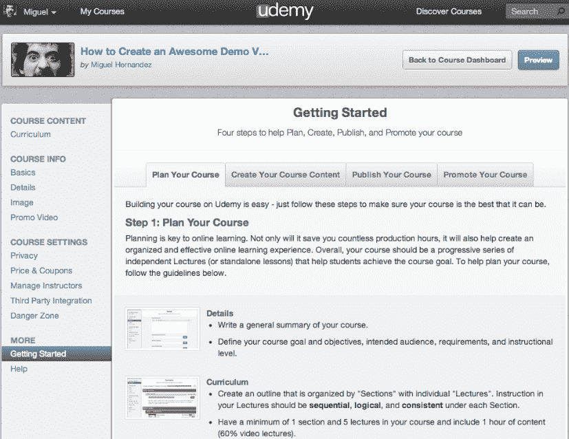
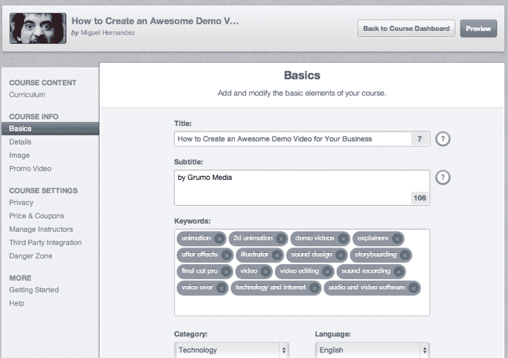

# Udemy 推出新发布平台，帮助教师创建优质在线课程 TechCrunch

> 原文：<https://web.archive.org/web/https://techcrunch.com/2012/10/17/udemy-rolls-out-new-publishing-platform-to-helps-teachers-create-quality-online-courses/>

由于像可汗学院、Coursera、Udacity、StraighterLine、Lynda.com、CreativeLIVE(以及更多)这样的公司，在线视频教育现在是一个热门领域，它们共同致力于实现教育民主化，并为全球观众带来负担得起的在线学习工具和课程。

虽然视频学习的兴起提升了所有船只，但也导致了一些拥挤。随着越来越多的玩家进入这一领域，初创公司试图脱颖而出并展示可行的商业模式变得非常重要。

Udemy 于 2010 年推出，致力于成为任何人都可以主持、提供和参加基于视频的在线课程的市场。随着教师在未来教育和高等教育课堂中扮演的角色越来越不确定，聪明的教育公司正在寻找方法，不仅为受过正式培训的教师授权，也为各种各样的教育者授权。

为了做到这一点，Udemy 今天推出了专门面向教师的课程创建平台的新版本。该平台旨在让专家和新手教育者更好地控制和拥有他们的在线内容，帮助他们通过课程编辑器和更强大的工具集来管理和推广他们的课程，从而组织和构建这些内容。

Udemy 尝试了不同的数字教育内容呈现和分发方法，特别是在它们对学习成果的影响方面，得出的结论是，最关键的组成部分之一(也是经常被忽视的部分)是结构良好的课程。因此，这家初创公司重建了它的课程编辑器，现在它鼓励教师建立一个大纲，作为课程创建过程的第一步。

使用新的课程编辑器，教师可以拖放讲座和部分，以将其内容组织到一个更结构化的课程中。最重要的是，考虑到 Udemy 的许多老师实际上是现实世界的专家，而不是那些精通教育学的人，这家初创公司重新设计了课程创建流程。一旦他们概述了他们的课程，他们就会得到一步一步的指导方针和最佳实践，涉及从规划到推广的一切。

这个想法，如果还不清楚的话，是为了帮助简化课程创建过程，并使那些不熟悉 Udemy 或类似技术的人的入职过程更加顺利。教师用户界面本质上已经成为“虚拟校样”，因为它为课程设计和交付制定了指导方针。

Udemy 的联合创始人 Eren Bali 告诉我们，讲师最需要的功能是更先进的营销和推广支持，这对于越来越多希望从课程中获得稳定收入的 Udemy 专家来说尤其重要。那么，教师重新设计自然会利用 Udemy 的内置市场，但教师现在也可以通过优惠券代码向潜在的学生提供折扣，或者通过初创公司的附属计划提供他们的内容。

为了进一步支持教师，Udemy 还努力建立支持社区，现在提供了一个名为“Udemy 教师休息室”的定制脸书小组，例如，它为教师提供了一个分享最佳实践、内容和联系教师的论坛。

考虑到他们每天所做工作的重要性，教师往往是劳动力中报酬较低的一部分。不断减少的资源、紧张的预算以及越来越多的关于技术可能会削弱他们在课堂上的地位的噪音，都对教师的士气产生了不利影响，结果是学生的参与度经常受到影响。

寻找用技术和数字学习工具赋予教育工作者权力的方法变得越来越重要，像 TeachersPayTeachers 这样的网站可以为教师每天的工作提供额外的补偿(额外的节省时间的好处是不必每天晚上重新发明轮子，这样他们就可以专注于，比如说，如何个性化教学)可以在改善学习成果方面发挥关键作用——以及整个系统。

像 TeachersPayTeachers 一样，Bali 告诉我们，Udemy 的第一位讲师最近的销售额达到了 100 万美元，这是展示市场模式价值的一个重要里程碑，同时也验证了 Udemy 的方法。

这个价值百万美元的里程碑和面向教师的用户界面的重新设计紧随这家初创公司去年的强劲增长而来。这位联合创始人说，在过去的九个月里，公司一直保持着 20%的月环比增长。巴厘岛表示，迄今为止，讲师们已经在 Udemy 上发布了 5000 门课程，涵盖从自助和设计到摄影和编程的各种主题，其中 1500 门是付费课程——这个数字自去年以来增长了 7 倍。

Udemy 全新面向老师的课程创作平台视频如下:
http://www.youtube.com/watch?v=qEJffATwo-s