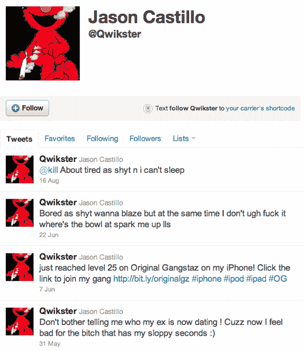

# 哦哦...Qwikster 已经有了一个活跃的 Twitter 账户，但它不属于网飞 TechCrunch

> 原文：<https://web.archive.org/web/http://techcrunch.com/2011/09/18/uh-oh-qwikster-already-has-a-lively-twitter-account-but-its-not-owned-by-netflix/>

# 啊哦… Qwikster 已经有了一个活跃的 Twitter 账户，但它不属于网飞

电影递送服务公司网飞刚刚宣布将其 DVD 邮寄服务更名为 Qwikster，并将继续称其流媒体服务为网飞。令人震惊的消息，是的，但互联网已经发现了该公司更名盔甲的一个直接漏洞，除了像许多其他失败的公司一样，[的名字以“斯特”结尾……](https://web.archive.org/web/20230205025341/https://twitter.com/#!/millsks/status/115661898011250688)

网飞天真地忽略了在发布前确定 [@Qwikster](https://web.archive.org/web/20230205025341/http://www.twitter.com/qwikster) Twitter 账户。该账户目前由一个人拥有，他选择最好地代表自己作为 Elmo 吸烟联合，他的最新推文包括这样的智慧珍珠，“无聊得像 shyt 想要燃烧，但同时我不，他妈的，spark me up lls 的碗在哪里”和辛酸的“不要告诉我我的前任现在在约会谁！Cuzz 现在我为那个拥有我邋遢老二的婊子感到难过:)

这种缺乏远见的最大问题是，许多技术专家在听到行业新闻后做的第一件事是检查一个知名品牌的 Twitter 账户，看看它是否活跃，是否有消息。很明显，此时此刻,@Qwikster 并没有代表网飞最好的一面。

是的，这是一个很好的猜测，不管这个人是谁，他可能会把这个名字卖回网飞，赚一大笔钱(尽管整个“卖名字是违反服务条款的”事情)。

嗯…不知道他会把钱花在什么地方…

**更新:**半天之后，@Qwikster 的声音 Jason Castillo，[意识到](https://web.archive.org/web/20230205025341/https://twitter.com/#!/Qwikster/status/115896169682579458)出事了。

https://twitter.com/#!/mat/status/115657134389215233

https://twitter.com/#!/迈克 _FTW/status/115661425715855360

https://twitter.com/#!/so 中断/status/115663531134824448

https://twitter.com/#!/red girl says/status/115673348448591872

https://twitter.com/#!/sacca/status/115673809448738816

