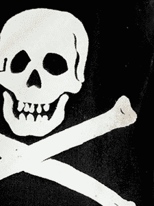

# 英国视频游戏盗版去年造成 14.5 亿英镑损失和 1000 个工作岗位 TechCrunch

> 原文：<https://web.archive.org/web/https://techcrunch.com/2011/01/21/uk-video-game-piracy-caused-1-45b-in-losses-1000-jobs-last-year/>

# 英国视频游戏盗版去年造成 14.5 亿英镑的损失和 1000 个工作岗位

视频游戏盗版[去年在](https://web.archive.org/web/20221207192145/http://www.bbc.co.uk/newsbeat/12248010)造成约 14.5 亿英镑(23.1 亿美元)的销售额损失，以及约 1000 人失业。英国互动娱乐协会(UKIE)如是说，它警告说，即使那些令人印象深刻的数字也是保守的。请注意，这是游戏机盗版，这再次推翻了出版商的论点，即盗版只是 PC 上的问题，因此严厉的 DRM 制度是必要的罪恶。你会想为什么索尼会对 PS3 越狱感到恐慌。

英国广播公司对一位 25 岁的各种专业游戏机改装师进行了简短采访。他修改一台游戏机收费 40 英镑(63 美元)，不管是 Xbox 360、Wii、DS、PSP 还是 PS3——即使修改一台 PS3 [比在 u 盘上放几个文件更费力气。一旦被改装，一台游戏机可以整天玩盗版游戏，正如 UKIE 所声称的，这几乎摧毁了这个行业。请记住，旧的 DSs 可以用一种特殊的、廉价的“空白”游戏卡玩盗版游戏。多年来，任天堂一直在与这些牌斗争，尤其是 R4。](https://web.archive.org/web/20221207192145/http://www.crunchgear.com/2011/01/17/jailbreaking-your-ps3-all-fun-games-until-your-online-gaming-is-ruined/)

同样的主机改装商也以 1 到 5 英镑(1.6 到 8 美元)的价格出售盗版视频游戏。

直觉告诉我，这款车型不会在市场上待太久。

还应该指出的是，去年英国的游戏销售额有所下降，从 2008 年的 19 亿英镑降至 14.5 亿英镑。那是因为盗版吗？那是因为行业已经见顶了吗？也许“好”的游戏少了？

英国浮世绘尽最大努力用吓人的话来吓唬市民——“像《使命召唤》这样的游戏可能需要两年时间来制作，并耗资数百万英镑。所以单个游戏涉及巨额资金。——但它从未真正解决为什么相当于《雷神之锤 3》的 mod 要花这么多钱来制作。

更不用说像《我的世界》这样的东西了，它是由一个人在没有数百万美元营销预算支持的情况下开发的。我想看到 UKIE 解释在这种糟糕的环境下这样的事情是如何发生的。

[弗利克](https://web.archive.org/web/20221207192145/http://www.flickr.com/photos/earlg/160807760/)