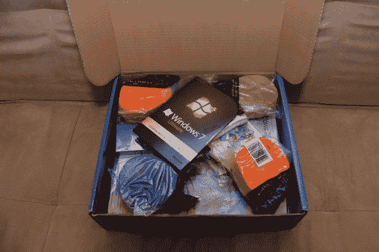

# 拆箱 Windows 7 发布派对套件

> 原文：<https://web.archive.org/web/https://techcrunch.com/2009/10/09/unboxing-the-windows-7-launch-party-kit/>

# 拆箱 Windows 7 发布会套件

我的 Windows 7 发布派对套件终于来了！您可能还记得，[我被](https://web.archive.org/web/20230319064335/http://www.crunchgear.com/2009/09/24/i-was-selected-to-host-a-windows-7-launch-party/)选中主持其中一场 Windows 7 发布会。我太幸运了。

哦，伙计，看看这些东西。彩带、气球、派对包、扑克牌、拼图和海报！！！微软确实知道如何举办聚会。再加点果冻和啤酒，这个派对会很疯狂。哦，事实上，我现在有一个完整的，合法的 Windows 7 旗舰版 32 位和 64 位也让我笑了。

现在我可能要做的就是再看一遍那些教学视频，寻找一些“有用的提示”然后[打印一些低分辨率的海报和有趣的小测验。最后，我可能会找到一些真正想用 Windows 7 开派对的朋友。](https://web.archive.org/web/20230319064335/http://www.crunchgear.com/2009/10/06/the-windows-7-launch-party-video-was-not-an-isolated-incident-they-have-party-favors/)

这些包已经被运送到预选的主机整个星期。主机[应提前收到一封带有 UPS 追踪信息的电子邮件](https://web.archive.org/web/20230319064335/http://www.crunchgear.com/2009/10/07/the-windows-7-launch-party-packs-ship-out-to-hosts/)。根据 HouseParty.com 的记录——他实际上组织了所有这些聚会——包裹仍在运送中，所以如果你还没有收到，不要担心。你应该在 10 月 15 日之前得到它。或者你也可以在易贝买一个。