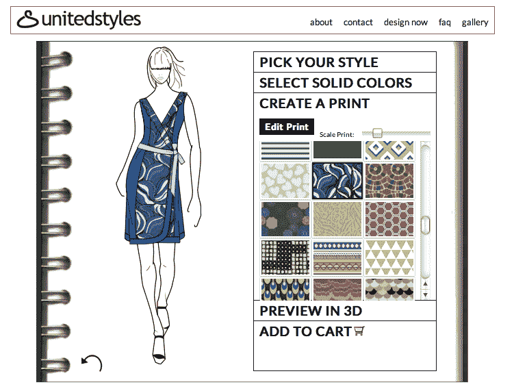
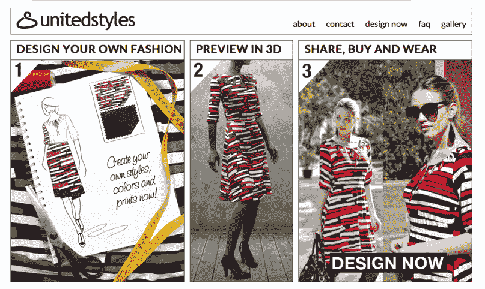

# UnitedStyles 让你玩时装设计师 

> 原文：<https://web.archive.org/web/https://techcrunch.com/2011/10/31/unitedstyles-lets-you-play-fashion-designer/>

以上海为基地，

[UnitedStyles](https://web.archive.org/web/20230203085835/http://www.unitedstyles.com/)

是一项支持脸书连接的服务，允许任何用户创建定制的女装，允许他们通过在线界面和定制的 3D 预览来绘制草图、调整和分享设计(注意:中国用户必须使用 VPN 通过脸书登录)。

联合创始人 Marc van der Chijs 告诉我，他的目标是为互联网用户重建整个时装设计体验，“你不能(已经)在网上设计自己的衣服，这很奇怪。”

时尚界的主导商业策略是提前几个月猜测顾客想要什么，而 UnitedStyles 想要扭转这种局面；“我们将时尚产业从‘推动’模式转变为顾客‘拉动’模式，”范德切斯解释道，“由于大规模生产，服装变得更便宜，但也更缺乏个性化。”他还创建了“中国 YouTube”土豆网。裁缝几乎不存在了，或者被认为太贵了。”

通过 UnitedStyles，用户可以复制他们自己的“定制”体验，从各种风格、印花、颜色和形状中进行选择(有几个图表可以检查尺寸)。该公司今天推出了五种风格，主要是上衣和连衣裙，但会尽快增加更多品种。

【T2

UnitedStyles 将所有的服装生产外包给中国的数字纺织品印刷商，因为它不创造自己的库存，所以避免了传统时装业产品过剩的问题。用户可以以 49.95 美元的价格购买一件上衣，79.95 至 99.95 美元的价格购买一件连衣裙，范德克里斯希望将其目前一个月的运输时间缩短至一周——此外，今天的前 100 个订单将获得免费运输。

当被问及他们最接近的市场竞争对手是谁时，范德奇认为 UnitedStyles 是“全新的”；“时尚界的商业模式没有太多创新。”他强调，他们与 Disrupt applicator[MadeToFitMe](https://web.archive.org/web/20230203085835/http://www.madetofitme.co.uk/)等服务的区别在于，UnitedStyles 完全专注于创造整个时装设计体验，“尺寸是过程的一部分，但不是我们的关键卖点。”

UnitedStyles 计划扩展到男装领域，并进一步改善其用户体验，最终使人们更容易大规模设计服装，“我们最终希望人们能从时尚设计中获得乐趣，”范德奇斯说。

【T2

**评委 Q & A**

问:你的目标用户是谁？这似乎很小众。

时尚是小众的，即使 Zara 和 HM 也只有 2%的市场份额，所以小众不是我们所担心的。

**问:**数字纺织生产技术怎么样？你做所有的印刷工作吗？

答:数码印刷机需要专家来管理，所以我们把数码印刷外包出去。

**问:**病毒式传播是你们的主要营销策略吗？

**答:**是的。

问:你的目标市场在哪里，中国还是美国？

时尚博客圈。

**问:**你的生产时间是什么时候？

**答:**一个月。

**问:**你觉得这个太长了吗？

**答:**人们购买是为了体验，而不是为了收到产品的速度。