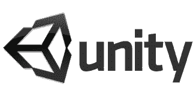

# Unity Technologies 从红杉资本获得 550 万美元

> 原文：<https://web.archive.org/web/https://techcrunch.com/2009/10/20/unity-technologies-raises-5-5-million-from-sequoia-capital/>

# Unity Technologies 从红杉资本获得 550 万美元

 [Unity 游戏开发平台背后的公司 Unity Technologies](https://web.archive.org/web/20230310221308/http://unity3d.com/) 已经完成了由红杉资本领投的 550 万美元融资轮。Unity 是一个强大的工具，允许开发人员为运行在各种平台上的游戏构建 3D 世界，包括 iPhone，PC，Mac 和任天堂的 Wii。

Unity 最近在 iPhone 上增长强劲，现在有超过 250 款游戏正在使用该工具集(该公司表示，与其他解决方案相比，这些游戏在使用 Unity 时性能提升了 3 倍)。在该平台上构建的游戏横跨多种流派，包括[拳击](https://web.archive.org/web/20230310221308/http://itunes.apple.com/WebObjects/MZStore.woa/wa/viewSoftware?id=309518895&mt=8)、[驾驶](https://web.archive.org/web/20230310221308/http://itunes.apple.com/WebObjects/MZStore.woa/wa/viewSoftware?id=305774371&mt=8)，甚至还有一款[武士](https://web.archive.org/web/20230310221308/http://itunes.apple.com/WebObjects/MZStore.woa/wa/viewSoftware?id=328219302&mt=8)游戏(全部为 iTunes 链接)。

在 iPhone 之外，使用 Unity 开发的游戏包括卡通网络公司的 MMO FusionFall 和 EA Game 的 Tiger Woods。TC50 决赛选手[Hangout.net](https://web.archive.org/web/20230310221308/http://www.hangout.net/)也使用 Unity。

首席执行官大卫·赫尔加松描述了该平台的一些优势:

> Unity 使用。NET(或者更确切地说是 Mono，Novell 的开源。NET 实现)，这避开了脚本与本机的整个经典难题，因为代码被 JIT 或 AOT 编译成本机代码，同时仍然是沙箱化的和容易的。此外，还有大量的文档和非常丰富的库可供使用。

该公司最近将总部从运营多年的哥本哈根搬到了旧金山，尽管其核心开发团队仍在哥本哈根。下面是一些基于该平台的游戏截图(你可以在这里看到完整的游戏库)。