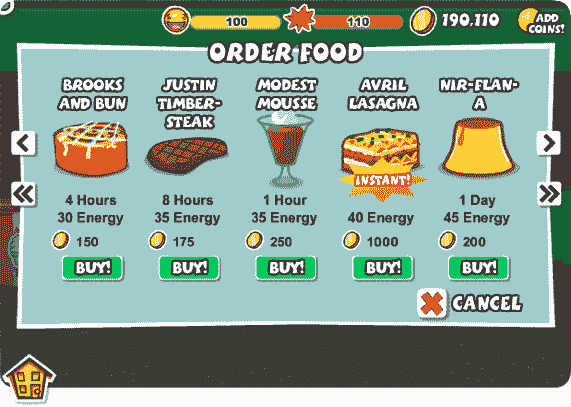

# 导管实验室罢工与环球音乐集团达成协议，将 Lady Gaga 和蕾哈娜引入社交游戏 

> 原文：<https://web.archive.org/web/https://techcrunch.com/2010/04/06/universal-music-group-strikes-deal-with-conduit-labs-to-bring-lady-gaga-and-rihanna-to-social-games/>

# 导管实验室罢工与环球音乐集团达成协议，将 Lady Gaga 和蕾哈娜带入社交游戏

环球音乐集团(UMG)已经与 [Conduit Labs，](https://web.archive.org/web/20221007042026/http://www.conduitlabs.com/)一家创建音乐社交游戏的初创公司达成协议，向用户提供 UMG 授权音乐库，这些音乐来自唱片公司的艺术家，如 Lady Gaga、Rihanna 等。这种合作关系将扩展到 Conduit Labs 游戏的所有 100 万用户，包括[音乐宠物](https://web.archive.org/web/20221007042026/http://apps.facebook.com/musicpets/)、超级舞蹈和 [Loudcrowd、](https://web.archive.org/web/20221007042026/http://loudcrowd.com/start)访问曲目。

Conduit Labs 的所有游戏都是免费的，但允许用户购买虚拟物品，如歌曲，以进一步个性化他们的体验。比如我们在[这里报道的 Loudcrowd，](https://web.archive.org/web/20221007042026/https://beta.techcrunch.com/2009/03/16/loudcrowd-marries-gaming-and-music-in-a-virtual-world/)允许用户在与朋友一起玩一系列音乐主题游戏的同时，用头像创建自己的虚拟世界，并访问音乐播放列表。Conduit 使用一种虚拟商品模式来销售游戏中的音乐，而社交网络范围内的歌曲将从零成本到几美元不等。通过协议，Conduit 将与唱片公司分享 UMG 音乐的所有销售收入。用户还可以购买 UMG 音乐和其他产品的单独数字下载。UMG 将提供 Lady Gaga，Little Wayne，Rihanna，The Killers，Beck，Kanye West，Black Eyed Peas，Weezer，贾斯汀比伯和其他几位知名艺术家的授权音乐。

Conduit Labs 已经与独立摇滚唱片公司合作，包括乞丐集团、DFA、Domino、Downtown Records 和 Modular，但 UMG 的交易对这家游戏初创公司来说相当巨大。该公司最近又筹集了 300 万美元的资金，正在迅速扩大其用户群。其脸书游戏《音乐宠物》(Music Pets)在推出不到 30 天后，月活跃用户就已经超过了 100 万。

环球音乐公司长期以来对音乐和视频分享服务的诉讼一直有点好战( [MySpace](https://web.archive.org/web/20221007042026/http://www.beta.techcrunch.com/2006/11/17/universal-music-sues-myspace/) 、 [Veoh 及其投资者](https://web.archive.org/web/20221007042026/http://www.beta.techcrunch.com/2009/02/04/judge-tells-umg-no-you-cannot-sue-veohs-investors-for-copyright-infringement/)、[Grouper/Bolt.com](https://web.archive.org/web/20221007042026/http://www.beta.techcrunch.com/2006/10/17/universal-music-files-suit-against-grouper-boltcom/)等)。)，所以这笔交易对这家年轻的游戏初创公司来说绝对是一场胜利。