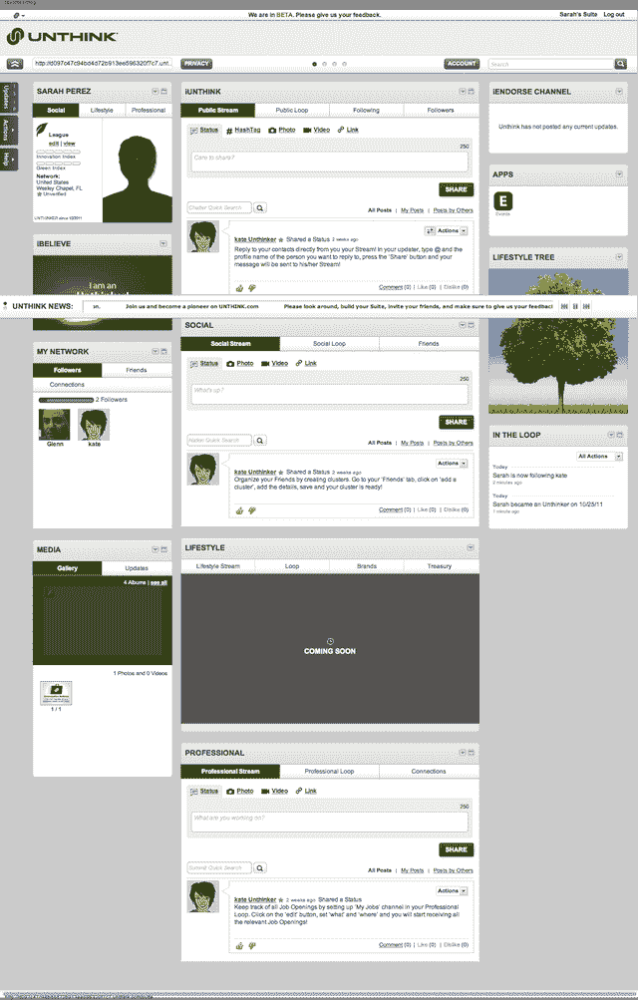

# Unthink 的“反脸书”社交网络拥有 10 万用户 

> 原文：<https://web.archive.org/web/http://techcrunch.com/2011/11/01/unthinks-anti-facebook-social-network-reaches-100000-users/>

该公司现在报告称，社交网络平台 un think T1 的营销活动[涉及大量抨击脸书的内容](https://web.archive.org/web/20230203130328/https://techcrunch.com/2011/10/25/anti-facebook-social-network-unthink-launches-to-public/)，注册用户已达 10 万人。你可能还记得，在 TechCrunch 向网络发送其通常的大流量后，该网站很快崩溃，Unthink 花了一天多的时间才恢复。

现在网站的访客数量每天都在翻倍，包括活跃用户和临时访客。

据首席运营官的 Rachael Vicari 称，该公司对看到的流量毫无准备。她说，前两天的访问量超过了前 90 天的预期，他们必须将服务器数量增加两倍才能跟上。她还引用了 Alexia 的统计数据，该数据显示仅在过去 7 天内，访问量就增长了 14，800%。明天将是推出的一周，自其公开亮相以来，10 万用户已经在网络上建立了自己的“套件”。(作为背景，未经思考的用户配置文件，涉及公共、私人和专业方面，被称为“套件”)

对于一个局外人来说，像这样的增长是令人印象深刻的(典型的例子:他们不知道 TechCrunch 发送了多少流量！)，尤其是一个敢于挑战脸书本身的国家。尽管如此，人们不得不怀疑有多少访问者是纯粹出于好奇和怀疑而访问该网站的，例如:*愚蠢的小初创公司，你认为你能打败脸书吗？这就是我要看的东西！*

Unthink 应该在一个月、一个季度、六个月、然后一年后进行回顾，看看当前的增长轨迹是否能持续，而不是兜售几周前的数据。用户参与是另一个重要的(也是没有答案的)问题。到底是谁在参与“不思考”节目？这 100，000 人中有多少是好友用户，发布更新，上传内容等。？

Vicari 说，增长的原因是因为像这样的网络“时机成熟”，但这种说法还为时过早。

相比之下，脸书用了一年时间达到 100 万用户，Google+用了大约一个月的时间达到 2500 万——脸书用了三年时间，Twitter 用了 30 个月。

总部位于坦帕的 Unthink 从 DouglasBay 获得了 250 万美元的资金，Douglas bay 公开声称拥有该网站 21%的股份。

*要了解更多关于 Unthink 的内容，请查看之前的[评论](https://web.archive.org/web/20230203130328/https://techcrunch.com/2011/10/25/anti-facebook-social-network-unthink-launches-to-public/)。*

