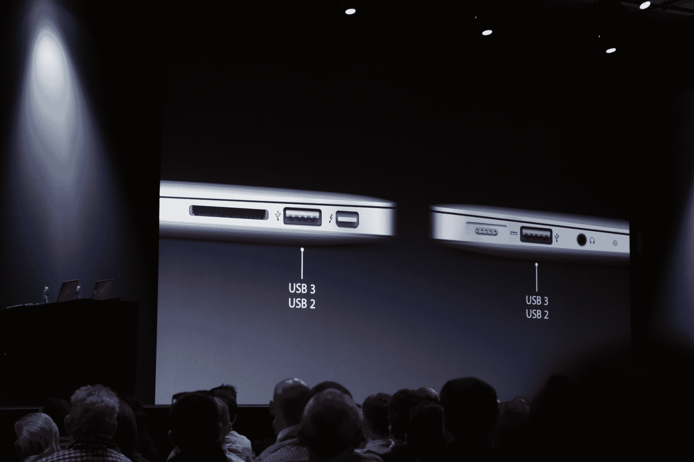

# 更新的 MacBook Air 采用英特尔酷睿 i5 处理器和 Ivy Bridge TechCrunch

> 原文：<https://web.archive.org/web/https://techcrunch.com/2012/06/11/updated-macbook-air-boasts-intel-core-processors-with-ivy-bridge/>

# 更新的 MacBook Air 采用了配备 Ivy Bridge 的英特尔酷睿 i5 处理器

苹果公司的蒂姆·库克刚刚宣布了一款更新的 MacBook Air，配备 3.2 GHz 的英特尔酷睿 i5 处理器，512GB 的固态硬盘存储和 500MBps 的读取速度。新 air 还包括 USB 3.0 端口，比 USB 2.0 快 10 倍。笔记本电脑将包括两个双 2.0/3.0 端口。

这些笔记本电脑使用英特尔的 [Ivy Bridge](https://web.archive.org/web/20221208222050/http://en.wikipedia.org/wiki/Ivy_Bridge_(microarchitecture)) 架构。

Facetime 摄像头以 720p 分辨率录制。这款笔记本电脑将有 11 英寸和 13 英寸两种尺寸，11 英寸配置的起价为 999 美元。笔记本电脑今天发货。
 
[产品页面](https://web.archive.org/web/20221208222050/http://www.apple.com/macbookair/)

