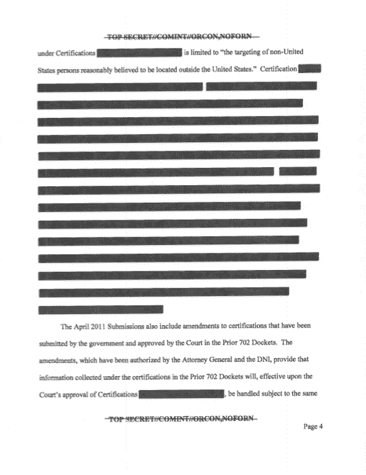

# 美国国家情报总监发布 Tumblr 网站“IC On The Record”以缓解监控担忧 TechCrunch

> 原文：<https://web.archive.org/web/http://techcrunch.com/2013/08/21/us-director-of-national-intelligence-launches-tumblr-site-ic-on-the-record-to-assuage-surveillance-concerns/>

# 美国国家情报总监发布 Tumblr 网站“IC On The Record”以缓解监控担忧

在围绕国家安全局监控策略长达数月的丑闻之后，美国国家情报办公室今天推出了一个新网站，以提高政府透明度。

“6 月，奥巴马总统要求国家情报总监詹姆斯·r·克拉珀(James R. Clapper)解密并公开尽可能多的关于国家安全局某些敏感项目的信息，同时注意保护敏感机密情报和国家安全的需要，”该网站上一篇未署名的帖子写道。

IC On The Record 今天推出了三份新文件，全部是 FISA 法院的法律意见文件，并重点介绍了即将发布的七份文件。

从表面上看，这个网站是个好主意，但如此大部分的解密文件都被编辑过(而且我认为，还会继续被编辑),所以它最终不会有太大的帮助。

【T2

目前还不清楚该部门为什么选择 Tumblr，这是一个在年轻人群中很受欢迎的博客平台，今年夏天早些时候被雅虎以 10 亿美元收购。该网站现在也有了一个 Twitter 账号。希望 office 能够在不编辑任何内容的情况下将 140 个字符串在一起。

国家情报总监办公室没有立即回应置评请求。更新:迈克尔伯明翰，ODNI 的发言人，发给我以下声明:

> “记录在案的情报的目的有两个:第一，使情报部门能够在迅速发展的情况下以真实的、记录在案的信息作出反应，第二，使这些信息更容易进入美国公众的手中。作为一个平台，Tumblr 是满足这两种需求的理想选择。
> 
> 关于平衡透明度和国家安全，政府正在进行一项仔细和彻底的审查，根据保护国家安全的原则，审查是否以及在多大程度上可以解密与该计划有关的其他信息或文件。
> 
> IC on the Record 提供了一个单一的在线位置来访问新信息，因为它可以从整个情报社区获得。"