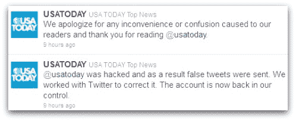
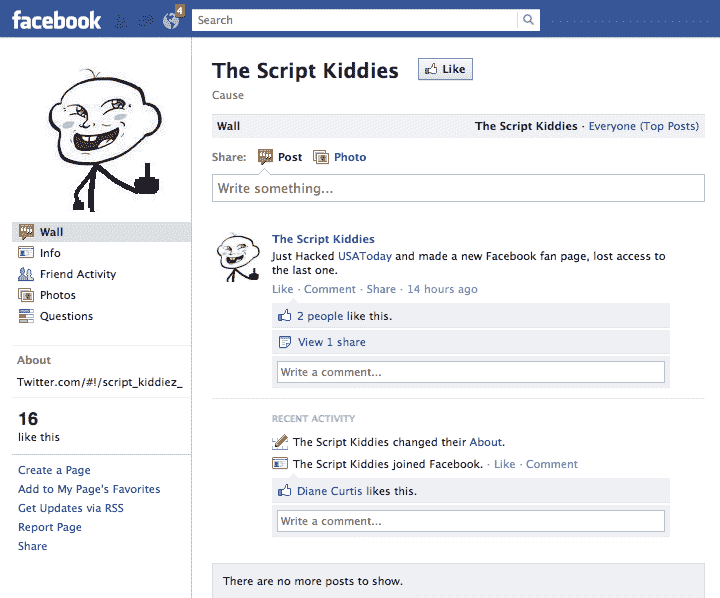

# 《今日美国》推特账户被“脚本小子”黑客攻击

> 原文：<https://web.archive.org/web/http://techcrunch.com/2011/09/26/usa-today-twitter-account-hacked-by-the-script-kiddies/>

一个自称为“脚本小子”的组织本周末入侵了《今日美国》的 Twitter 账户，并利用它来征求未来目标的请求，甚至推广自己的脸书页面。虽然最近的这次黑客攻击看起来更像是一个幼稚的恶作剧，但由于其早期的[黑客攻击](https://web.archive.org/web/20230203113830/http://nakedsecurity.sophos.com/2011/09/09/nbc-news-twitter-account-hacked-sick-911/)涉及在 NBC 的 Twitter 账户上发布虚假的恐怖主义声明，该组织正受到 FBI 的认真对待。

就在今年 9/11 周年纪念日的前几天，Script Kiddies 向@nbcnews 发布了世贸中心遗址遭到袭击的消息，展示了一种令人严重不安的对人类悲剧的麻木不仁。

现在这个团体又开始行动了，嘲弄 Twitter，抚摸他们的自我，并请求你们支持脸书。

其中一条推文指向@script_kiddiez_ Twitter 账户，该账户现在似乎已被暂停。《今日美国》也重新控制了自己的账户，并发表了道歉声明。

【T2

此外，黑客声称对其他黑客攻击负责，包括福克斯新闻频道([我们的报道](https://web.archive.org/web/20230203113830/https://techcrunch.com/2011/07/04/fox-news-twitter-account-hijacked-president-obama-declared-dead/))、沃尔玛、联合利华(Unilever？)和辉瑞，此外还有 NBC 和《今日美国》。

是的，[他们确实有一个脸书页面](https://web.archive.org/web/20230203113830/https://www.facebook.com/pages/The-Script-Kiddies/244165828962605?sk=wall)，目前已经有 16 个赞了。(我不会推荐参观…你永远不知道)。

根据安全专家 Graham Cluley 的说法，很可能新的《今日美国》黑客攻击涉及一个间谍软件特洛伊木马，[就像早先的 NBC 黑客](https://web.archive.org/web/20230203113830/http://nakedsecurity.sophos.com/2011/09/13/christmas-tree-trojan-blamed-for-nbc-news-twitter-hack/)所做的那样。对于 NBC 的黑客攻击，NBC 新闻的社交媒体总监瑞安·奥斯本(Ryan Osborn)可能通过电子邮件收到了一个包含键盘记录程序的特洛伊木马，然后在密码输入他的电脑时捕获密码。

黑客相对简单的本质——通过电子邮件发送间谍软件——可能是该黑客组织得名的原因。“脚本小子”(Script kiddie)是黑客社区中的贬义词，指的是那些利用他人编写的黑客工具和程序攻击系统或污损网站的人。

尽管黑客攻击中涉及的技术过于简单，但它们肯定是有效的。尽管 Twitter 擅长在这种情况发生时迅速做出反应，但这个社交网络早就应该提供类似脸书今天提供的更多保护了。

在脸书上，可以通过额外的身份验证机制、警报、登录批准甚至主动暂停相关账户来保护账户。与此同时，Twitter 一直在承担清理工作。

*图片鸣谢，推特: [Sophos](https://web.archive.org/web/20230203113830/http://nakedsecurity.sophos.com/2011/09/26/usa-todays-twitter-account-falls-foul-of-hackers)*