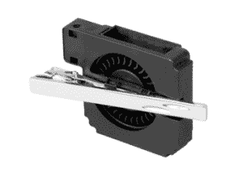

# USB 供电的领带夹冷却器 

> 原文：<https://web.archive.org/web/http://techcrunch.com/2011/07/14/usb-powered-necktie-clip-cooler/>

# USB 供电的领带夹子冷却器

这有点傻，但没关系。总部位于东京的配件制造商 Thanko 开发了一种非常特殊的小工具，据说可以帮助你抵御夏天的炎热:一种与迷你风扇相连的领带夹，通过 USB 供电。

夹子重 28g。你可以通过将设备直接连接到电脑的 USB 端口(当你坐在办公桌前时)或将其插入电池单元(见下文)来降温。

[T3](https://web.archive.org/web/20230203035755/https://techcrunch.com/wp-content/uploads/2011/07/necktie-a.jpg)T5

Thanko 正在他们的[日本在线商店](https://web.archive.org/web/20230203035755/http://www.thanko.jp/product/usb/usb-tie-clip-fan.html)出售 USB 领带夹子冷却器，售价 35 美元(含电池单元)。如果你感兴趣，但住在日本以外，等待[日本潮流商店](https://web.archive.org/web/20230203035755/http://www.japantrendshop.com/)列出它——或者你可以浏览他们的商店寻找[其他](https://web.archive.org/web/20230203035755/http://www.japantrendshop.com/usb-cooling-necktie-from-thanko-p-298.html) [独特](https://web.archive.org/web/20230203035755/http://www.japantrendshop.com/usb-heater-and-cooler-keyboard-p-1175.html) [冷却](https://web.archive.org/web/20230203035755/http://www.japantrendshop.com/usb-air-conditioned-shirt-by-kuchofuku-p-51.html) [小玩意](https://web.archive.org/web/20230203035755/http://www.japantrendshop.com/kuchofuku-air-conditioned-bed-p-140.html)。