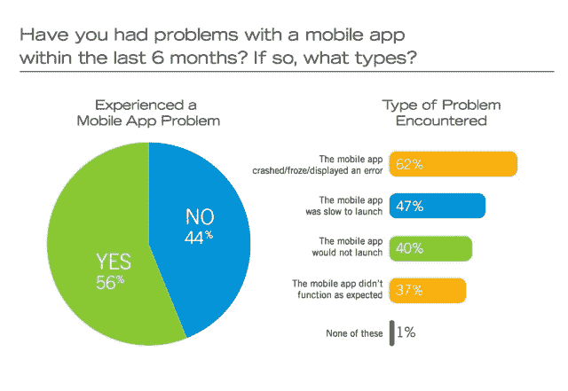

# 用户对错误应用的容忍度很低——只有 16%的人会尝试一个失败的应用两次以上 TechCrunch

> 原文：<https://web.archive.org/web/https://techcrunch.com/2013/03/12/users-have-low-tolerance-for-buggy-apps-only-16-will-try-a-failing-app-more-than-twice/>

根据 Compuware 的一项新研究，移动应用生态系统不会很快衰落，该研究发现大多数智能手机用户(85%)仍然喜欢移动应用而不是移动网站。用户认为应用程序更方便(55%)、更快(48%)和更容易浏览(40%)。当然，这些数据并不令人震惊——毕竟，原生体验确实更好——但有趣的是，用户对有问题的应用的容忍度有多低。79%的人表示，如果第一次失败，他们只会重试一两次。

只有 16%的人说他们会尝试两次以上。

这个比例很低，不足以让移动优先的公司在发布前感到不安。

如今，遇到应用程序问题的用户比没有遇到问题的用户多。Compuware 表示，62%的用户在使用一个或多个应用程序时遇到过崩溃、死机或出错的情况。另外 47%的人经历了缓慢的发布时间。40%的人说他们尝试过一个根本无法启动的应用程序。

【T2

为了获得这一数据，Compuware 委托 Equation Reach 进行了一项研究，该研究调查了美国(大多数人——1，002 人)、英国、法国、德国、印度和日本的 3，534 名受访者，他们在过去六个月中使用过智能手机或平板电脑，需要连接互联网。

现在，让我们明确一点，该公司在发布此类数据方面有既得利益——它出售旨在解决此类问题的应用性能监控解决方案。虽然这样一个非中立的立场应该让你提高警惕，但在这种情况下，这些发现听起来差不多是正确的。这项研究是在去年 10 月进行的——大约在同一时间，分析公司 [Flurry 也详细介绍了移动消费者中应用参与度的变化](https://web.archive.org/web/20230127142259/https://techcrunch.com/2012/10/22/flurry-examines-app-loyalty-news-communication-apps-top-charts-personalization-apps-see-high-churn/)。当时，Flurry 报告称，所有类别的移动应用的平均周使用频率已从 2009 年的 6.7 次下降到今天的 3.7 次。问题是，用户现在不得不把时间分散在越来越多的应用程序上。

为了支持这一结论，[尼尔森去年春天报告称，普通用户现在在他们的智能手机上有 41 个应用](https://web.archive.org/web/20230127142259/https://techcrunch.com/2012/05/16/nielsen-u-s-consumers-app-downloads-up-28-to-41-4-of-the-5-most-popular-still-belong-to-google/)，比 2011 年报告的 32 个应用增加了 28%。

与此同时，移动应用商店也一直在不停地增长，苹果的应用商店有大约 80 万个应用，安卓有大约 75 万个以上。如今，用户似乎也被知名出版商所吸引。[在这一点上，新人很难取得突破性的成功](https://web.archive.org/web/20230127142259/https://techcrunch.com/2013/02/20/the-app-stores-are-getting-full-only-2-of-iphone-top-publishers-in-u-s-are-newcomers-3-on-google-play/)，所以在新应用上线之前，它们就已经处于不利地位。

回到 2011 年，[大约四分之一的移动应用程序被下载，使用一次就被抛弃](https://web.archive.org/web/20230127142259/https://techcrunch.com/2011/03/15/mobile-app-users-are-both-fickle-and-loyal-study/)。如今的用户更易变，因为他们有了更多的选择。根据 Mobilewalla 创始人阿尼迪亚·达塔在去年接受《今日美国》采访时所说，估计 80%到 90%的应用程序最终会从用户手机中删除。

谈论只有一次机会留下好的第一印象。

所有这些加在一起，意味着用户对一个有缺陷的应用程序的容忍度非常低。(当然，除非你是脸书，在这一点上，我们似乎会永远忍受它，或者[，直到你最终明白过来](https://web.archive.org/web/20230127142259/https://techcrunch.com/2012/09/11/mark-zuckerberg-our-biggest-mistake-with-mobile-was-betting-too-much-on-html5/)。)

值得一提的是，我可以报告说，我个人对新应用的不良行为的容忍度甚至可能低于正常水平。[例如，我讨厌穿越](https://web.archive.org/web/20230127142259/https://techcrunch.com/2012/12/28/rethinking-the-mobile-app-walkthrough/)。在这一点上，我无法忍受那些不通过脸书或 Twitter 注册的应用程序。有时，即使这样也不够好——如果我不确定我会喜欢一个应用程序，甚至在我通过注册屏幕之前我都不知道它是什么，有时我根本就不会费心。

哦，这里有另一个值得咀嚼的数据点:Compuware 的研究还报告称，用户期望应用程序比移动网站快得多，平均加载时间为 2 秒。

开发者们，也许你们最好也[关掉那个闪屏](https://web.archive.org/web/20230127142259/http://blog.manbolo.com/2012/06/27/of-splash-screens-and-ios-apps)，当你们在做的时候。