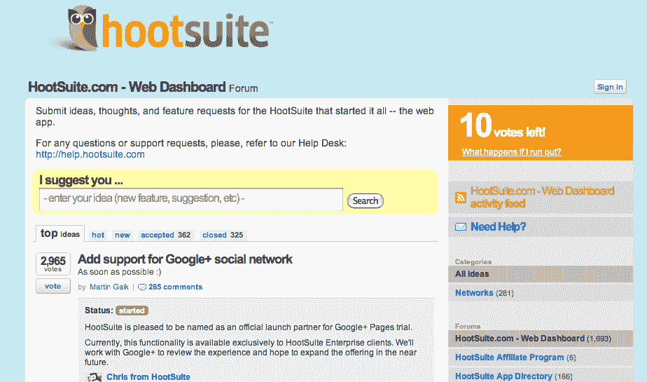

# 为 Meebo、HootSuite 等提供客户参与工具的 UserVoice 筹集了 100 万美元 

> 原文：<https://web.archive.org/web/https://techcrunch.com/2011/11/18/uservoice-which-powers-customer-engagement-tools-for-meebo-hootsuite-more-raises-1-million/>

客户参与工具的制造商 UserVoice 今天宣布，它已经筹集了 100 万美元的股权资金。本轮由 [Baseline Ventures](https://web.archive.org/web/20221226064120/http://www.crunchbase.com/financial-organization/baseline-ventures) 牵头，[Western Technology Investment](https://web.archive.org/web/20221226064120/http://www.crunchbase.com/financial-organization/western-technology-investment)、[Accelerator Group](https://web.archive.org/web/20221226064120/http://www.crunchbase.com/financial-organization/the-accelerator-group)、 [Tekton Ventures](https://web.archive.org/web/20221226064120/http://www.crunchbase.com/financial-organization/tekton-ventures) 、Dharmesh Shah、Mike Davidson、Peter Lehrman、Shan Mehta、Aayush Phumbra 和 Reza Hussein 出资。这家初创公司在 2009 年 5 月筹集了 80 万美元的种子资金，总投资不到 200 万美元。

据 UserVoice 创始人兼首席执行官理查德·怀特称，这家初创公司的产品，如 [UserVoice Feedback](https://web.archive.org/web/20221226064120/http://uservoice.com/feedback) (一种直接从公司客户那里收集产品想法并进行优先排序的托管工具)和 [Helpdesk](https://web.archive.org/web/20221226064120/http://uservoice.com/helpdesk) (一种易于使用的票务系统，让公司在更短的时间内解决更多的客户服务问题)，已经导致了 75，000 次注册和 4，000 万次用户互动。

他说，这家总部位于旧金山的初创公司发展迅速，因此为了支持其发展，UserVoice 将在北卡罗来纳州的罗利开设一个新的工程办公室。“来自罗利，非常熟悉工程人才的财富，在那里设立办公室是一个自然的选择”，怀特说。有了新的资金，这家初创公司计划在未来几个月内组建开发、设计和销售团队。

自 2008 年成立以来，UserVoice 基本上已经成为中小型企业通过社交化和游戏化的想法生成器智能处理员工和客户反馈的托管方式，他们可以在这里提出想法，对他人进行投票，并获得快速反馈。这是软件公司和 web 应用程序开发人员将反馈工具整合到他们的产品网站的有效方式，扩展了反馈渠道，为用户提供了一种简单的方式来表达他们对新功能、路线图等的想法。

通过像 [Instant Answers](https://web.archive.org/web/20221226064120/http://uservoice.com/instant-answers) 这样的产品，企业可以减少他们花在回答客户问题上的时间，因为该工具从公司的知识库中提取匹配的文章，并立即将这些信息发送给客户，以回答他们的产品问题等。

UserVoice 还提供小工具，以便公司可以直接从他们的网站上获得客户反馈，iPhone SDK 用一行代码嵌入了完整的客户服务解决方案，以及[脸书应用程序，以便粉丝可以在公司的脸书页面上提交](https://web.archive.org/web/20221226064120/https://techcrunch.com/2010/12/13/uservoice-brings-its-customer-feedback-service-to-facebook-pages/)，讨论和投票。

Seesmic、Posterous、Meebo、Miso、Rapportive 和 HootSuite 等公司目前正在使用初创公司的客户参与工具来简化他们的客户关系，并使他们接收客户反馈的方式多样化。(你可以在下图中查看 HootSuite 对 UserVoice 反馈解决方案的集成。)

关于用户之声计划和定价的更多信息，[点击这里](https://web.archive.org/web/20221226064120/http://uservoice.com/helpdesk)查看。

补充说明:UserVoice 创始人兼首席执行官理查德·怀特[将于 11 月 21 日(周一)上午 8:30(太平洋标准时间)主持一次炉边谈话](https://web.archive.org/web/20221226064120/http://www.ustream.tv/channel/uservoice-fireside-chats)，感兴趣的人可以向首席执行官询问关于融资轮和 UserVoice 未来的问题。

