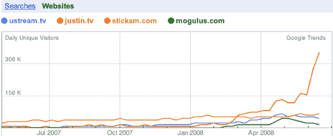
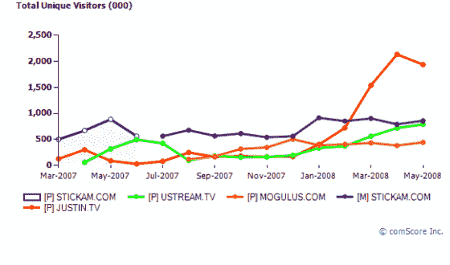
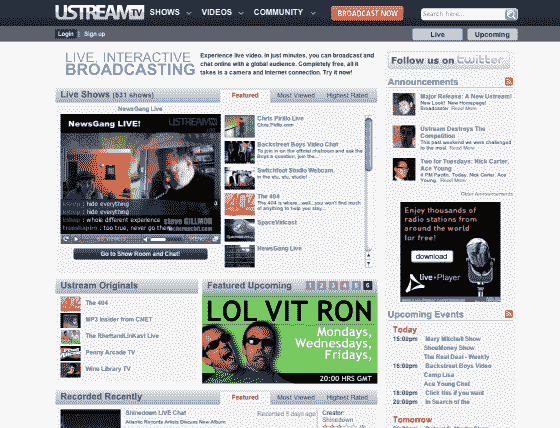

# Ustream.tv 刚刚进行了重新设计，但 Justin.tv 仍在努力

> 原文：<https://web.archive.org/web/https://techcrunch.com/2008/07/01/ustreamtv-just-got-a-redesign-but-justintv-is-still-beating-its-pants-off/>

# Ustream.tv 刚刚进行了重新设计，但 Justin.tv 仍在努力

 
谁将赢得网络视频直播的冠军？在谷歌趋势网站和 comScore 上快速查看一下就可以发现，在过去的四个月里，Justin.tv 领先于其他网站。根据[谷歌趋势](https://web.archive.org/web/20230121135632/http://trends.google.com/websites?q=ustream.tv%2C+justin.tv%2C+stickam.com%2C+mogulus.com&geo=all&date=all&sort=0)的数据，Justin.tv 每天吸引超过 30 万独立访客*，相比之下，Stickam.com 和 Ustream.tv 都只有大约 6 万。康姆斯克按月衡量访客，但显示出类似的相对细分，Justin.tv 每月在全球吸引 190 万独立访客，而 Stickam 为 86 万，为 79 万， [Ustream 为 79 万(见下图)。](https://web.archive.org/web/20230121135632/http://www.ustream.tv/)*

 *这两项指标都只衡量了每个竞争对手的主要网站的流量，并不包括有多少人在网络上的其他地方通过嵌入式播放器观看视频。但它们是苹果之间的比较，应该能很好地反映总体趋势。

Ustream.tv 至少意识到，为了赶上来，它需要改变一些东西。今天，它发布了网站的重新设计，这使得 DIY 广播公司能够在他们的视频中添加文本和图形覆盖，并更好地衡量有多少人正在观看他们的视频。此外，观众现在可以订阅特定的广播公司。该公司声称，6 月份共有 1000 万独立观众，包括在异地观看的视频。它拥有 41 万注册用户。其中有 10 万个用户是活跃的，每天直播 1 万到 1.5 万个事件。一些更知名的用户包括约翰尼·纳什维尔、戴恩·库克、詹姆斯·布朗特、Plain White Ts 和两位总统竞选人。TechCrunchIT 的编辑史蒂夫·吉尔默也在他的 NewsGang Live 节目中使用它。

但这可能就是问题所在。你更愿意看史蒂夫·吉尔默和他的妻子在分屏屏幕上谈论 Twitter，而她的猫在背景中爬上沙发(这实际上已经开始了)，还是在 Justin.tv 上看[穿着比基尼的法国女牛仔](https://web.archive.org/web/20230121135632/http://www.justin.tv/secretstory)？史蒂夫，无意冒犯，但 Justin.tv 上的特色直播似乎比 Ustream.tv 上的更年轻、更有趣。

【T2

*