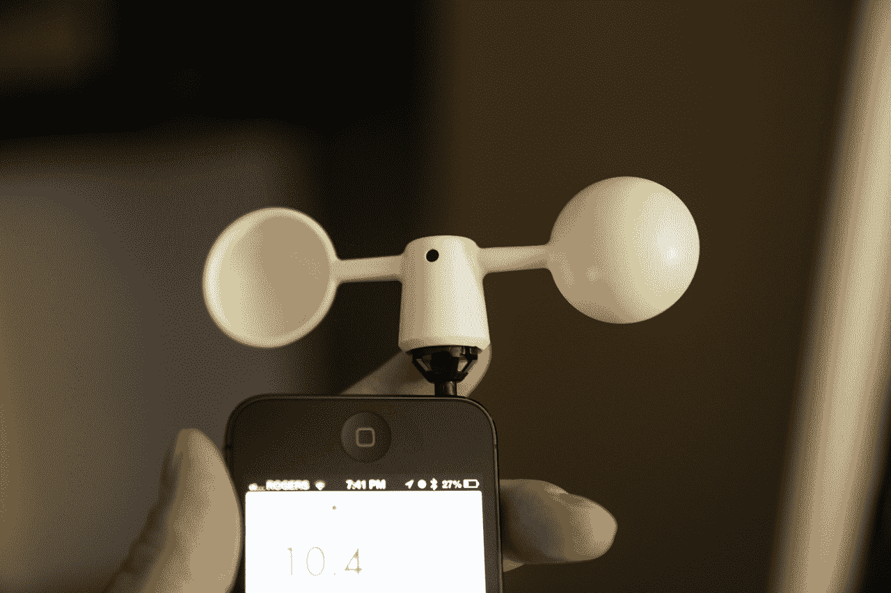

# Vaavud 智能手机风速计现已上市，使用您的手机测量风速，就像测量未来一样 TechCrunch

> 原文：<https://web.archive.org/web/https://techcrunch.com/2013/07/29/vaavud-smartphone-wind-meter-review/>

# Vaavud 智能手机风速计现已上市，使用您的手机来测量风速，就像它的未来

Kickstarter 的成功是一件美妙的事情。由一个丹麦创新团队创造，它插入你的 iPhone 或 Android 设备的耳机插孔，并与一个应用程序连接[告诉你当前的风速](https://web.archive.org/web/20221007225309/https://beta.techcrunch.com/2013/03/19/vavuud-wind-meter-for-smartphones-contains-no-electronics-delivers-accurate-ground-wind-speed-readings/ "Vavuud Wind Meter For Smartphones Contains No Electronics, Delivers Accurate Ground Wind Speed Readings")。它不使用电源，实际上通过现代智能手机自带的内置磁场传感器与你的手机无线通话。

Vaavud 将于 7 月 30 日发货，并在 bitemyapple，Grand St .和其他小工具和小发明的优秀供应商那里销售，但我有机会提前测试一个。事实上，Vaavud 通过了测试(看到我在那里做了什么吗？)并且明确告诉我外面的风有多快，或者当我在室内自娱自乐时，我对着它吹气有多有效。我做了很多，因为很有趣。

Vaavud 配备了一个内部机制，可以与大多数智能手机一起使用，还有一个工具包可以将其转换为处理三星 Galaxy S2，这需要稍微不同的设计。它还配有一个柔软的携带袋，配有登山扣，因为这个东西是为了在你爬山或勇敢的激流中随身携带而设计的。

你可以将 Vaavud 与该公司自己开发的应用程序一起使用，但也支持第三方应用程序，首先是第一个利用该 API 的应用程序 [Weendy](https://web.archive.org/web/20221007225309/http://weendy.com/) 。该应用程序是关于众包天气情况的，并从世界各地使用 Vaavud 的人那里收集信息，以建立各地的风速档案。这是一个完美的整合，但由于 Vaavud 是一个很小的市场，所以不要期望大部分景点会出现大量的数据。

 数据似乎很准确，但很难比较，因为我附近没有任何其他种类的风速计技术可以与之比较。原生 Vaavud 应用程序生成的图表很有吸引力，易于阅读，而且不需要电池的事实在户外和偏远地区使用它可能是最有用的。€40.00 英镑(约 61 美元)对于一个新奇的东西来说有点贵，但任何进行环境研究或真正热衷于天气的人肯定会从中得到乐趣。

许多 Kickstarter 项目，无论成功与否，都瞄准了特定的利基市场；这是他们不适合传统融资渠道的部分原因。Vaavud 可能会吸引一小部分人，但与大多数 Kickstarter 项目不同，它执行巧妙，建造精良，设计优雅。如果你认为你需要一个 Vaavud，不要犹豫，去买一个吧。