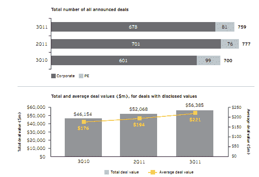
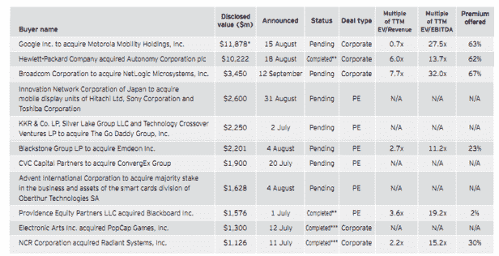
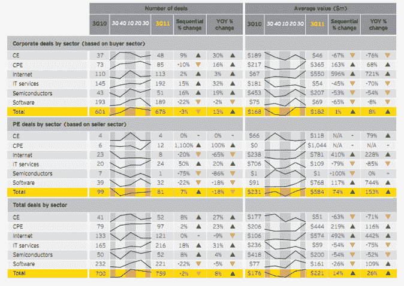

# 2011 年第三季度，M&A 技术交易价值增长 22%，达到 564 亿美元 TechCrunch

> 原文：<https://web.archive.org/web/http://techcrunch.com/2011/11/09/value-of-tech-ma-deals-up-22-percent-in-q3-2011-to-56-4-billion/>

就价值而言，M&A 在技术部门的活动继续增长。根据安永会计师事务所今天发布的一份报告，2011 年第三季度，大型收购推动全球技术 M&A 公司的总价值达到 565 亿美元，比一年前增长 22%，比上一季度增长 8%。

该报告称，自全球经济衰退前的 2007 年以来，总交易价值(包括已披露价值的交易)是任何一个季度的最高值。特别是，涉及智能移动和商业分析的交易在本季度表现强劲，推动了两项价值超过 100 亿美元的交易，这是自 2010 年第一季度以来首次在同一个季度发生两项如此规模的交易。

本季度最大的交易包括谷歌[125 亿美元](https://web.archive.org/web/20230203071031/https://techcrunch.com/2011/08/15/breaking-google-buys-motorola-for-12-5-billion/)收购摩托罗拉，惠普[102 亿美元](https://web.archive.org/web/20230203071031/https://techcrunch.com/2011/08/18/hp-to-buy-enterprise-software-autonomy-for-10-billion/)收购 Autonomy，博通[35 亿美元](https://web.archive.org/web/20230203071031/https://techcrunch.com/2011/09/12/broadcom-buys-chipmaker-netlogic-for-3-7-billion/)收购 NetLogic，创新网络[26 亿美元](https://web.archive.org/web/20230203071031/https://techcrunch.com/2011/08/30/sony-hitachi-and-toshiba-to-merge-operations-for-small-and-mid-sized-lcds/)收购索尼、日立和东芝的移动显示设备；以 23 亿美元收购 GoDaddy，Providence Equity 以 16 亿美元收购 BlackBoard，EA 以 13 亿美元收购 PopCap，NCR 以 11 亿美元收购 Radiant Systems。

2011 年第三季度 M&A 科技节的一个特别关注点是“大数据”第三季度，这一商业智能/分析类别大约有 24 笔交易，其中包括一笔超过 100 亿美元的交易。

云计算、信息安全、社交网络、在线和移动游戏、医疗保健 IT、互联网和移动视频也推动了交易。许多交易结合了两种或两种以上的趋势。

安永表示，私人股本交易总值的增长推动了整体价值的环比增长。本季度 PE 总价值同比增长 82%，达到 146 亿美元，同比增长 86%。在第三季度价值超过 10 亿美元的 11 笔交易中，私募股权公司贡献了 6 笔。

大额交易在本季度占据主导地位，前 11 笔交易的总价值为 401 亿美元，占本季度披露交易总额的 71%。这是自 2008 年以来第二个季度，前 11 笔交易的价值都超过 10 亿美元。

每笔交易的平均价值也在攀升，比上一季度增长 14%，同比增长 26%，达到 2.21 亿美元，为 11 年来的最高水平。前 11 笔交易的总价值占该季度总交易量的 70%以上。

从交易量来看，第三季度 M&A 交易数量连续第二个季度下降 2%，至 759 笔。与 2011 年第二季度相比，2011 年第三季度跨境交易的数量和价值均下降了 11%。全球趋势给前景蒙上阴影

因此，科技 M&A 交易的价值将继续增长。安永(Ernst & Young)警告称，市场和经济波动可能导致交易价值和金额下降。但持续开发的(也是有需求的)颠覆性技术可以缓解这一问题。

