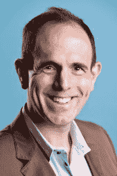

# “创业援助”:关于董事会应该做什么和不应该做什么的哲学观点 

> 原文：<https://web.archive.org/web/https://techcrunch.com/2013/02/26/venture-assistance-a-philosophical-view-of-what-boards-should-and-should-not-do/>

**编者按:** *传奇投资人维诺德·科斯拉是[科斯拉风险投资](https://web.archive.org/web/20230217015852/http://www.khoslaventures.com/)的创始人。可以在 Twitter[@ vk hostla](https://web.archive.org/web/20230217015852/http://www.twitter.com/vkhosla/)关注他。*

大多数风投把他们的风险公司定位为给公司的创业者增加价值。就我个人而言，我认为领先的风险投资公司在支持他们的公司方面做得很好，大多数企业家都像他们的投资者一样得到了良好基金的资助。但是，在“增值”的问题上，大多数风险资本家，甚至是领先公司的风险资本家，在帮助公司时都非常被动和低效。在我看来，他们中的许多人(如果不是大多数的话)在职业生涯中做得不够，不足以赢得为企业家提供建议的权利，我认为这是一份责任重大的工作。

许多风投，尤其是那些来自更注重财务的公司的风投，如果他们自己没有建立过公司，或者从内部看不到公司，就进入公司董事会，这对创业公司弊大于利。风投作为董事会成员能给公司增加什么价值？我们经常问我们的年轻人(如果他们进入董事会，他们会受到非常密切的监督，处于学习和建议模式，大多数人会在科斯拉风险投资公司工作三年，然后他们自己出去成为企业家)是“你做了什么，以获得为企业家提供建议的权利？”我不希望创业者在重要的事情上得到没有经验的建议。

基思·拉博伊斯

我们的信念是为我们的公司带来最好的资源，这就是为什么我们对科斯拉风险投资团队的最新成员[感到非常兴奋](https://web.archive.org/web/20230217015852/https://techcrunch.com/2013/02/26/former-square-coo-keith-rabois-joins-square-investor-khosla-ventures-as-partner/) : [Keith Rabois](https://web.archive.org/web/20230217015852/http://www.businesswire.com/news/home/20130226006378/en/Keith-Rabois-Joins-Khosla-Ventures-Team) 。在招募他加入我们的时候，我一直问自己的不是他是否会成为一名伟大的投资者(他确实是)，而是他是否会被企业家们聘为导师、顾问和董事会成员。我们几乎所有的背景调查都是针对企业家(成功的、有抱负的、经验丰富的、初次创业的)，而不是其他投资者。背景调查反复引发反馈，如“他问了最棘手的问题”；“他推我最多，让我思考”；“当我需要帮助的时候，他总是在那里”；“在我所有的董事会成员和顾问中最有价值”；“不只是告诉我我想听的”；“可以想象未来”；”帮助招聘”；等等等等。

作为 PayPal、LinkedIn、Slide、Square 和其他地方的企业家和经营者，以及多年来许多创业公司的导师，Keith 赢得了为企业家提供建议的权利。通过 PayPal 和 Square，他知道了增长的样子和感觉，通过他在 Slide 的经历，他知道了创业奋斗的感觉。他知道如何在创业公司的真实环境中，就招聘/解雇、管理团队、管理资金、何时/如何控制烧钱率以及做出其他艰难的管理决策向企业家提供建议。在成长型公司中，他是一个实际动手的人，他符合科斯拉风险投资公司(Khosla Ventures)的“风险援助模式”，即有权为企业家提供建议的人。

这让我想到了我最喜欢问的一个年轻创业公司的问题:董事会成员的角色是什么？

### 合适的顾问会问你从来不知道重要的问题。

优秀的董事会成员会增加多种战略价值，这对建立一家成功的公司至关重要，他们会以多种方式做到这一点。我们大多数人都不知道在一个新的领域运营时我们不知道什么。合适的顾问会问你从来不知道重要的问题。他们充当向导，帮助你在白手起家创建公司的艰难道路上导航，发现企业家可能会错过的东西(风险和机遇)。他们拥有一个广泛的网络，可以应对沿途可能出现的各种问题和挑战，无论是找到一个技能和经验完美匹配的关键员工，还是让公司在潜在客户那里与决策者进行一次成败攸关的会议。

在科斯拉风险投资公司，我们的“运营伙伴”是我们提供真正有针对性的帮助的理念的一部分，无论是教企业家如何建立招聘组织以获得最佳人才，还是帮助围绕新产品发布制定营销策略。优秀的董事会成员也会带来不同的技能和观点，这些都是通过多年的经验(和失败)积累起来的。他们迫使公司在为时已晚之前解决最棘手的成败问题，他们将企业家推向比他们自己可能达到的更高的高度。有这样的顾问做你的教练，就像是在一旁给你的创业引擎增压。

创业者通常会同时处理很多问题，做 CEO 是一件非常孤独的工作。无论事情进展顺利还是不顺利，他们经常被细节埋没，以至于看不到未来。一个好的董事会成员和顾问(我交替使用这两个术语)的工作是帮助团队抬起头来，发现即将到来的问题，找出隐藏的机会，并获得更广阔的视角。如果事情进展顺利，预见问题就更加重要，因为过度自信会毁掉一家公司。挑战团队思考风险或定位一些长期资产可以在帮助企业家“创造”更大机会方面产生很大影响。问企业家不想听到的问题也是一个同样重要的角色，拥有以前犯过错误的顾问会有所帮助。

我经常谈论我多年来搞砸的[教训。团队多元化的价值以及](https://web.archive.org/web/20230217015852/http://www.khoslaventures.com/vinod-khosla/)[根据团队面临的风险和机遇设计团队的基因库](https://web.archive.org/web/20230217015852/http://www.khoslaventures.com/wp-content/uploads/2012/10/Gene_Pool_Engineering.pdf)，这些都是优秀顾问能够带给初次创业者的关键因素。了解[如何避免需要雇佣 CEO](https://web.archive.org/web/20230217015852/https://techcrunch.com/2012/11/10/if-when-and-how-to-avoid-hiring-a-ceo/) 或者当你需要雇佣 CEO 时该怎么做[都是从以前的大量错误中得到的更好的信息。我经常说，我比风险投资行业的大多数人有更多的个人错误。](https://web.archive.org/web/20230217015852/https://techcrunch.com/2012/11/11/signs-it-might-be-time-to-consider-hiring-a-ceo/)

我如何衡量我的合作伙伴和我自己？如果在我们的建议、激励和挑战下，一个团队没有将其机会扩大两倍或更多，或者如果我们没有推动一个团队招募比没有我们时更高水平的人员，或者让无法接触到的候选人考虑该公司(在我看来，一个公司成为它雇用的人)，或者如果我们没有帮助一个团队抓住机会(战略或战术大客户)或比他们本来应该更早地解决风险，那么我们没有增加价值。我们没有完成我们的工作。

我们的目标不是成为所有投资者中最好的，而是推动团队尽可能地伟大，帮助他们看到严峻的现实和即将到来的风险，并迫使他们担心烧钱速度或根据情况加快支出。出于同样的原因，尽管我们可以给团队施加很大压力(有时其他风投会说我们给他们施加的压力太大，但这些是被动的风投)，但我们对与我们密切合作的公司和企业家非常忠诚(在特别困难的情况下，比大多数风投公司更忠诚)。

### 优秀的企业家精神就像有一份由专业厨师烹饪的精致食谱，配料在正确的时间以正确的量加入。

更重要的是，在近 30 年的董事会和公司顾问生涯中，我从未投票反对过一个团队想要做的事情，即使我强烈反对他们的选择。我会努力讨论每一个问题，推进我的观点，但把最终决定权留给团队。我不认为创业型私营公司的董事会应该投票(除了雇佣和解雇首席执行官这个问题)。如果团队不相信董事会投票的结果，那么他们就不会成功地实施它。

一个团队每周花 80 个小时在一家公司工作，了解正在发生的数百件事情的所有细微差别，并负责实施一项决定，应该由这个团队做出决定(而不是每隔六、八周就来一次的董事会)。我越是相信一个团队在他们的方法上走错了路，我就越是会打扰他们，推动他们，哄骗他们，恳求他们，但我总是建议我和其他顾问/董事会成员不要为团队做决定。

决策应该是一条清晰的线，任何董事会都不能越过。如果一个团队知道决定将留给他们，你会得到更多诚实的输入和反馈，公开的讨论和激烈的(有时不舒服的)辩论，更好地理解恐惧和机会，以及更透明的自我评估。我发现许多董事会反其道而行之，不与团队密切接触，但仍试图投票决定公司应该做什么。偶尔，当我发现我与团队之间没有良好的化学反应时，我经常退出，让他们走自己的路，不再积极参与公司活动。不是每段感情都有趣，你必须承认这一点。如果一个团队不想要帮助，我们也不想提供帮助。

与这种个人对理想董事会的看法相反，许多董事会往往彬彬有礼，令人愉快，在许多情况下甚至有所失误。有一次，我所在的一个董事会没有告诉一家公司(这家公司资金雄厚，在银行有 4500 万美元的存款)他们不相信团队正在追求的计划。董事会成员是友好的啦啦队员。在我看来，我几乎是孤立的。三年后，在浪费了许多生命之后，该公司以 300 万美元的价格被出售，该团队几乎在收购后立即被解雇。我发誓不会让这种事情再次发生，并在我们的网站上发布了“我们更喜欢残酷的诚实，而不是虚伪的礼貌”的声明。

我要求首席执行官们关注公司面临的最关键、最关键的风险、问题和机遇，而不是关注常规的董事会“治理”(我认为这种活动在优秀的初创公司中只需要最低限度的要求)。董事会应该挑战团队，让他们变得更大、更好、更谨慎或更有抱负，几乎达到(但不会超过)企业家舒适和能力的极限。它们应该让企业家进行认真的、批判性的思考。他们应该有足够的能力去理解一家公司的业务，以一种团队不仅尊重而且寻求的方式来集思广益。我希望我的每一位合伙人都能把这一点带到他们所在的董事会，我也希望企业家们像我认为的那样重视这一点。

我们采访的一些优秀企业家谈到基思·拉布瓦时告诉我们，他是他们最严厉的批评者，也是最严厉的提问者，这让他在科斯拉风险投资公司对我们更有吸引力。我们希望企业家实现他们所能实现的一切，并尽可能避免风险。优秀的企业家应该希望董事会成员积极、有思想、忠诚、有经验，同时也尊重和顺从，而不是虚伪的好人。顺便提一下，一个企业家越不自信，越关注自我(而不是公司使命)，他们就越喜欢独处。

像基思这样伟大的董事会成员还能给聚会带来什么？理解一个新的空间，有想象可能性的想象力，引导非常精益的创业型实验朝着这些目标前进，而不是假设每个策略第一次都会成功。大多数成功的计划都经历了许多曲折、转折和演变，这是线性思维的董事会成员很少认识到的一个事实。在创业公司工作的真实经历让董事会成员对创业生活的这些现实更加敏感。好的顾问本身就有创业经验。

### 好的顾问和董事会成员帮助企业家避免他们可能看不到的错误，因为他们正埋头努力建立自己的企业。

好的顾问也做过很多招聘工作，知道应该寻找什么。我见过董事会把一些天真的、近乎临床的招聘规范放在一起，看起来就像是《商业 101》之外的东西。现实生活要复杂得多，微妙得多，也灵活得多，除非你在招聘中犯了足够多的错误(我假设我不能以超过 66%的成功率来判断招聘有多好)，否则在我看来，你不知道如何给团队提建议。

招聘可能是一家公司做的最重要的事情(如果你和我一样相信一家公司“成为他们雇佣的人”)，招聘中“成功和失败因素”的经验以及“吸引遥不可及的候选人的可信度”成为公司董事会贡献的最重要的事情之一。我仍然花更多的时间为我们的公司招聘人员(甚至在需要的时候为个别关键工程师招聘),而不是其他任何一项活动。

好的顾问和董事会成员帮助企业家避免他们可能看不到的错误，因为他们正埋头努力建立自己的企业。董事会成员应该成为值得信赖的顾问核心圈子，激励公司管理层进行自我评估和改进，优秀的董事会可以帮助创始人 CEO 建立合适的团队来支持他们，从而帮助他们扩大规模。有时候公司需要花时间做一些基本的计划，有时候他们需要专注于做好未来六个月的事情。好的董事会知道区别，他们知道什么时候什么是重要的。

在科斯拉风险投资公司，我们鼓励我们的企业家定期进行 360 度评估，思考[基因库工程](https://web.archive.org/web/20230217015852/http://www.khoslaventures.com/wp-content/uploads/2012/10/Gene_Pool_Engineering.pdf)，进行[风险分析](https://web.archive.org/web/20230217015852/http://www.khoslaventures.com/wp-content/uploads/2012/02/Risk_Matrix.ppt)，关注可衡量的目标设定，进行诚实的竞争分析，在需要时执行[步枪](https://web.archive.org/web/20230217015852/http://www.khoslaventures.com/wp-content/uploads/2012/02/Rifle_Methodology_Applied_For_KV_Site2.ppt)市场分析，最重要的是，进行严格的“如果-那么”财务规划我们称这些流程为“标准操作程序”,每季度一次，在我们的内部会议上为每家公司决定哪些是最相关的，以引起团队的注意。

优秀的企业家精神就像有一份由专业厨师烹饪的精致食谱，配料在正确的时间以正确的量加入。没有好的顾问的帮助，仅凭自己的直觉很难找到创业成功的秘诀。那些顾问不为管理层做决定。他们唯一的作用是通过提供诚实的建议来帮助企业家，即使这些建议听起来不舒服。他们不在那里治理，做决定或投票。他们在那里倾听、争论、辩论和指导，但是把最终的决定留给必须执行它的团队。最后，顾问应该推动和挑战团队，而不要让团队觉得他们不能做出最终决定，或者董事会成员的利益与他们的利益有分歧。

我们从不称自己为风险资本家。我们努力成为“创业助手”获得好的建议比获得资金重要得多。得到钱比得到正确的建议要容易得多。经营一家初创公司需要做出所有的判断，这就是拥有合适的顾问真正重要的地方。在技术、创新、经验、烧钱速度和许多其他因素之间有一个微妙的平衡，很少被那些没有从小规模开始建立大型成功公司的人所理解。拥有正确的帮助来管理这种平衡行为会在公司的轨迹中产生阶跃函数式的变化。这就是建立一个一亿美元的企业和十亿美元的企业之间的区别。