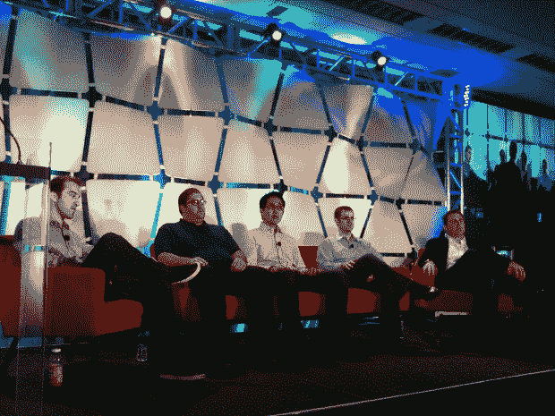

# 在# TC disrupt TechCrunch 上，风险投资家受到盘问(并被扔在小便池里)

> 原文：<https://web.archive.org/web/https://techcrunch.com/2010/05/26/venture-capitalists-get-grilled-and-pitched-at-urinals-at-tcdisrupt/>

不一定总是风险资本家在拷问创业者——在 [TechCrunch Disrupt](https://web.archive.org/web/20230120010153/http://disrupt.beta.techcrunch.com/) ，我们已经打破了这种观念(看我在那里做了什么？)并为创业者举办了一场开放式麦克风会议，现场和未经审查地挑战风投。

被质疑的投资者是[马克·戴维斯](https://web.archive.org/web/20230120010153/http://www.crunchbase.com/person/mark-davis)(DFJ 高谭风险投资的合伙人)、[里克·海兹曼](https://web.archive.org/web/20230120010153/http://www.crunchbase.com/person/rick-heitzmann)(董事总经理、[第一马克资本](https://web.archive.org/web/20230120010153/http://www.crunchbase.com/financial-organization/firstmark-capital))、[李尚义](https://web.archive.org/web/20230120010153/http://www.crunchbase.com/person/david-lee)(SV 天使的普通合伙人)、迈克·布朗([美国在线风险投资](https://web.archive.org/web/20230120010153/http://www.crunchbase.com/financial-organization/aol-ventures))和[埃里克·威森](https://web.archive.org/web/20230120010153/http://www.crunchbase.com/person/eric-wiesen)(普通合伙人、 [RRE 风险投资](https://web.archive.org/web/20230120010153/http://www.crunchbase.com/financial-organization/rre-ventures))。

**问:**有没有这样一种情况，创业者应该付钱给投资者？

里克——虽然很难说从来没有，但我见过的骗局比好事还多。如今的企业家更有能力接触优秀的投资者。简而言之:我认为没有任何理由为推销付费。

问:你喜欢别人以独特而有创意的方式推销你吗？

马克——当然，我们鼓励这样做。

大卫——我们喜欢看到真实性，因为这是你无法伪造的。

问:你经历过的最糟糕的一次投球是什么？

瑞克——那是 20 分钟前，有人开始在小便池旁对我耳语。坏主意。

迈克:我一直不明白为什么企业家没有预约就出现在风投办公室门口。

**问:**是做一条能游过网的小鱼好，还是做一条大到让网没用的鱼好？

Eric–我想你的比喻是关于竞争格局的。我的答案很简单:你想进入一个初创企业有机会颠覆的行业，在这个行业里，现有企业发展缓慢。

**问:**在其他人都很明显之前，你怎么知道某件事是破坏性的？

**答:**马克——我想你可以在相对早的时候就看出来了；你看产品、团队、市场规模、竞争格局、定位等。

埃里克:但最终，你不知道，这不是一门科学。这项工作是预测未来，这很难做到。

问:你对第一轮会谈有什么期望？

大卫——这因人而异，但我们寻找的是激情，这项业务应该对你真正有意义。举几个例子:YouTube，20×200。还有，我们热爱数据；我们想要可以合作的东西。只有幻灯片却没有数据，这不是一个好的开始。

**问:**本着颠覆的精神:你花了很多时间寻找投资。但是创业公司拿到钱的方式越来越多。那么，你如何看待风险投资的发展？你对你在这方面看到的变化感到威胁吗？

Rick——我认为在过去，风险投资更容易，你只需要找到合适的人，就能拿到 1000 万美元。如今，创办公司需要更少的资金，而且所有者持有公司更大的股份。形势迫使我们发展，但这对行业是好事。

问:比起设计，你更喜欢功能性还是相反？

**答:**Eric——数据通常会为我们回答这个问题。你的用户会告诉你，它会显示在数字中。

Mike——我不在乎花了多长时间来构建你的产品，但是关注用户以获得反馈。

大卫——我们更喜欢企业家把一件事做得非常好，而不是把很多事情都做得相当好。

**问:**大家对在资金上支持你投资组合中公司的竞争对手有什么看法？

**答:**马克-我们尽量避免这种情况，投资组合中的冲突不是你想要的。暴露风险太大。

Eric–如果我们投资组合中的一家公司改变方向，最终与另一家公司竞争，我们不会阻止他们。

大卫——我们可能是例外。我们没有董事会席位，所以我们能够以不同的方式管理冲突。我们一直在投资竞争对手。

**问:**创业者冒险做大。为了成为下一个红杉，你承担了什么样的风险？

里克——通过努力工作和支持，好事往往会发生。你自下而上地建立你的声誉，为你的公司建立关系。即使你不投资，也要保持亲近和友善，这是因果报应的事情。

问:现在开公司花的钱少了。自举会让对 VC 的需求消失吗？

马克-风险投资对一些人来说可能是好事，对另一些人来说可能是坏事。有时候风投会支持那些不需要现金的公司，而且从来没有好结果。但是一些创业公司需要资金来实现他们的目标。