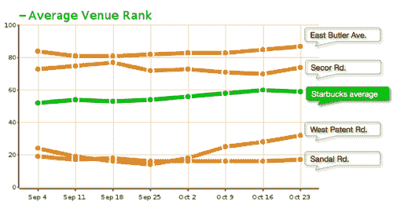
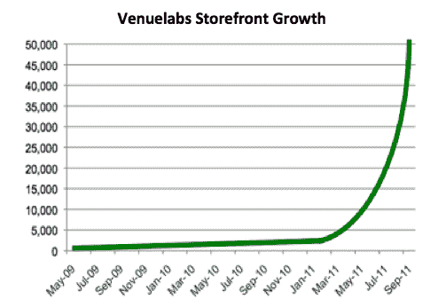

# Venuelabs 正在推出 VenueRank，这是一个“店面 Klout”

> 原文：<https://web.archive.org/web/https://techcrunch.com/2011/11/02/venuelabs-is-launching-venuerank-a-klout-for-storefronts/>

Venuelabs ，一家在 2011 年初转向之前以 [Valuevine](https://web.archive.org/web/20230203072513/http://www.crunchbase.com/company/valuevine) 起家的公司，本周在三藩市的 Geo-Loco 会议上推出了一项名为 [VenueRank](https://web.archive.org/web/20230203072513/http://www.venuerank.com/) 的新服务。简而言之，VenueRank 的运作有点像“店面 Klout”，因为它允许拥有多家商店的品牌使用单一的一目了然的分数相互比较或与竞争对手比较。

尽管将 VenueRank 与 Klout 进行比较有助于你理解该产品的功能，但这是有害的。Klout 仍处于早期开发阶段，人们过于强调它的[自我提升副作用](https://web.archive.org/web/20230203072513/https://techcrunch.com/2011/10/26/nobody-gives-a-damn-about-your-klout-score/)，而不是它更实际的用例。与 Klout 不同，VenueRank 的潜在最终用户，在这里是品牌，不需要任何服务价值的说服力。该公司在 beta 测试期间与大约 500 个品牌合作，现在正在 7 个国家的 68，000 个店面上运行 VenueRank。目前的客户包括 Ruby Tuesday、Jaguar、Aspen Dental、Little Caesar's、Red Robin、Precision Tune Auto Care、Roto-Rooter、Interim Healthcare 和许多其他公司。

为了确定一家商店的排名(其“VenueRank”)，该服务会考虑许多因素，如当地社区参与度、规模、增长、覆盖范围和人气。这些都是通过社交媒体分析确定的，其中包括脸书和 Foursquare 的签到，脸书的“喜欢”，在线评论和提示，以及来自 CitySearch，Yahoo Local，Bing Places 等网站的用户评论。

排名显示在一个在线仪表板上，该仪表板还支持自定义视图和电子邮件提醒。品牌可以单独比较不同的商店，商店群，甚至他们自己的商店与竞争对手进行比较。当检查提供的分析时，品牌可以深入数据，查看谁在何时入住，谁喜欢它，谁评论，评论说什么等具体细节。

Venuelabs 与 [Saepio](https://web.archive.org/web/20230203072513/http://www.saepio.com/) 、 [PlayNetwork](https://web.archive.org/web/20230203072513/http://www.playnetwork.com/) 合作，并刚刚增加了 [GroupM](https://web.archive.org/web/20230203072513/http://groupm.com/) 、[WPP](https://web.archive.org/web/20230203072513/http://www.wpp.com/wpp/)整合媒体投资管理业务，该业务将把 VenueRank 的本地店面分析整合到自己的产品中。明年，它还将与一些机构合作。

在发布时，VenueRank 将在订阅的基础上提供，价格由位置的数量决定。

据 Venuelabs 现在的报告，自其转向以来，该公司已实现了 30%的月环比增长。该公司现在有一个 10 人的团队(6 名全职)，包括首席执行官尼尔·克里斯特和首席技术官皮特·曼尼克斯。它目前的资金很少，从当地天使那里筹集了 45 万美元。

