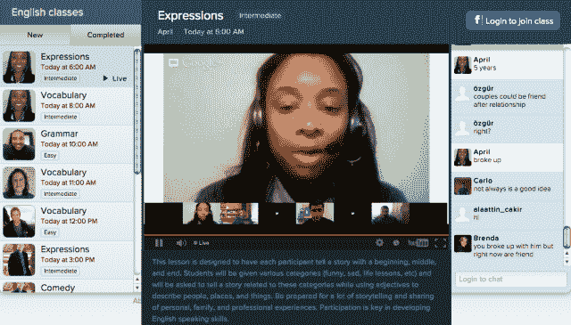

# 语言学习服务 Verbling 推出基于 Google Hangouts 的课程，增加了对 9 种新语言的支持 

> 原文：<https://web.archive.org/web/https://techcrunch.com/2012/11/30/verbling-classes-new-languages/>

学习一门新语言可能是乏味和令人沮丧的。幸运的是，新一代创业公司正在利用移动和网络技术的进步，让这一过程变得更加愉快和有益。如今，像 [Livemocha](https://web.archive.org/web/20221206050609/http://livemocha.com/) 、 [PlaySay](https://web.archive.org/web/20221206050609/https://beta.techcrunch.com/2012/05/01/playsay-social-language-learning-app-launches-with-820k-and-a-harpercollins-deal-in-its-pocket/) 、 [Voxy](https://web.archive.org/web/20221206050609/http://voxy.com/) 、 [italki](https://web.archive.org/web/20221206050609/http://www.italki.com/) 、[mind 零食](https://web.archive.org/web/20221206050609/http://www.mindsnacks.com/)和 [Duolingo](https://web.archive.org/web/20221206050609/https://beta.techcrunch.com/2012/09/17/duolingo-raises-15m-series-b-round-lead-by-nea-will-expand-to-more-languages-and-to-mobile-soon/) 这样的公司为传统语言学习软件提供了越来越可行的替代品——世界罗塞塔石碑。

另一个最近进入这一领域的是 Y Combinator grad[Verbling](https://web.archive.org/web/20221206050609/https://www.verbling.com/)，这是一家由风险投资支持的初创公司，希望通过视频聊天将语言学习者与真实、现场的母语人士联系起来，帮助他们成为通晓多种语言的人。与专注于文本和基于算法的 Duolingo 不同，Verbling 希望通过创建一种无摩擦的浏览器内实时视频聊天体验来帮助用户达到流畅并避免掉线，这种体验鼓励沉浸感——尽管是虚拟的。

加入后，这家初创公司会自动将想要学习西班牙语和英语流利的人与相反的人配对，例如，那些西班牙语流利但想要学习英语的人。这是通过互惠的沉浸。用户根据他们的经验水平进行匹配，并被鼓励在各种语言之间来回切换(通过附带的计时器)，系统会在此过程中建议各种提示和目标。

自今年早些时候推出以来，Verbling 一直专注于英语和西班牙语，但今天该公司增加了对 9 种新语言的支持，包括意大利语、法语、德语、普通话、日语、希伯来语、葡萄牙语、阿拉伯语和俄语，使总数达到 11 种。创始人 Mikael Bernstein 告诉我们，这些是用户要求最多的语言，事实上，它们代表了世界上最常用的语言。

与 Duolingo、Voxy 和 mind 零食相比，它对 11 种语言的新支持使这家初创公司处于有利地位，并使它与它可能最相似的网站 Busuu 不相上下。许多网站提供了一些与母语使用者交流的工具，包括课程和其他课程。伯恩斯坦认为 Verbling 在这方面有优势，因为它专注于新手到专家的匹配和一对一的视频模型。

这位联合创始人告诉我们，用户现在每月参加超过 50，000 次练习，11 月份的月环比增长率为 317%，他预计随着新语言支持的推出，这一数字将会增加。利用这一点，随着课程的增加，Verbling 也推出了自己的课程。

但它是通过坚持其视频聊天的根基来做到这一点的，因为“Verbling Classes”为九名语言学生提供了加入由官方的、经 TEFL 认证的 Verbling 老师领导的 Google Hangout 课程的能力。伯恩斯坦说，他们最初对使用 Hangouts 持怀疑态度，但在谷歌提出解决方案后，他们更认真地考虑了这一复制课堂环境的有效方式。他说，这可以提供一种虚拟课堂体验，更有趣，更基于对话，并且可以成为未来的赚钱工具。

对于其主要的一对一视频聊天体验，Verbling 试图通过允许用户与聊天伙伴保持联系来提高粘性，如果他们喜欢对话并认为对话富有成效。学习一门新的语言肯定有助于增加一点稳定性和熟悉度，所以能够通过平台发送好友请求，相互发送消息(或者如果视频看起来很尴尬，就打个语音电话)是鼓励用户建立工作专业关系并从他们离开的地方重新开始的好方法。

起初，这家初创公司将只开设英语的谷歌社交语言课程，每节课将限制在 9 节，但将开设一系列科目。九将直接参与，但即使你没有做到，你仍然可以收听并积极参与。伯恩斯坦说，展望未来，这家初创公司希望能够允许学生支付少量费用，以保证他们在某个班级的一席之地。

展望未来，Verbling 将专注于建立课堂和一对一的学习体验，并将筹集新一轮资金来支持这一增长。100 万美元的启动资金来自 DFJ、Learn Capital、Start Fund、Inspovation Ventures、SV Angel、Meck Investments、Ace & Company [等，早在 1 月份](https://web.archive.org/web/20221206050609/https://beta.techcrunch.com/2012/01/26/verbling-raises-1m-to-link-up-language-learners-with-native-speakers-through-video-chat/)。这位联合创始人还告诉我们，Verbling 最近聘请了 Gustav Rydstedt 作为新的 CTO，他曾是暴雪在暗黑破坏神 3 上的团队经理，并聘请了 T20-20 决赛选手和 YC 校友以及 [FamilyLeaf](https://web.archive.org/web/20221206050609/https://beta.techcrunch.com/2012/03/26/familyleaf-brings-your-kin-together-in-its-own-private-social-network/) 联合创始人 Brandon Paton。

[vimeo 52593050 w=640&h=380]