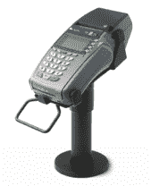

# VeriFone 以超过 10 亿美元收购欧洲支付处理公司 Point 

> 原文：<https://web.archive.org/web/http://techcrunch.com/2011/11/14/verifone-buys-european-payments-processing-company-point-for-820-million/>

VeriFone 正在疯狂收购。在[收购](https://web.archive.org/web/20230205014827/http://allthingsd.com/20111101/verifone-acquires-company-that-helps-retailers-swap-registers-for-ipads/)支付软件开发商 Global Bay 之后，支付公司[以 8 . 2 亿美元收购](https://web.archive.org/web/20230205014827/http://www.marketwatch.com/story/verifone-to-acquire-point-to-build-out-alternative-payments-infrastructure-2011-11-14)欧洲电子支付巨头 [Point](https://web.archive.org/web/20230205014827/http://www.point.se/sv/Sweden/Om-Point/Corporate-information/) 。此次收购预计将于 2011 年底完成。VeriFone 还将承担 Point 价值 2.3 亿美元的债务，使交易总额超过 10 亿美元。

被私人股本集团 Nordic Capital 出售的 Point 是北欧最大的支付和零售商及商户网关服务提供商。单点安装每天处理 1000 万笔交易，客户包括欧洲一些最大的零售公司，以及小型独立商店和在线商家。

该公司的技术包括销售点技术和支持、网关服务、卡加密服务和多渠道电子商务处理。Point 拥有 800 多名员工，在丹麦、爱沙尼亚、芬兰、法国、冰岛、爱尔兰、拉脱维亚、立陶宛、挪威、瑞典和英国设有分支机构。目前，Point 拥有 475，000 份商户合同。

VeriFone 计划将 Point 平台扩展到整个地区及更远的地方，目的是为快速部署替代支付创建世界上最大的基础设施。

VeriFone 首席执行官 Douglas G. Bergeron 在谈到此次收购时表示:“我们的愿景是为各地的零售商提供托管服务，让他们能够轻松接受所有现有的支付类型，包括由 Google、PayPal、Groupon、Isis、Visa、MasterCard 和 American Express 提供的不断发展的替代和移动支付方式。与此同时，我们可以越来越多地为新的支付进入者提供轻松、快速地访问我们全球 2000 多万条商户通道的服务。”

除了在欧洲扩展销售点技术，point 也是 VeriFone 的赚钱机器，预计在未来 12 个月内将带来 2.6 亿美元的销售额。VeriFone 预计 2012 财年服务总收入将超过销售额的 30 %, 2015 财年将超过收入的 50%。

正如 AllThingsD 在 8 月份报道的那样，VeriFone 计划每年花费 10 亿美元收购新技术，以帮助引领支付领域。虽然看起来 VeriFone 今年可能会达到这个数字，但明年的大量收购应该会很有趣。