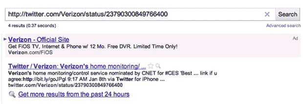

# 嘿，苹果迷，我们没有删除威瑞森 iPhone 推特的 Photoshop

> 原文：<https://web.archive.org/web/http://techcrunch.com/2011/01/10/verizon-iphone-2/>

# 嘿，苹果迷们，我们没有用 Photoshop 删除威瑞森的 iPhone 推文

今天早上早些时候，记者 Rich DeMuro [用一条不同寻常的](https://web.archive.org/web/20230203004829/http://twitter.com/richdemuro/status/24519219731234816)[@威瑞森](https://web.archive.org/web/20230203004829/http://twitter.com/verizon)推文吸引了的注意，这条推文看起来像是来自 iPhone 的 [Twitter。](https://web.archive.org/web/20230203004829/http://itunes.apple.com/us/app/twitter/id333903271?mt=8)

虽然我们不是第[个看到它的第](https://web.archive.org/web/20230203004829/http://www.theiphonespot.net/?p=7908)个，或者甚至不是第[个就此发表文章的第](https://web.archive.org/web/20230203004829/http://www.businessinsider.com/verizon-sends-a-tweet-from-an-iphone-2011-1?utm_source=feedburner&utm_medium=feed&utm_campaign=Feed:+typepad/alleyinsider/silicon_alley_insider+(Silicon+Alley+Insider))个科技博客，但我们[还是写了关于它的第](https://web.archive.org/web/20230203004829/https://techcrunch.com/2011/01/10/verizon-iphone/)篇文章，也就是说，因为它是*“有趣的”*威瑞森账户的幕后黑手可能在[传言的](https://web.archive.org/web/20230203004829/https://techcrunch.com/2011/01/10/verizon-iphone-hype/)威瑞森 iPhone 发布会前几天一直在用 iPhone(威瑞森或其他地方)发推文。

事情变得更有趣了。我们的帖子发布后不久，这条推文就神秘消失了。

与此同时，在 [Cult of Mac](https://web.archive.org/web/20230203004829/http://www.cultofmac.com/did-verizon-really-tweet-from-an-iphone/76470) 上，无偿服务的 TechCrunch 事实审查员朗尼·耶戈决定扫描威瑞森的 Twitter 账户，寻找我们提到的那条推文，但没有结果。当他发现 CoTweet 1 月 7 日发来的一条类似的推文时，他决定写一篇文章暗示我们 PS 了上面的图片。

> “但这是否也是网络上最受关注的科技博客之一沉迷于一点流量诈骗的机会呢？”

嗯，没有。除了我们不是唯一看到它的人，最初的推文有一个 http://twitter.com/Verizon/status/23790300849766400 的状态 URL 和唯一的推文 ID，后来被删除了。但不是来自谷歌搜索。去吧，[自己试试](https://web.archive.org/web/20230203004829/http://www.google.com/#sclient=psy&hl=en&prmdo=1&q=http%3A%2F%2Ftwitter.com%2FVerizon%2Fstatus%2F23790300849766400&aq=f&aqi=&aql=&oq=&gs_rfai=&pbx=1&fp=1&cad=b)。
T3

瞧，这是我们在 1 月 8 日消失的推文，是通过 iPhone 的 Twitter 发送的。呵。

当我们与他通电话时，威瑞森代表 Jeffrey Nelson 告诉 TechCrunch，他听到了这条推文的传言，但无法证实，因为它已经不在威瑞森的账户上了。要求进一步解释为何不再存在的请求得到了*“无可奉告”Twitter 也尚未回复我们的置评请求。*

同样，对于为什么一些威瑞森员工会用 iPhone 发推文，有很多解释，但删除推文的解释明显较少。有人在某个地方惊慌失措。