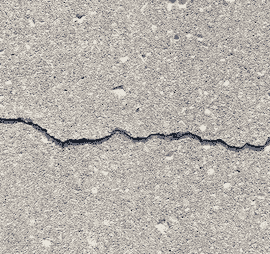

# PSA:用 4 英尺厚的混凝土覆盖 iPhone 可能会影响信号强度 

> 原文：<https://web.archive.org/web/https://techcrunch.com/2011/02/08/verizon-iphone-antenna/>

还记得“[天线门](https://web.archive.org/web/20230203001757/https://techcrunch.com/2010/07/16/antennagate-complaints-returns-and-call-drops-are-all-extremely-low/)”吗？等等，你不知道？让我提醒你:这几乎是有史以来最大的一笔交易……整整两周。实际上，让我换个说法:对于我们这些科技媒体人来说，这几乎是有史以来最大的一笔交易，他们能够就一个普通人绝对不会关心的问题写几十篇报道。

不相信我？也许你会想问问上个季度购买了 iPhone 的 1600 多万 T4 人。或者是前一个季度买了一辆的 1400 多万辆[中的任何一辆](https://web.archive.org/web/20230203001757/https://techcrunch.com/2010/10/18/apple-q4-2010-earnings/)。天线问题显然是一个如此大的问题，不仅苹果的 [iPhone](https://web.archive.org/web/20230203001757/http://crunchgear.com/tag/iPhone) 图表记录了每个季度的销售，而且顾客对产品不满并退货的报道基本上是闻所未闻的。该死，那个讨厌的天线——它差点毁了苹果！

撇开滑稽不谈，你可能会认为，那些在集会上为 Antennagate 呐喊的人会对最终完全不成问题的事情平静下来。但是没有！[不是 iLounge](https://web.archive.org/web/20230203001757/http://www.ilounge.com/index.php/news/comments/verizon-iphone-4-antenna-problems-persist-video/) 。他们今天带着“天线门 2”(商标待定)回来了！

但这一次可以说更好。威瑞森 iPhone 不仅有“死亡之握”的问题，现在还有“死亡拥抱”的问题。现在听听这个:如果你能把整个手和 iPhone 包在一起，尽可能用力挤压，你可能会失去一些 WiFi 信号！

相关:如果你把 iPhone 锁在一个没有信号的房间里，你也可能会失去一些信号。

事实上，没有人会像 iLounge 视频中那样拿着 iPhone，也没有明显的链接诱饵(我们很大方地接受了)，我只想说:如果 Antennagate 1 在问题等级上是 10 分，这就是 0 分。或者可能是负 1。

虽然我一直坚持我的立场，即 iPhone 4(AT T6 T 版本)的天线问题是非常真实的，这不是一个真正的大问题，我认为这不是一个问题。首先，我无法在威瑞森的 iPhone 上复制死亡握持的问题。我可以(现在仍然可以)使用 AT & T 版本。我不能在这里。众所周知，苹果在这款新机型中改变了天线设计，因此很难相信他们会在不纠正这个问题的情况下做出改变。

其次，也就是说，天线仍然在手机的外面。正如我们在过去的这个夏天所熟知的那样，人体根本无助于增强信号。事实上，它伤害了它。我敢肯定，你仍然可以用手做一些杂技动作，让威瑞森的 iPhone 信号消失。比如“死亡拥抱”。

第三，用四英尺厚的混凝土覆盖 iPhone 也会影响信号强度。我们仍在等待视频证明，但请注意。

*【图片:Flickr/[coun 2 r parts](https://web.archive.org/web/20230203001757/http://www.flickr.com/photos/coun2rparts/3509673674/)*