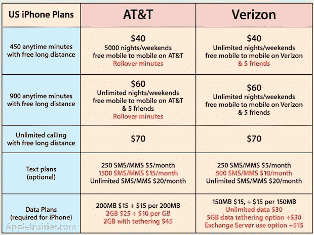

# 威瑞森将带着 iPhone 去美国电话电报公司旅行——然后用无限的数据指着它笑

> 原文：<https://web.archive.org/web/http://techcrunch.com/2011/01/09/verizon-iphone-data/>

啊哦，在。

看起来[非常](https://web.archive.org/web/20230202233201/https://techcrunch.com/2011/01/07/verizon-iphone-launch/)、[非常](https://web.archive.org/web/20230202233201/http://online.wsj.com/article/SB10001424052748704030704576070090093187986.html)、[非常](https://web.archive.org/web/20230202233201/http://digitaldaily.allthingsd.com/20110107/apple-ceo-likely-to-appear-at-verizon-iphone-event/)、[非常](https://web.archive.org/web/20230202233201/http://daringfireball.net/linked/2011/01/07/verizon-iphone)有可能,[威瑞森周二上午在纽约市举办的活动](https://web.archive.org/web/20230202233201/https://techcrunch.com/2011/01/07/what-is-this-verizon-event-and-why-was-i-invited-could-it-be-dare-i-say-iphone/)就是为了发布将在该运营商网络上运行的 CDMA iPhone 。对于我们这些长期忍受 AT & T 网络的折磨而无法使用 iPhone 的人来说(尤其是我们这些生活在旧金山和纽约等城市的人),这基本上是圣诞节的又一次重演。在典型的苹果时尚中，可能会有一个不错的小“还有一件事”——但它很可能来自威瑞森的赞美。

威瑞森不仅准备推出 iPhone，看起来他们还会推出无限数据套餐。这是美国电话电报公司去年扼杀的东西，巧妙地伪装成对大多数客户来说更好的短期交易。当然，现实是，数据上限实际上是一项长期计划，有助于保护他们苦苦挣扎的网络，更重要的是，[赚更多的钱。](https://web.archive.org/web/20230202233201/https://techcrunch.com/2009/05/18/whats-funny-as-hell-about-the-supposed-att-iphone-plan-price-cut/)

但是威瑞森显然还没有准备好朝这个方向发展。至少，现在还没有。

昨天，路透社[援引](https://web.archive.org/web/20230202233201/http://www.reuters.com/article/idUSTRE7072L620110108)一位未透露姓名的消息人士称，威瑞森将向其现有无线服务计划的客户提供 iPhone。今天，《华尔街日报》进一步[澄清](https://web.archive.org/web/20230202233201/http://online.wsj.com/article/SB10001424052748703667904576072110862862244.html?mod=djemalertTECH)称“一位知情人士”称，威瑞森 iPhone 实际上将提供无限数据套餐。

AppleInsider 有一个[对这实际上意味着什么的很好的分解](https://web.archive.org/web/20230202233201/http://www.appleinsider.com/articles/11/01/09/verizon_iphone_to_use_existing_plans_similar_to_att.html)。虽然这两个网络的核心通话时间和文本计划基本相同(尽管在& T 有展期分钟)，但在& T 不再提供无限制的数据计划。相反，他们的最高数据计划是 2g，每月 25 美元。在这两次演出之后，每一次额外演出是 10 美元。与此同时，如果计划保持不变，威瑞森将以 30 美元的固定费用提供无限量数据。

这也是美国电话电报公司曾经提供的无限数据费用，直到他们在 6 月份将其阉割。此举的时机很奇怪，因为就在 iPhone 4 在美国独家与美国电话电报公司推出之前。换句话说，他们让数百万客户锁定了新计划至少两年(尽管以前的客户可以保留现有计划)。哦，在另一个奇怪的时刻，美国电话电报公司也设法在所有这些新合同签署之前提高了他们的提前终止费。想象一下。那个动作[不可能与周二将要发生的事情](https://web.archive.org/web/20230202233201/https://techcrunch.com/2010/05/21/att-hikes-smartphone-early-termination-fees-claims-it-has-nothing-to-do-with-iphone-right/)有关，对吗？当然可以…

还有更多。不仅威瑞森的标准数据速率更好，而且网络共享计划也更好。目前，美国电话电报公司为你提供了在 iPhone 上使用网络共享的选项，但这需要你每月支付 45 美元(你的 25 美元数据外加 20 美元的额外费用),而且它会计入你同样的 2 GB 上限。与此同时，威瑞森提供额外 30 美元的网络共享服务，但他们会给你 5 GB 的数据，专门用于网络共享。换句话说，它更贵，但更划算，因为你的 AT & T 2 GB 数据上限将很快被你实际的 iPhone 使用所吞噬。

假设所有这些信息都是准确的，这看起来对 AT&T 非常非常不利。看起来被认为是优越的更大的网络不仅拿走了他们的皇冠上的宝石，他们还在他们这样做的时候踢他们的坚果。看起来威瑞森很有信心能够处理 iPhone 巨大的数据流量激增，而美国电话电报公司已经证明了他们做不到，并相应地改变了他们的计划。

让我先发制人地把美国电话电报公司毫无疑问即将发表的观点包括在内。类似这样的话:“客户对我们比以前便宜 5 美元的数据套餐感到高兴——数据上限并不重要，因为绝大多数客户从未达到 2 GB 的上限。”让我再一次先发制人地称这种说法是胡说八道。当然，大多数客户现在可能没有达到 2 GB 的上限，但每个人都在继续使用越来越多的数据。因此，越来越多的人将在未来几个月或几年内开始碰壁。这对美国电话电报公司来说意味着一件事:超龄费增加了 10 美元.

当然，总的来说，威瑞森仍然是一个贪婪的运营商。虽然他们的数据计划现在看起来不错，但据说他们也在考虑限制它们的想法。如果这种情况迟早会发生，不要感到惊讶。

尽管如此，至少对于 iPhone 的首次发布，看起来威瑞森将是一朵盛开的大红玫瑰。美国电话电报公司·威瑟斯。

**更新**:在& T 已经写信澄清，任何拥有以前合同的客户都可以选择保留它，即使是在升级到新设备之后，所以我已经更新了那里的一些措辞。关键的一点是完整的:新用户不能选择在& T 上获得无限制的套餐，但他们可以在威瑞森上获得。

美国电话电报公司还希望指出，威瑞森首先提高了他们的 ETF。我们仍然觉得 iPhone 4 发布前的时机可疑。

