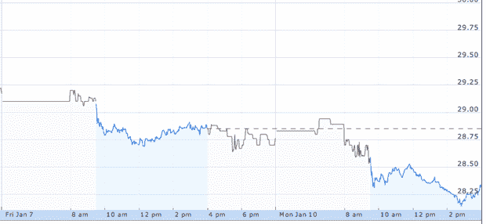
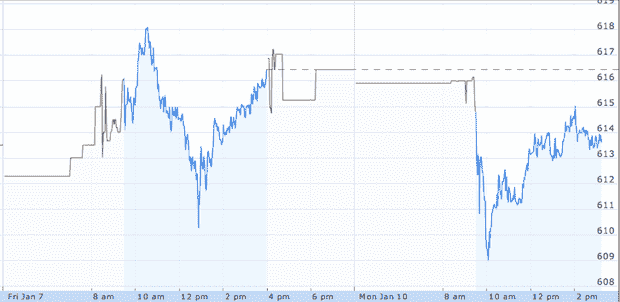

# 一张图片展示的威瑞森 iPhone 炒作 

> 原文：<https://web.archive.org/web/http://techcrunch.com/2011/01/10/verizon-iphone-hype/>

# 一张图展示了威瑞森 iPhone 的炒作

我现在在飞往纽约的飞机上。为什么？看上面的图表。这是全世界对明天的期待的完美想象:威瑞森的 iPhone。

苹果公司[的股票](https://web.archive.org/web/20230202230554/http://www.google.com/finance?q=aapl)今天飙升了 5 个百分点。自从周五开始的[传言称周二将是大的揭幕日以来，已经上涨了近 10 个百分点。这种激增不应该令人惊讶，因为至少，威瑞森 iPhone 预计将为苹果的底线增加几十亿美元。](https://web.archive.org/web/20230202230554/https://techcrunch.com/2011/01/07/what-is-this-verizon-event-and-why-was-i-invited-could-it-be-dare-i-say-iphone/)

就在一周前，苹果的市值首次突破 3000 亿美元。现在已经超过 3130 亿美元了。仅自上周五以来(再次，当关于该设备的讨论真正开始时)，苹果公司的市值仅增加了约 100 亿美元。这是一个强大的设备。

然而，其他参与者的结果还不清楚。威瑞森的股票(下图)在周五晚些时候暴涨，但后来又回落了。

美国电话电报公司(下图)将失去该设备的独家经营权，但仍将销售 iPhone，自上周五以来，该公司股价下跌了不少(百分比)。今天对该公司来说尤其惨淡，尽管他们现在有所好转。

与此同时，竞争对手 Android 智能手机软件背后的公司谷歌(下图)自上周五以来一直在暴跌和反弹。现在也差不多是在周五开始的地方。

结果出来了:刚刚发布的威瑞森 iPhone 的大赢家是苹果。惊喜惊喜。

**更新**:当我第一次发表的时候，我有[其他](https://web.archive.org/web/20230202230554/http://www.google.com/finance?q=NYSE:ATT)的& T 图。我把它换成了正确的。