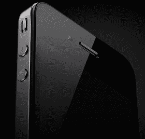

# 为什么苹果会让威瑞森发布 iPhone 

> 原文：<https://web.archive.org/web/http://techcrunch.com/2011/01/07/verizon-iphone-launch/>

# 为什么苹果会让威瑞森发布 iPhone

** *编者按*** :吉姆·达尔林普尔(Jim Dalrymple)撰写关于苹果的文章已经超过 15 年。你可以在 Twitter [@jdalrymple](https://web.archive.org/web/20230202230016/http://twitter.com/jdalrymple) 和他的网站 [The Loop](https://web.archive.org/web/20230202230016/http://www.loopinsight.com/) 上关注他。

今天早些时候，[威瑞森宣布将在下周举行一场特别活动](https://web.archive.org/web/20230202230016/https://techcrunch.com/2011/01/07/what-is-this-verizon-event-and-why-was-i-invited-could-it-be-dare-i-say-iphone/)，虽然该公司没有透露任何细节，但每个人都在猜测这就是期待已久、备受期待的威瑞森 iPhone。

如果是这样的话，一个问题立即跃入脑海——苹果真的会让另一家公司为他们发布 iPhone 吗？我们都知道苹果有多神秘，他们有多喜欢做自己的事情。

我相信这个问题的答案是，是的。苹果会让威瑞森发布 iPhone。也就是 iPhone 4。

苹果让威瑞森发布这一声明的最重要原因是苹果正在管理预期。

如果苹果发出典型的邀请，邀请他们在加州参加一个活动，人们会猜测苹果将发布 iPhone 5 或者 iPad 2。我相信当兼容威瑞森的 iPhone 真的出现时，它将只是 iPhone 4 的 CDMA 版本。

虽然苹果将经历开发与威瑞森网络兼容的手机的过程，但我怀疑他们会完全改变开发周期，提前发布 iPhone 5。

如果苹果的 iPhone 开发周期保持不变，我们应该会在 2011 年 6 月或 7 月看到新的 iPhone。

当然，还有一个原因。苹果在许多国家的多家运营商都有 iPhone，他们对此并不重视。从商业角度来看，威瑞森只是苹果的另一个载体。

这对我们大多数人来说是一件大事，因为许多人想在威瑞森使用 iPhone。但对苹果来说，这只是一个已经发布的产品的修改版本。