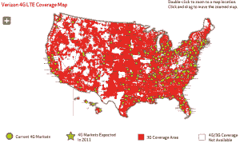

# 威瑞森用 4G LTE 覆盖点亮 22 座新城市 TechCrunch

> 原文：<https://web.archive.org/web/http://techcrunch.com/2011/10/20/verizon-lights-up-22-new-cities-with-4g-lte-coverage/>

# 威瑞森用 4G LTE 覆盖点亮 22 个新城市

准备好，威瑞森的订户们。既然威瑞森已经将其 4G LTE 覆盖范围扩展到 22 个新城市，你可能有理由升级到一个全新的支持 LTE 的设备——比如[刚刚发布的摩托罗拉 Droid RAZR](https://web.archive.org/web/20230203123423/https://techcrunch.com/2011/10/18/verizon-officially-unveils-the-motorola-droid-razr/) 。

LTE 向这 22 个新城市的扩展将使威瑞森的 4G 覆盖范围扩大到 165 个城市，11 月 17 日还将有 13 个地区点亮。

 如今受到 LTE 热捧的新城市包括:

> 亚拉巴马州伯明翰；加利福尼亚州莫德斯托和斯托克顿；印第安纳州的布鲁明顿、埃尔克哈特、埃文斯维尔、南本德和特雷霍特；衣阿华州苏城；马里兰州黑格斯敦；密西西比州图珀洛；新墨西哥州阿尔伯克基和圣菲；纽约州布法罗市；北卡罗来纳州阿什维尔；巴特尔斯维尔，OK；杰克逊和马丁，田纳西州；弗吉尼亚州大汉普顿路和里士满；和威斯康星州格林贝。

威瑞森还扩展了其在洛杉矶、圣地亚哥、华盛顿特区和宾夕法尼亚州伊利的现有 4G LTE 覆盖范围。随着今天的部署和 11 月 17 日的另一次部署，威瑞森的 4G LTE 网络将在不到一个月的时间内覆盖 178 个城市。届时，威瑞森表示将向客户提供至少 13 款支持 LTE 的设备。