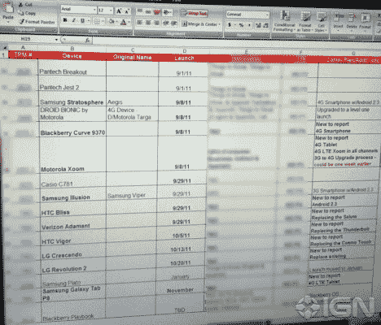

# 威瑞森路线图承诺 9 月 8 日推出 Droid 仿生超级手机...最后 

> 原文：<https://web.archive.org/web/http://techcrunch.com/2011/08/05/verizon-roadmap-promises-september-8-launch-for-droid-bionic-superphone-finally/>

# 威瑞森路线图承诺 9 月 8 日推出 Droid 仿生超级手机…终于

好吧，看看我们这里有什么。事实证明，一家名为[摩托罗拉](https://web.archive.org/web/20230203043051/https://techcrunch.com/tag/motrola)的小公司的首席执行官桑杰·贾没有说谎，他说期待已久的机器人仿生机器人[将于 9 月](https://web.archive.org/web/20230203043051/https://techcrunch.com/2011/07/28/motorola-ceo-droid-bionic-will-launch-in-september/)在威瑞森上架。准确地说，是 9 月 8 日。至少， [IGN](https://web.archive.org/web/20230203043051/http://gear.ign.com/articles/118/1185976p1.html) 获得的这份泄露的[威瑞森](https://web.archive.org/web/20230203043051/https://techcrunch.com/tag/verizon)文件是这么告诉我们的。

这还不是它要说的全部。显然，一款未经宣布的黑莓手机 9370 4G 也将在 9 月 8 日亮相，同时亮相的还有来自摩托罗拉的 4G LTE Xoom。另一款神秘手机[三星同温层](https://web.archive.org/web/20230203043051/https://techcrunch.com/tag/samsung)也将于 8 日发布，据说是一款 4G [Android 2.3](https://web.archive.org/web/20230203043051/https://techcrunch.com/tag/gingerbread) 设备。一些人认为这将是三星 Fascinate 的继任者，三星 Fascinate 是威瑞森品牌的 Galaxy S 变体。然后，我们又听说 Galaxy S II 将被称为威瑞森的功能，所以这个有点问题。

除此之外，我们还将看到 10 月 20 日登陆的 LG 革命的继任者，以及一款名为三星 Galaxy Tab P8 的 4G 无线电设备——我们假设将是 Galaxy Tab 8.9——定于 11 月上市。

我们还看到了另一款定于 9 月 29 日发布的奇怪手机，据称是专门为女性设计的:HTC Bliss。HTC Vigor 是 ThunderBolt 的替代品，将于 10 月 5 日上市。休息后查看大图。

