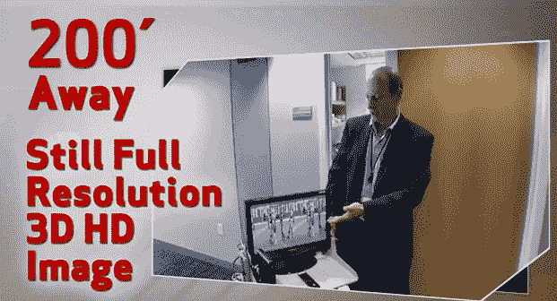

# 威瑞森将于 2012 年推出家庭媒体服务器，计划淘汰机顶盒 TechCrunch

> 原文：<https://web.archive.org/web/https://techcrunch.com/2011/12/22/verizon-to-launch-a-home-media-server-in-2012-plans-to-eliminate-set-top-box/>

明年晚些时候，威瑞森将为其 FiOS 客户推出一种新的媒体服务器产品，这将是一种单一的硬件设备，最终将完全消除对机顶盒的需求。该服务器将能够向家中的所有设备传输高清电视，当然包括电视，也包括游戏系统、移动设备和 iPad 等平板电脑。尽管该公司尚未正式宣布细节、时间表或定价，但我们最近得到了该公司计划的一瞥。

在这个宣传视频中，您可以看到媒体服务器在讨论威瑞森对其产品能效的关注。在这里，威瑞森的技术总监 Tushar Saxena 谈论了近几个月来威瑞森机顶盒的升级。他展示了一个大盒子，这是过时技术的一个例子(嘿，那是我的盒子！)和更紧凑、能效提高 30%的型号。Saxena 随后展示了即将发布的新机顶盒，它们甚至更小，很快就会小到足以“在你的电视后面 velcro”，他说。

但有趣的是，这些微型机顶盒是为房子里的*附加*电视准备的——你的主电视将连接一个更大的媒体服务器，也在视频中显示，在一堆机顶盒下面。视频解释说，该服务器将向其他联网设备传输媒体，包括笔记本电脑、Xboxes、PlayStations、平板电脑和 iPhone 等移动设备。Saxena 表示，该计划旨在通过向所有 IP 连接设备(包括电视)提供应用程序，最终完全消除机顶盒，这些设备可以通过 Wi-Fi 直接与服务器通信。他指出，这种转变应该在“几年内”发生。

摆脱机顶盒当然意味着提高能效，这也是视频的重点。但威瑞森发言人告诉我们，媒体服务器本身将在 2012 年底发布。

威瑞森也在使用相同的媒体服务器技术，通过 Wi-Fi 进行 3D 高清电视流媒体测试。威瑞森测试实验室中的路由器已经成功地传输了超过 200 英尺的 3D 高清 FiOS 信号(40 Mbps ),穿过石膏板和钢铁墙壁，而没有损失视频质量。这里有一个演示[使用带有多个天线阵列的路由器，通过 802.11n 标准和媒体服务器硬件进行传输。](https://web.archive.org/web/20221211063506/http://www.youtube.com/watch?v=0dCi6ul1KK0&feature=youtu.be)

可以说，在每个人都在考虑切断有线电视的时候，看到这样的发展是很有趣的，它更正确地将电视视为一种服务，应该可以在家中的任何屏幕上使用。

现在，我们希望威瑞森的定价也能达到目标。

*更新:摩托罗拉希望大家知道，媒体服务器实际上是一个“高级机顶盒网关——下一代更智能的机顶盒，现在可以与家中的多种设备通信，”据公司发言人说，“当人们看到机顶盒正在消失时，他们会自动(并错误地)认为我们的业务注定要失败。”*

有没有翻白眼的表情符号？
【YouTube = http://www . YouTube . com/watch？v = qogfvxtsop 8&w = 640&h = 360】