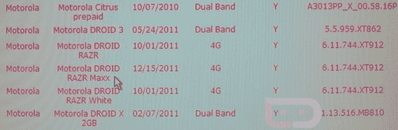

# 威瑞森的下一个机器人 RAZR 已经在他们的系统中发现了 

> 原文：<https://web.archive.org/web/https://techcrunch.com/2011/12/17/verizons-next-droid-razr-already-spotted-in-their-system/>

# 威瑞森的下一个机器人 RAZR 已经出现在他们的系统中

因为“摩托罗拉的威瑞森机器人 RAZR”这个名字似乎不够长，看起来威瑞森已经在计划另一个 RAZR *了，名字中会有更多的单词。我当然是开玩笑的(名字有关系吗？技术领域之外的每个人都称每一款 Android 手机为“机器人”，但我选择这个名字，因为这几乎是我们目前唯一知道的东西。*

Droid-Life 的人员[发现了潜伏在 VZW 库存系统中的手机，看起来 DROID RAZR 系列的下一款手机将是 DROID RAZR MAXX。](https://web.archive.org/web/20221006234409/http://www.droid-life.com/2011/12/16/droid-razr-maxx-is-real-pops-up-in-verizon-system/)

摩托罗拉上周刚刚在中国推出了一款手机(HD XT928 ),除了两个大的不同之外，它可以被视为 RAZR 的孪生兄弟:它有一个 720p 屏幕(1280×720，而最初的 DROID RAZR 的屏幕为 960×540 ),还有一个 1300 万像素的摄像头(8。)目前的想法是，HD XT928 和 Droid Razr Maxx 是一体的，尽管在这一点上这都是猜测。

密切注意，如果你发现什么就告诉我们，好吗？

