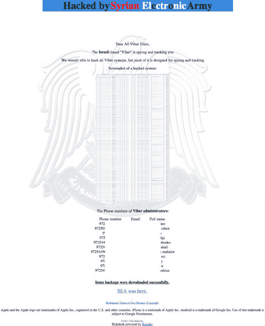
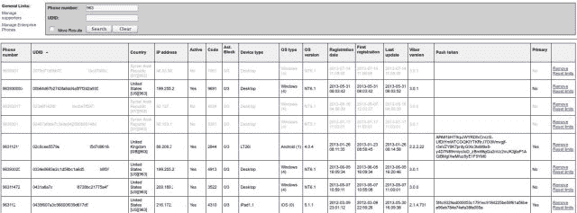

# Viber 被叙利亚电子军攻击

> 原文：<https://web.archive.org/web/https://techcrunch.com/2013/07/23/viber-attacked-by-syrian-electronic-army/>

今天早上早些时候，Viber 证实了一个情况，Viber 似乎被[叙利亚电子军](https://web.archive.org/web/20230326022446/http://en.wikipedia.org/wiki/Syrian_Electronic_Army)(一个与叙利亚总统巴沙尔·阿萨德结盟的亲政府电脑黑客组织)黑客攻击。

[AppleSpot](https://web.archive.org/web/20230326022446/http://www.applespot.nl/48057/viber-gehackt-door-sea-dienst-bespioneert-gebruikers/) 最初报道了影响 [Viber 支持页面](https://web.archive.org/web/20230326022446/http://support.viber.com/)的黑客攻击，尽管尚不清楚黑客进入 Viber 系统的程度。

Viber 现已澄清，黑客只允许访问两个次要系统，一个客户支持面板和一个支持管理系统。根据该公司的官方回应，“没有暴露任何敏感的用户数据，Viber 的数据库也没有被‘黑客攻击’。”

该公司没有证实攻击是否来自叙利亚电子军，但该黑客组织确实对此次黑客攻击负责。然而，Viber 声称这次黑客攻击是针对他们一名员工的网络钓鱼攻击的产物。

以下是官方声明:

> 今天，在一名 Viber 员工不幸成为电子邮件钓鱼攻击的受害者后，Viber 支持网站遭到破坏。钓鱼攻击允许访问两个次要系统:一个客户支持面板和一个支持管理系统。其中一个系统的信息被贴在被污损的页面上。
> 
> 需要强调的是，没有暴露任何敏感的用户数据，Viber 的数据库也没有被“黑客攻击”。敏感的私人用户信息保存在一个安全的系统中，不能通过这种类型的攻击来访问，也不是我们支持系统的一部分。
> 
> 我们非常重视这一事件，我们现在正在努力恢复支持网站，为我们的用户提供全面服务。此外，我们希望向所有用户保证，我们正在审查我们的所有政策，以确保今后不再发生此类事件。

黑客拿下了 Viber 支持页面，并替换为以下消息和黑客截图。

> 亲爱的所有 Viber 用户:
> 
> 以色列的“Viber”在监视和跟踪你
> 
> 我们无法黑进所有 Viber 系统，但大部分是为间谍和跟踪设计的

上面的截图(截图内)是为了证明黑客确实访问了 Viber 的数据库。我们还查看了他们发布的文件，以确认他们的说法(第二个截图)。

正如你所看到的，黑客能够访问诸如电话号码、UDID(Viber 专用的 UDID，不是苹果提供的——见下面的更新)、国家、IP 地址、设备类型、操作系统类型、操作系统版本、注册日期、最近更新和推送令牌等信息。Viber 再次重申这个截图是一个管理仪表板，而不是一个数据库。

Viber 也借此机会回应了间谍指控:

> 像微软、思科、谷歌和英特尔等许多其他公司一样，Viber 在以色列设有一个开发中心。这似乎导致一些人想出了一些非常奇怪的阴谋论。
> 
> 不言而喻，这些指控毫无根据，没有任何现实依据。

Viber 是一项免费的信息和通话服务，总部设在伦敦，开发中心设在以色列，在全球拥有超过 2 亿用户。

**更新— Viber 已经跟进了被访问数据的更多细节:**

> 这些数据非常基本——我们想知道用户何时注册，来自哪里(国家)，设备类型(帮助我们了解谁使用 Viber，检测问题等)，UDID 是内部 ID(不是苹果 UDID)，推送令牌用于与用户通信(但不能由第三方使用)等。虽然这不是最敏感的数据(邮件内容、地址簿等)，但我们对黑客能够访问这些系统感到失望。正如我们所说的，我们正在努力确保这种事情不会再次发生。
> 
> 被攻破的系统是我们的 CSR(客户支持)。支持者需要访问这些数据来帮助用户解决各种技术问题。大多数应用开发者会向他们的支持者提供类似的数据。

*随着更多信息的获得，我们将继续更新这个故事。*