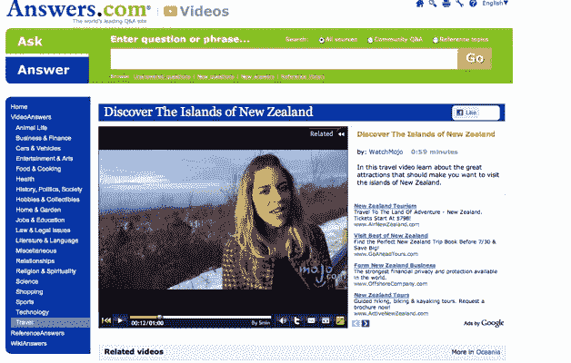

# 独家:Answers.com 从 5 分钟| TechCrunch 获得 20 万个视频答案

> 原文：<https://web.archive.org/web/https://techcrunch.com/2010/07/28/video-answers-5min/>

# 独家:Answers.com 从 5 分钟内获得 20 万个视频答案

网络上的每个大出版商都希望能够提供广告友好的视频，但是创建它们可能是一件痛苦的事情。但是现在已经有很多高质量的视频，涵盖了所有你能想到的主题。考虑到这一点，Answers.com 已经悄悄推出了[视频回答](https://web.archive.org/web/20230314153913/http://video.answers.com/)，视频分发网络[5 分钟](https://web.archive.org/web/20230314153913/http://www.5min.com/)约 20 万个视频，内容从家庭维修和时尚小贴士到汽车和旅行，无所不包。

5Min 已经是[最大的视频网络](https://web.archive.org/web/20230314153913/https://techcrunch.com/2010/02/03/5min-rules-the-how-to-video-space/)之一，每月有超过 1.1 亿的视频浏览量，800 个合作网站上有 3000 万独立访客。但 Answers.com 将成为其最大的合作伙伴。5Min 联合了大约 1000 个在线视频制作人的视频，包括 CBS、Hearst、Scripps 和 WatchMojo。任何时候，只要有一个 5 分钟的视频与 Answers.com、维基问答或参考答案上的问题相匹配，视频结果就会显示出来，并在新的视频答案页面上播放。广告收入将在 Answers.com、5Min 和视频发行商之间平分，大约各占三分之一。

首席执行官 Ran Harnevo 表示:“我们在这里真正建立的是让每个出版商都有自己的视频部分，而无需制作，因为我认为制作没有投资回报。他网络中的视频都是针对性很强的常青树，比如瑜伽或食物视频，每分钟花费不到两位数。视频制作人可以通过与 5 分钟连锁来扩大自己网站之外的影响，并赚些外快。

5Min 的模式与 Demand Media 的模式形成对比，Demand Media 以 50 美元左右的价格制作自己的视频，并在 eHow 和其搜索友好的利基网站组合上播放。AOL 也想通过最近对 Studio Now 的收购进入这一领域。但 5Min 的理念是让别人生产最好的视频，并专注于规模化分发，同时分割下游收入。“如今的目的地还不够大，”他说。