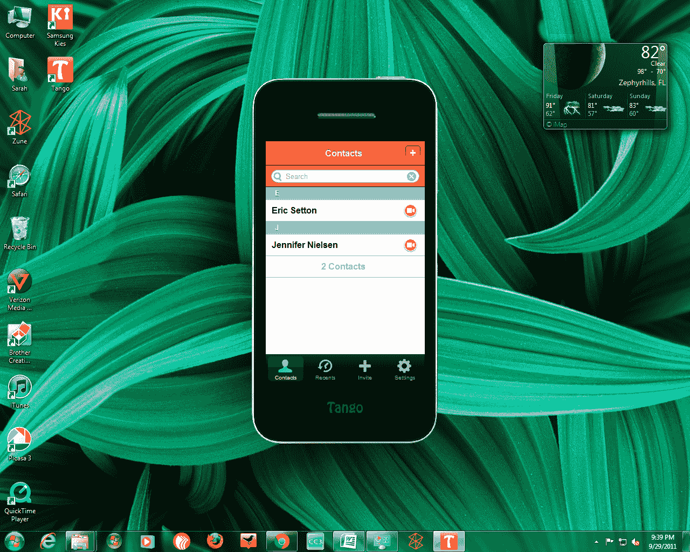

# 视频通话服务 Tango 在 PC 上推出 

> 原文：<https://web.archive.org/web/http://techcrunch.com/2011/09/30/video-calling-service-tango-launches-on-pc/>

正如今年夏天早些时候承诺的那样，移动视频通话应用程序 [Tango](https://web.archive.org/web/20230203150928/http://www.tango.me/) 终于登陆了个人电脑。今天，在 iOS 和 Android 上推出一年后，Tango 现在可以用于 Windows 桌面计算机(XP、Vista 和 Windows 7)。该公司表示，Mac 版本将于今年晚些时候推出。

与移动产品一样，新的 PC 版本旨在易于使用。不需要登录或密码。相反，你只需输入你的电话号码和电子邮件地址就可以开始了。对于现有的 Tango 用户，PC 应用程序会自动将你的 Tango 联系人填充到你的地址簿中，也就是说，该应用程序最初在首次安装时在你的手机联系人列表中发现的人。你也可以通过短信或电子邮件邀请人们从新的 PC 应用程序加入 Tango。

虽然我们没有太多机会在应用程序发布前对其进行测试，但它和 Skype 有一个显著的区别:它看起来像一个巨大的 iPhone。

[Tango](https://web.archive.org/web/20230203150928/http://www.tango.me/) 一贯专注于拥有极简的功能集，PC app 也不例外。在推出时，没有高级选项，如群组通话、文本聊天、文件共享选项或购买点数。Tango 的联合创始人 Eric Setton 说，在这些人中，文字聊天在未来将是“很棒的”,但它不是立即计划的事情。至于群组通话，Tango 认为这更像是一个商业级的功能，而且，考虑到它的重点是消费者，目前也没有兴趣包括它。

不过，在不久的将来，我们计划推出高级别的服务。Setton 表示，Tango 的语音和视频通话将永远免费，但一些尚未宣布的付费服务将在今年晚些时候作为可选的附加服务推出。Setton 证实，Tango 将不收取使用费，也不包含广告，但该公司有信心将其 2300 万用户中的一部分转化为付费用户。

7 月份，该公司获得了由 Draper Fisher Jurvetson 牵头的 4200 万美元的 B 轮融资，这家风投公司也是 Skype 的第一投资者。天使投资人莱恩·布拉瓦特尼克和亚历克斯·祖比拉格也参加了。这笔资金是 Tango 已经获得的 1400 万美元风险投资的一部分。

Windows 被选为 Tango 的第三平台是基于它的规模(全球 15 亿台 PC ),此外还是 Tango 用户的头号功能需求。塞顿说，到目前为止，Tango 的采用顺应了智能手机的趋势，其 50%的用户群在美国以及亚洲、欧洲和中东的发达市场。[快速增长的服务](https://web.archive.org/web/20230203150928/https://techcrunch.com/2011/07/01/tango-17-million-skype/)现在每天增加 70，000 到 80，000 名新成员，其中 75%的注册来自口头推荐。随着 Tango Windows 的推出，这些数字应该会再次增加。

你可以从该公司的网站[点击](https://web.archive.org/web/20230203150928/http://www.tango.me/)下载新的 Tango 电脑应用。